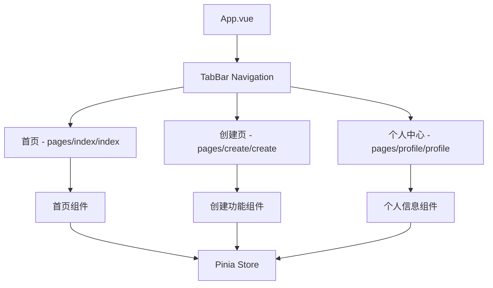
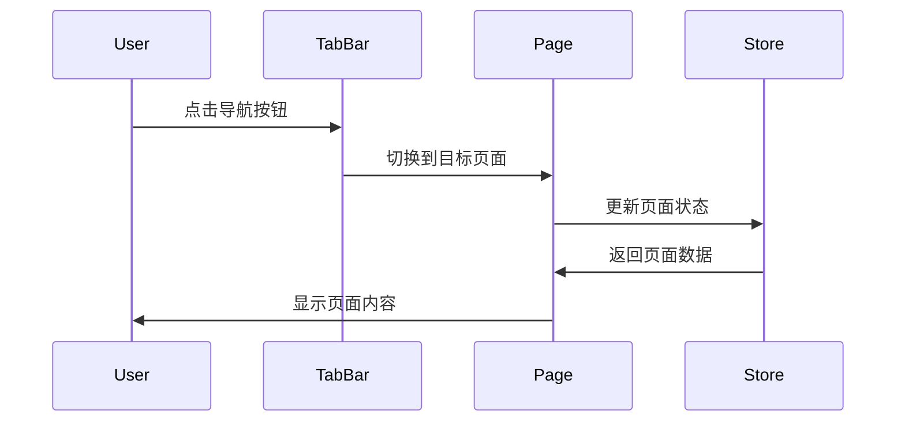

# Design Document

## Overview

本设计文档描述了为 uni-app 应用实现三按钮底部导航栏的技术方案。该导航栏将包含首页、创建操作（+号）和个人中心三个主要功能入口，通过 uni-app 的 tabBar 配置实现原生导航体验。

基于现有项目分析，当前已有基础的 tabBar 配置，包含首页和个人页面。我们需要扩展现有配置，添加第三个创建页面，并优化整体的用户体验。

## Architecture

### 系统架构概览



### 导航流程



## Components and Interfaces

### 1. TabBar 配置 (pages.json)

**功能**: 定义底部导航栏的结构和样式
**位置**: `src/pages.json`

```json
{
  "tabBar": {
    "color": "#999999",
    "selectedColor": "#1AA86C",
    "borderStyle": "white",
    "backgroundColor": "#ffffff",
    "list": [
      {
        "pagePath": "pages/index/index",
        "text": "首页",
        "iconPath": "static/icons/home.png",
        "selectedIconPath": "static/icons/home-active.png"
      },
      {
        "pagePath": "pages/create/create",
        "text": "创建",
        "iconPath": "static/icons/add.png",
        "selectedIconPath": "static/icons/add-active.png"
      },
      {
        "pagePath": "pages/profile/profile",
        "text": "我",
        "iconPath": "static/icons/profile.png",
        "selectedIconPath": "static/icons/profile-active.png"
      }
    ]
  }
}
```

### 2. 页面组件结构

#### 首页组件 (pages/index/index.vue)

- **功能**: 应用主页面，展示主要功能入口
- **状态管理**: 使用现有的 Pinia store
- **路由**: 保持现有路由逻辑

#### 创建页面组件 (pages/create/create.vue)

- **功能**: 提供创建操作的界面
- **特点**:
  - 简洁的创建界面
  - 可扩展的创建选项
  - 与现有 store 集成

#### 个人中心组件 (pages/profile/profile.vue)

- **功能**: 用户个人信息和设置
- **增强**: 在现有基础上添加更多个人功能

### 3. 图标资源管理

**位置**: `src/static/icons/`
**文件结构**:

```
static/
├── icons/
│   ├── home.png (首页图标)
│   ├── home-active.png (首页激活图标)
│   ├── add.png (+号图标)
│   ├── add-active.png (+号激活图标)
│   ├── profile.png (个人图标)
│   └── profile-active.png (个人激活图标)
```

## Data Models

### 1. 导航状态模型

```typescript
interface TabBarState {
  currentTab: number;
  tabs: TabItem[];
}

interface TabItem {
  id: string;
  name: string;
  path: string;
  icon: string;
  activeIcon: string;
  badge?: number;
}
```

### 2. 页面状态模型

```typescript
interface PageState {
  isLoading: boolean;
  title: string;
  data: any;
}

// 创建页面特有状态
interface CreatePageState extends PageState {
  createOptions: CreateOption[];
  selectedOption: string | null;
}

interface CreateOption {
  id: string;
  title: string;
  description: string;
  icon: string;
  action: string;
}
```

## Error Handling

### 1. 页面加载错误处理

```typescript
// 页面加载失败时的处理
const handlePageError = (error: Error) => {
  console.error("页面加载失败:", error);
  uni.showToast({
    title: "页面加载失败，请重试",
    icon: "none",
  });
};
```

### 2. 导航错误处理

```typescript
// 导航切换失败时的处理
const handleNavigationError = (error: Error) => {
  console.error("导航失败:", error);
  // 回退到首页
  uni.switchTab({
    url: "/pages/index/index",
  });
};
```

### 3. 图标资源加载错误

- 提供默认图标作为 fallback
- 图标加载失败时显示文字标签
- 记录错误日志便于调试

## Testing Strategy

### 1. 单元测试

**测试范围**:

- 页面组件的渲染
- 状态管理逻辑
- 工具函数

**测试工具**:

- Vue Test Utils
- Jest

### 2. 集成测试

**测试场景**:

- 导航栏切换功能
- 页面间数据传递
- 状态持久化

### 3. 端到端测试

**测试流程**:

- 用户完整的导航流程
- 跨页面的功能测试
- 不同平台的兼容性测试

### 4. 视觉回归测试

**测试内容**:

- 导航栏在不同设备上的显示
- 图标和文字的对齐
- 主题色彩的一致性

## Implementation Considerations

### 1. 性能优化

- **懒加载**: 页面组件按需加载
- **图标优化**: 使用适当尺寸的图标资源
- **状态管理**: 避免不必要的状态更新

### 2. 平台兼容性

- **小程序**: 确保 tabBar 配置符合各平台规范
- **H5**: 处理浏览器兼容性问题
- **App**: 原生导航栏的适配

### 3. 用户体验

- **动画效果**: 平滑的页面切换动画
- **反馈机制**: 点击反馈和加载状态
- **无障碍访问**: 支持屏幕阅读器

### 4. 扩展性设计

- **配置化**: 导航项目可通过配置文件管理
- **插件化**: 支持动态添加导航项
- **主题化**: 支持多主题切换

## Git Workflow Integration

### 分支策略

- **功能分支**: `feature/bottom-navigation`
- **基于**: 当前主分支
- **合并策略**: Pull Request + Code Review

### 提交规范

- 遵循现有的 commitizen 配置
- 使用语义化提交信息
- 包含相关的测试用例

### CI/CD 集成

- 自动运行测试套件
- 代码质量检查
- 构建验证
