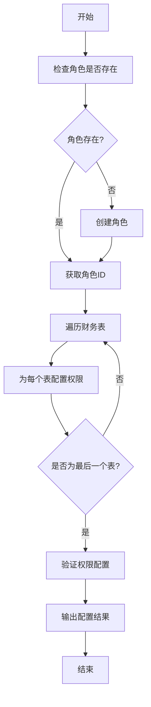

# Design Document

## Overview

本设计文档描述了如何为 BetterHome 财务模块配置 Directus 权限系统。我们将通过 Directus Permissions API 为不同用户角色配置细粒度的数据访问控制，确保数据安全的同时满足业务需求。

设计采用基于角色的访问控制（RBAC）模型，结合字段级权限和条件过滤，实现灵活的权限管理。

## Architecture

### 权限模型

```
┌─────────────────────────────────────────────────────────────┐
│                     Directus Permissions                     │
├─────────────────────────────────────────────────────────────┤
│                                                               │
│  ┌──────────────┐  ┌──────────────┐  ┌──────────────┐      │
│  │   Resident   │  │   Property   │  │  Committee   │      │
│  │   (业主)      │  │   Manager    │  │   Member     │      │
│  │              │  │  (物业管理员)  │  │ (业委会成员)  │      │
│  └──────┬───────┘  └──────┬───────┘  └──────┬───────┘      │
│         │                 │                 │               │
│         ▼                 ▼                 ▼               │
│  ┌──────────────────────────────────────────────────┐      │
│  │         Collection Permissions                    │      │
│  │  - billings (应收账单)                             │      │
│  │  - billing_payments (实收记录)                     │      │
│  │  - incomes (公共收益)                              │      │
│  │  - expenses (支出记录)                             │      │
│  │  - employees (员工信息)                            │      │
│  │  - salary_records (工资记录)                       │      │
│  │  - maintenance_fund_* (维修基金相关)               │      │
│  └──────────────────────────────────────────────────┘      │
│                                                               │
└─────────────────────────────────────────────────────────────┘
```

### 权限配置流程



## Components and Interfaces

### 1. 权限配置脚本 (configure-finance-permissions.ts)

```typescript
interface PermissionRule {
  collection: string;
  role: string;
  action: 'create' | 'read' | 'update' | 'delete';
  permissions: Record<string, any> | null;  // 条件过滤
  fields: string[] | null;  // 字段限制
}

interface RoleConfig {
  name: string;
  description: string;
  permissions: PermissionRule[];
}

class PermissionConfigurator {
  constructor(directusUrl: string, adminToken: string);
  
  // 确保角色存在
  async ensureRole(roleName: string, description: string): Promise<string>;
  
  // 配置单个权限规则
  async configurePermission(rule: PermissionRule): Promise<void>;
  
  // 批量配置角色权限
  async configureRolePermissions(config: RoleConfig): Promise<void>;
  
  // 验证权限配置
  async verifyPermissions(roleName: string): Promise<boolean>;
}
```

### 2. 权限规则定义

#### 业主角色 (resident)

```typescript
const residentPermissions: PermissionRule[] = [
  // billings - 只读自己的账单
  {
    collection: 'billings',
    role: 'resident',
    action: 'read',
    permissions: {
      _and: [
        { owner_id: { _eq: '$CURRENT_USER' } }
      ]
    },
    fields: ['*']
  },
  
  // billing_payments - 只读自己的缴费记录
  {
    collection: 'billing_payments',
    role: 'resident',
    action: 'read',
    permissions: {
      _and: [
        { owner_id: { _eq: '$CURRENT_USER' } }
      ]
    },
    fields: ['*']
  },
  
  // incomes - 只读所属社区的公共收益
  {
    collection: 'incomes',
    role: 'resident',
    action: 'read',
    permissions: {
      _and: [
        { community_id: { _eq: '$CURRENT_USER.community_id' } }
      ]
    },
    fields: ['*']
  },
  
  // expenses - 只读所属社区的已批准支出
  {
    collection: 'expenses',
    role: 'resident',
    action: 'read',
    permissions: {
      _and: [
        { community_id: { _eq: '$CURRENT_USER.community_id' } },
        { status: { _eq: 'approved' } }
      ]
    },
    fields: ['*']
  },
  
  // maintenance_fund_accounts - 只读自己的维修基金账户
  {
    collection: 'maintenance_fund_accounts',
    role: 'resident',
    action: 'read',
    permissions: {
      _and: [
        { owner_id: { _eq: '$CURRENT_USER' } }
      ]
    },
    fields: ['*']
  },
  
  // maintenance_fund_payments - 只读自己的缴纳记录
  {
    collection: 'maintenance_fund_payments',
    role: 'resident',
    action: 'read',
    permissions: {
      _and: [
        { owner_id: { _eq: '$CURRENT_USER' } }
      ]
    },
    fields: ['*']
  },
  
  // maintenance_fund_usage - 只读所属社区的使用记录
  {
    collection: 'maintenance_fund_usage',
    role: 'resident',
    action: 'read',
    permissions: {
      _and: [
        { community_id: { _eq: '$CURRENT_USER.community_id' } },
        { approval_status: { _eq: 'approved' } }
      ]
    },
    fields: ['*']
  }
];
```

#### 物业管理员角色 (property_manager)

```typescript
const propertyManagerPermissions: PermissionRule[] = [
  // 所有财务表的完整 CRUD 权限（限制在所属社区）
  ...['billings', 'billing_payments', 'incomes', 'expenses', 
      'employees', 'salary_records', 'maintenance_fund_accounts',
      'maintenance_fund_payments', 'maintenance_fund_usage'].flatMap(collection => [
    {
      collection,
      role: 'property_manager',
      action: 'create',
      permissions: null,  // 创建时会自动设置 community_id
      fields: ['*']
    },
    {
      collection,
      role: 'property_manager',
      action: 'read',
      permissions: {
        _and: [
          { community_id: { _eq: '$CURRENT_USER.community_id' } }
        ]
      },
      fields: ['*']
    },
    {
      collection,
      role: 'property_manager',
      action: 'update',
      permissions: {
        _and: [
          { community_id: { _eq: '$CURRENT_USER.community_id' } }
        ]
      },
      fields: ['*']
    },
    {
      collection,
      role: 'property_manager',
      action: 'delete',
      permissions: {
        _and: [
          { community_id: { _eq: '$CURRENT_USER.community_id' } }
        ]
      },
      fields: null
    }
  ])
];
```

#### 业委会成员角色 (committee_member)

```typescript
const committeeMemberPermissions: PermissionRule[] = [
  // 所有财务表的读权限
  ...['billings', 'billing_payments', 'incomes', 'expenses', 
      'employees', 'salary_records', 'maintenance_fund_accounts',
      'maintenance_fund_payments', 'maintenance_fund_usage'].map(collection => ({
    collection,
    role: 'committee_member',
    action: 'read',
    permissions: {
      _and: [
        { community_id: { _eq: '$CURRENT_USER.community_id' } }
      ]
    },
    fields: ['*']
  })),
  
  // expenses - 可以更新审批字段
  {
    collection: 'expenses',
    role: 'committee_member',
    action: 'update',
    permissions: {
      _and: [
        { community_id: { _eq: '$CURRENT_USER.community_id' } }
      ]
    },
    fields: ['status', 'approved_by', 'approved_at', 'rejection_reason']
  },
  
  // maintenance_fund_usage - 可以更新审批字段
  {
    collection: 'maintenance_fund_usage',
    role: 'committee_member',
    action: 'update',
    permissions: {
      _and: [
        { community_id: { _eq: '$CURRENT_USER.community_id' } }
      ]
    },
    fields: ['approval_status', 'approved_by', 'approved_at', 'rejection_reason']
  }
];
```

### 3. 验证脚本 (verify-finance-permissions.ts)

```typescript
interface VerificationTest {
  role: string;
  collection: string;
  action: 'create' | 'read' | 'update' | 'delete';
  shouldSucceed: boolean;
  testData?: any;
}

class PermissionVerifier {
  constructor(directusUrl: string);
  
  // 使用指定角色的 token 执行测试
  async runTest(test: VerificationTest, token: string): Promise<boolean>;
  
  // 批量运行验证测试
  async runAllTests(tests: VerificationTest[]): Promise<{
    passed: number;
    failed: number;
    details: Array<{ test: VerificationTest; result: boolean; error?: string }>;
  }>;
}
```

## Data Models

### Directus Permission 对象结构

```typescript
interface DirectusPermission {
  id?: number;
  role: string;  // 角色 UUID
  collection: string;  // 表名
  action: 'create' | 'read' | 'update' | 'delete';
  permissions: Record<string, any> | null;  // 过滤条件
  validation: Record<string, any> | null;  // 验证规则
  presets: Record<string, any> | null;  // 预设值
  fields: string[] | null;  // 允许的字段
}
```

### Directus Role 对象结构

```typescript
interface DirectusRole {
  id: string;  // UUID
  name: string;
  icon: string;
  description: string | null;
  ip_access: string[] | null;
  enforce_tfa: boolean;
  admin_access: boolean;
  app_access: boolean;
}
```

## Error Handling

### 错误类型

1. **角色不存在错误**
   - 检测：尝试获取角色时返回 404
   - 处理：自动创建角色

2. **权限冲突错误**
   - 检测：相同的 (role, collection, action) 组合已存在
   - 处理：更新现有权限规则

3. **API 认证错误**
   - 检测：返回 401 或 403
   - 处理：提示检查 admin token

4. **网络错误**
   - 检测：请求超时或连接失败
   - 处理：重试机制（最多 3 次）

### 错误处理流程

```typescript
async function safeConfigurePermission(rule: PermissionRule): Promise<void> {
  const maxRetries = 3;
  let attempt = 0;
  
  while (attempt < maxRetries) {
    try {
      await configurePermission(rule);
      return;
    } catch (error) {
      if (error.code === 'ECONNREFUSED' && attempt < maxRetries - 1) {
        attempt++;
        await sleep(1000 * attempt);  // 指数退避
        continue;
      }
      
      if (error.status === 404 && error.message.includes('role')) {
        // 角色不存在，先创建
        await ensureRole(rule.role, `Auto-created role: ${rule.role}`);
        continue;
      }
      
      throw error;
    }
  }
}
```

## Testing Strategy

### 单元测试

1. **权限规则生成测试**
   - 验证每个角色的权限规则数量正确
   - 验证权限规则的结构完整性
   - 验证过滤条件的语法正确性

2. **API 调用测试**
   - Mock Directus API 响应
   - 测试错误处理逻辑
   - 测试重试机制

### 集成测试

1. **权限配置测试**
   - 在测试环境中执行完整的权限配置流程
   - 验证所有角色和权限规则都已创建
   - 验证权限规则的参数正确

2. **权限验证测试**
   - 使用不同角色的 token 测试数据访问
   - 验证业主只能访问自己的数据
   - 验证物业管理员可以管理所有数据
   - 验证业委会成员只能更新审批字段

### 测试用例

```typescript
const verificationTests: VerificationTest[] = [
  // 业主测试
  {
    role: 'resident',
    collection: 'billings',
    action: 'read',
    shouldSucceed: true,
    testData: { owner_id: '$CURRENT_USER' }
  },
  {
    role: 'resident',
    collection: 'billings',
    action: 'read',
    shouldSucceed: false,
    testData: { owner_id: 'other-user-id' }  // 不应该能访问其他人的数据
  },
  {
    role: 'resident',
    collection: 'billings',
    action: 'create',
    shouldSucceed: false  // 业主不能创建账单
  },
  
  // 物业管理员测试
  {
    role: 'property_manager',
    collection: 'billings',
    action: 'create',
    shouldSucceed: true
  },
  {
    role: 'property_manager',
    collection: 'billing_payments',
    action: 'create',
    shouldSucceed: true
  },
  
  // 业委会成员测试
  {
    role: 'committee_member',
    collection: 'expenses',
    action: 'update',
    shouldSucceed: true,
    testData: { status: 'approved' }  // 只能更新审批字段
  },
  {
    role: 'committee_member',
    collection: 'expenses',
    action: 'delete',
    shouldSucceed: false  // 不能删除
  }
];
```

## Implementation Notes

### 环境变量

```bash
# .env
DIRECTUS_URL=http://localhost:8055
DIRECTUS_ADMIN_TOKEN=your-admin-token-here
```

### 脚本执行顺序

1. `configure-finance-permissions.ts` - 配置权限
2. `verify-finance-permissions.ts` - 验证权限

### 注意事项

1. **Admin Token 安全**
   - 不要将 admin token 提交到版本控制
   - 使用环境变量或配置文件管理
   - 定期轮换 token

2. **权限更新**
   - 脚本支持幂等操作，可以重复执行
   - 更新权限时会覆盖现有规则
   - 建议在测试环境先验证

3. **社区隔离**
   - 所有权限规则都基于 `community_id` 过滤
   - 确保用户的 `community_id` 字段正确设置
   - 物业管理员和业委会成员必须属于某个社区

4. **特殊字段**
   - `$CURRENT_USER` - 当前登录用户的 ID
   - `$CURRENT_USER.community_id` - 当前用户的社区 ID
   - 这些是 Directus 的内置变量

## Deployment

### 开发环境

```bash
# 1. 配置环境变量
cp .env.example .env
# 编辑 .env 文件，设置 DIRECTUS_URL 和 DIRECTUS_ADMIN_TOKEN

# 2. 执行权限配置
npm run configure:permissions

# 3. 验证权限
npm run verify:permissions
```

### 生产环境

```bash
# 1. 确保生产环境的 Directus 实例正在运行
# 2. 使用生产环境的 admin token
# 3. 执行配置脚本
DIRECTUS_URL=https://your-production-url.com \
DIRECTUS_ADMIN_TOKEN=your-production-token \
npm run configure:permissions

# 4. 验证配置
npm run verify:permissions
```

### 回滚计划

如果权限配置出现问题：

1. 备份当前权限配置
2. 使用 Directus 管理界面手动调整
3. 或者删除所有财务相关权限，重新执行配置脚本
