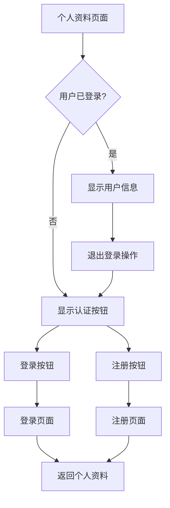

# 设计文档

## 概述

个人资料页面重构将把当前调试功能繁重的实现转换为简洁、生产就绪的界面。设计专注于两个主要状态：已认证和未认证用户，在认证页面之间无缝导航，并在整个过程中一致使用uview-plus组件。

## 架构

### 组件结构
```
ProfilePage
├── AuthenticatedView (用户已登录时)
│   ├── UserInfoCard (显示用户详情)
│   └── ActionButtons (退出登录、设置等)
└── UnauthenticatedView (用户未登录时)
    ├── WelcomeSection (应用品牌和欢迎信息)
    └── AuthButtons (登录和注册按钮)
```

### 状态管理
- 使用Pinia中现有的`useUserStore`
- 使用`storeToRefs`进行响应式状态绑定
- 不进行认证状态的本地状态管理

### 导航流程


## 组件和接口

### 主要个人资料组件
```typescript
interface ProfilePageProps {
  // 不需要props - 使用全局用户存储
}

interface ProfilePageData {
  // 不需要本地响应式数据 - 使用存储引用
}
```

### 用户信息显示
```typescript
interface UserDisplayInfo {
  displayName: string;        // first_name 只显示名字
  phoneNumber: string;        // 电话号码
  communityName: string;      // 小区名称
  avatarUrl?: string;         // 可选头像
}
```

### 使用的uview-plus组件
- `u-card`: 用户信息容器
- `u-cell-group` & `u-cell`: 用户详情行
- `u-button`: 操作按钮
- `u-avatar`: 用户头像显示
- `u-divider`: 分段分隔
- `u-empty`: 空状态（如需要）

## 数据模型

### 用户信息结构
组件将从现有用户存储中消费数据，使用生成的Directus TypeScript接口：

```typescript
// 使用生成的Directus TypeScript接口
import type { DirectusUser, Community } from '@/@types/directus-schema';

// 来自现有用户存储
interface UserStoreState {
  profile: DirectusUser | null;
  community: Community | null;
  building: Building | null;
  isLoggedIn: boolean;
}

// 计算显示数据
interface DisplayUserInfo {
  name: string;              // 只显示first_name
  phoneNumber: string;       // 电话号码
  community: string;         // 小区名称
  hasAvatar: boolean;        // 用户是否有头像
}
```

### 认证状态
```typescript
interface AuthState {
  isAuthenticated: boolean;   // 来自store.isLoggedIn
  userInfo: DisplayUserInfo | null;
  loading: boolean;          // 来自store.loading
}
```

## 错误处理

### 认证错误
- 处理用户存储加载失败的情况
- 用户数据不完整时的优雅降级
- 导航失败的错误边界

### 数据显示错误
- 缺失用户信息的回退值
- 用户头像不可用时的默认头像
- 缺失小区信息的占位符文本
- 使用封装好的Directus SDK接口进行错误处理

### 导航错误
- 处理导航到登录/注册页面失败
- 使用uni.showToast的适当错误消息
- 使用uni.navigateBack的回退导航

## 测试策略

### 单元测试
- 测试已认证与未认证状态渲染
- 测试用户信息显示格式化
- 测试导航函数调用
- 测试错误处理场景

### 集成测试
- 测试用户存储集成
- 测试页面间导航流程
- 测试认证后状态更新

### 端到端测试
- 测试从个人资料页面的完整登录流程
- 测试从个人资料页面的完整注册流程
- 测试成功认证后个人资料页面显示
- 测试退出登录功能

## UI/UX设计规范

### 已认证状态布局
```
┌─────────────────────────────────┐
│           个人资料               │
├─────────────────────────────────┤
│  ┌─────┐                       │
│  │ 👤  │  用户名字               │
│  └─────┘                       │
│                                 │
│  📱 电话号码                    │
│  🏠 小区名称                    │
│                                 │
│  [        退出登录      ]       │
└─────────────────────────────────┘
```

### 未认证状态布局
```
┌─────────────────────────────────┐
│           个人资料               │
├─────────────────────────────────┤
│                                 │
│  ┌─────┐                       │
│  │ 🏠  │  欢迎使用               │
│  └─────┘  BetterHome            │
│                                 │
│  请登录或注册                   │
│                                 │
│  [        登录         ]       │
│  [        注册         ]       │
│                                 │
└─────────────────────────────────┘
```

### 配色方案
- 主色：#1AA86C（现有应用主色）
- 辅助色：#007AFF（操作按钮）
- 背景色：#F5F5F5（浅灰背景）
- 卡片背景：#FFFFFF
- 主要文本：#333333
- 次要文本：#666666

### 字体排版
- 标题：32rpx，粗细600
- 正文：28rpx，粗细400
- 说明：24rpx，粗细400
- 按钮文本：28rpx，粗细500

### 间距
- 页面内边距：30rpx
- 卡片内边距：40rpx
- 元素间距：20rpx
- 按钮高度：88rpx
- 头像大小：120rpx

## 性能考虑

### 懒加载
- 用户头像图片按需加载
- 最小初始渲染以实现快速页面加载

### 状态优化
- 使用storeToRefs进行响应式状态绑定
- 使用计算属性避免不必要的重新渲染
- 高效导航，无需完整页面重新加载

### 内存管理
- 组件卸载时清理事件监听器
- 适当处理响应式引用
- 个人资料数据的最小内存占用

## 可访问性

### 屏幕阅读器支持
- 适当的语义HTML结构
- 交互元素的ARIA标签
- 头像图片的替代文本

### 键盘导航
- 交互元素的Tab顺序
- 按钮的Enter键支持
- 导航的焦点指示器

### 视觉可访问性
- 文本的高对比度比率
- 足够的触摸目标大小（最小44px）
- 适当间距的清晰视觉层次