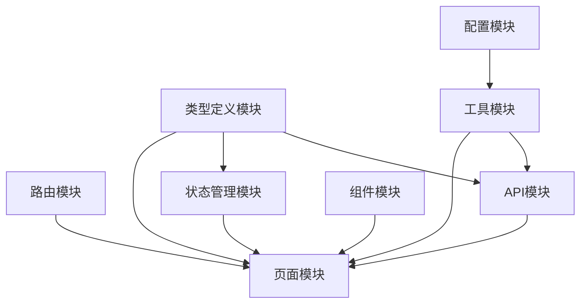
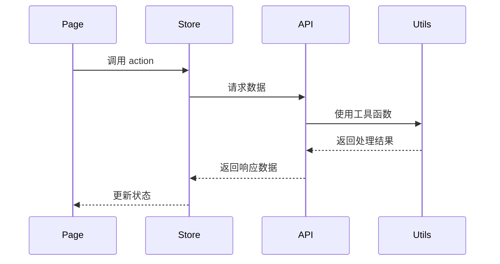

# 模块协作指南

> 项目模块划分、依赖关系和协作开发原则

## 📋 项目模块架构总览

### 核心模块划分

本项目采用模块化架构，共分为 8 个核心模块：



#### 1. 路由模块 (Route Module)

- **位置**: `src/pages.json`
- **职责**: 管理应用所有页面路由配置
- **依赖**: 无依赖，被所有页面模块依赖
- **特点**: 配置即文档，声明式路由管理

#### 2. 页面模块 (Pages Module)

- **位置**: `src/pages/`
- **职责**: 具体业务页面实现
- **依赖**: Store 模块、API 模块、组件模块、工具模块
- **特点**: 业务逻辑集中，数据流向清晰

#### 3. 组件模块 (Components Module)

- **位置**: `src/components/`
- **职责**: 可复用的 UI 组件
- **依赖**: 工具模块(可选)
- **特点**: 高内聚低耦合，支持自动导入

#### 4. 状态管理模块 (Store Module)

- **位置**: `src/store/`
- **职责**: 应用状态管理和数据持久化
- **依赖**: 类型定义模块
- **特点**: 响应式状态，跨组件共享

#### 5. API 模块 (API Module)

- **位置**: `src/api/`
- **职责**: 网络请求接口封装
- **依赖**: 工具模块(request.ts)、类型定义模块
- **特点**: 统一请求管理，类型安全

#### 6. 工具模块 (Utils Module)

- **位置**: `src/utils/`
- **职责**: 通用工具函数和服务封装
- **依赖**: 配置模块
- **特点**: 纯函数设计，无副作用

#### 7. 配置模块 (Config Module)

- **位置**: `src/config/`
- **职责**: 应用配置和环境管理
- **依赖**: 无依赖，被多个模块依赖
- **特点**: 环境隔离，配置集中

#### 8. 类型定义模块 (Types Module)

- **位置**: `src/@types/`
- **职责**: TypeScript 类型声明
- **依赖**: 无依赖，被多个模块依赖
- **特点**: 全局类型，编译时检查

---

## 🏗️ 模块开发原则与约束

### 1. 路由模块开发原则

**核心原则**: 路由即文档，保持配置的清晰和可维护性

**开发约束**:

- ❌ **禁止直接修改** `pages.json` 文件
- ✅ **必须使用** `npm run add` 命令添加新页面
- ✅ **命名规范**: 页面路径使用 kebab-case (如: user-profile)
- ✅ **结构规范**: 每个页面必须有独立的文件夹

**配置模板**:

```json
{
  "path": "pages/module-name/page-name",
  "style": {
    "navigationBarTitleText": "页面标题",
    "enablePullDownRefresh": false
  }
}
```

### 2. 页面模块开发原则

**核心原则**: 页面职责单一，数据流向清晰

**开发约束**:

- ✅ **必须使用** `<script setup lang="ts">` 语法
- ✅ **必须定义** 明确的 TypeScript 类型
- ❌ **禁止在页面中** 直接调用 uni API，必须通过工具模块封装
- ✅ **状态管理**: 页面级状态使用 ref/reactive，应用级状态使用 Pinia
- ✅ **样式规范**: 使用 scoped + SCSS，支持 UnoCSS 原子类

**页面结构模板**:

```vue
<script setup lang="ts">
// 1. 导入依赖
import { ref, onMounted } from 'vue'
import { useUserStore } from '@/store/user'
import { getUserInfo } from '@/api/user'

// 2. 类型定义
interface PageData {
  loading: boolean
  userInfo: UserInfo | null
}

// 3. 响应式数据
const pageData = ref<PageData>({
  loading: false,
  userInfo: null
})

// 4. Store
const userStore = useUserStore()

// 5. 方法定义
const loadUserInfo = async () => {
  pageData.value.loading = true
  try {
    const result = await getUserInfo()
    pageData.value.userInfo = result.data
  } catch (error) {
    console.error('加载用户信息失败:', error)
  } finally {
    pageData.value.loading = false
  }
}

// 6. 生命周期
onMounted(() => {
  loadUserInfo()
})
</script>

<template>
  <view class="page-container">
    <!-- 页面内容 -->
  </view>
</template>

<style lang="scss" scoped>
.page-container {
  padding: 20rpx;
}
</style>
```

### 3. 组件模块开发原则

**核心原则**: 高内聚低耦合，可复用性优先

**开发约束**:

- ✅ **组件分类**: base(基础) / business(业务) / layout(布局)
- ✅ **命名规范**: PascalCase，语义化命名
- ✅ **Props 设计**: 明确类型，合理默认值
- ✅ **事件设计**: 使用 defineEmits，语义化事件名
- ❌ **禁止直接修改** props，通过事件通信

**组件结构模板**:

```vue
<script setup lang="ts">
// 1. 类型定义
interface Props {
  title: string
  type?: 'primary' | 'secondary'
  disabled?: boolean
}

interface Emits {
  click: [event: MouseEvent]
  change: [value: string]
}

// 2. Props 和 Emits
const props = withDefaults(defineProps<Props>(), {
  type: 'primary',
  disabled: false
})

const emit = defineEmits<Emits>()

// 3. 方法定义
const handleClick = (event: MouseEvent) => {
  if (!props.disabled) {
    emit('click', event)
  }
}
</script>

<template>
  <button 
    :class="[
      'base-button',
      `base-button--${type}`,
      { 'base-button--disabled': disabled }
    ]"
    @click="handleClick"
  >
    {{ title }}
  </button>
</template>

<style lang="scss" scoped>
.base-button {
  // 样式定义
}
</style>
```

### 4. 状态管理模块开发原则

**核心原则**: 状态最小化，操作原子化

**开发约束**:

- ✅ **Store 分割**: 按业务领域划分 Store
- ✅ **状态设计**: 扁平化结构，避免深层嵌套
- ✅ **Action 设计**: 异步操作封装，错误处理完整
- ✅ **持久化**: 敏感数据加密存储
- ❌ **禁止在 Store 中** 直接调用 uni API

**Store 结构模板**:

```typescript
// store/user.ts
import { defineStore } from 'pinia'
import { getUserInfo, updateUserInfo } from '@/api/user'

interface UserState {
  userInfo: UserInfo | null
  isLoggedIn: boolean
  loading: boolean
}

export const useUserStore = defineStore('user', {
  // 1. 状态定义
  state: (): UserState => ({
    userInfo: null,
    isLoggedIn: false,
    loading: false
  }),

  // 2. 计算属性
  getters: {
    userName: (state) => state.userInfo?.name || '未登录',
    hasPermission: (state) => (permission: string) => {
      return state.userInfo?.permissions?.includes(permission) || false
    }
  },

  // 3. 操作方法
  actions: {
    async fetchUserInfo() {
      this.loading = true
      try {
        const result = await getUserInfo()
        this.userInfo = result.data
        this.isLoggedIn = true
      } catch (error) {
        console.error('获取用户信息失败:', error)
        throw error
      } finally {
        this.loading = false
      }
    },

    async updateProfile(data: Partial<UserInfo>) {
      try {
        const result = await updateUserInfo(data)
        this.userInfo = { ...this.userInfo, ...result.data }
      } catch (error) {
        console.error('更新用户信息失败:', error)
        throw error
      }
    },

    logout() {
      this.userInfo = null
      this.isLoggedIn = false
    }
  },

  // 4. 持久化配置
  persist: {
    key: 'user-store',
    storage: localStorage,
    paths: ['userInfo', 'isLoggedIn']
  }
})
```

### 5. API 模块开发原则

**核心原则**: 接口即契约，类型安全优先

**开发约束**:

- ✅ **接口分组**: 按业务模块组织接口
- ✅ **类型定义**: 完整的请求/响应类型
- ✅ **错误处理**: 统一错误处理机制
- ✅ **请求封装**: 使用底座 request 工具
- ❌ **禁止直接使用** uni.request

**API 结构模板**:

```typescript
// api/user.ts
import request from '@/utils/request'

// 1. 类型定义
interface LoginParams {
  username: string
  password: string
}

interface LoginResponse {
  token: string
  userInfo: UserInfo
}

// 2. 接口实现
export const userApi = {
  // 用户登录
  login(params: LoginParams) {
    return request.post<LoginResponse>('/auth/login', params)
  },

  // 获取用户信息
  getUserInfo() {
    return request.get<UserInfo>('/user/info')
  },

  // 更新用户信息
  updateUserInfo(data: Partial<UserInfo>) {
    return request.put<UserInfo>('/user/info', data)
  },

  // 上传头像
  uploadAvatar(file: File) {
    const formData = new FormData()
    formData.append('avatar', file)
    return request.post<{ url: string }>('/user/avatar', formData, {
      headers: { 'Content-Type': 'multipart/form-data' }
    })
  }
}

// 3. 导出便捷方法（可选）
export const { login, getUserInfo, updateUserInfo, uploadAvatar } = userApi
```

### 6. 工具模块开发原则

**核心原则**: 纯函数设计，无副作用

**开发约束**:

- ✅ **函数式编程**: 纯函数，可预测的输入输出
- ✅ **类型安全**: 完整的类型定义
- ✅ **单一职责**: 每个工具函数只做一件事
- ✅ **可测试性**: 易于单元测试
- ❌ **禁止修改** 底座核心工具函数

**工具函数模板**:

```typescript
// utils/formatters.ts

/**
 * 格式化日期
 * @param date 日期对象或时间戳
 * @param format 格式字符串
 * @returns 格式化后的日期字符串
 */
export function formatDate(
  date: Date | number | string,
  format: string = 'YYYY-MM-DD'
): string {
  const d = new Date(date)
  
  if (isNaN(d.getTime())) {
    throw new Error('Invalid date')
  }

  const year = d.getFullYear()
  const month = String(d.getMonth() + 1).padStart(2, '0')
  const day = String(d.getDate()).padStart(2, '0')
  const hour = String(d.getHours()).padStart(2, '0')
  const minute = String(d.getMinutes()).padStart(2, '0')
  const second = String(d.getSeconds()).padStart(2, '0')

  return format
    .replace('YYYY', String(year))
    .replace('MM', month)
    .replace('DD', day)
    .replace('HH', hour)
    .replace('mm', minute)
    .replace('ss', second)
}

/**
 * 格式化文件大小
 * @param bytes 字节数
 * @param decimals 小数位数
 * @returns 格式化后的文件大小
 */
export function formatFileSize(bytes: number, decimals: number = 2): string {
  if (bytes === 0) return '0 Bytes'

  const k = 1024
  const dm = decimals < 0 ? 0 : decimals
  const sizes = ['Bytes', 'KB', 'MB', 'GB', 'TB']

  const i = Math.floor(Math.log(bytes) / Math.log(k))

  return parseFloat((bytes / Math.pow(k, i)).toFixed(dm)) + ' ' + sizes[i]
}
```

---

## 🔄 模块间通信规范

### 1. 数据流向



### 2. 依赖注入原则

```typescript
// ✅ 正确的依赖方式
// 页面依赖 Store
const userStore = useUserStore()

// Store 依赖 API
import { getUserInfo } from '@/api/user'

// API 依赖 Utils
import request from '@/utils/request'

// ❌ 错误的依赖方式
// Store 直接依赖页面组件
// API 直接操作 DOM
// Utils 依赖具体业务逻辑
```

### 3. 事件通信

```typescript
// 组件间通信
// 父组件 -> 子组件: Props
// 子组件 -> 父组件: Events
// 兄弟组件: 通过共同父组件或 Store

// 页面间通信
// 路由参数传递
// Store 状态共享
// 事件总线（谨慎使用）
```

---

## 📊 模块质量度量

### 1. 代码质量指标

- **圈复杂度**: 单个函数 < 10
- **文件行数**: 单个文件 < 300 行
- **函数行数**: 单个函数 < 50 行
- **类型覆盖率**: > 90%

### 2. 依赖关系检查

```bash
# 检查循环依赖
npm run check-circular

# 分析依赖关系
npm run analyze-deps

# 检查未使用的依赖
npm run check-unused
```

### 3. 模块独立性验证

- 每个模块可以独立测试
- 模块间接口稳定
- 模块内部实现可以独立修改

---

## 🛠️ 开发工作流

### 1. 新功能开发流程

```bash
# 1. 创建功能分支
git checkout -b feature/user-profile

# 2. 定义类型（如需要）
# 编辑 src/@types/user.d.ts

# 3. 实现 API 接口
# 编辑 src/api/user.ts

# 4. 创建 Store（如需要）
# 编辑 src/store/user.ts

# 5. 创建组件（如需要）
# 编辑 src/components/UserProfile.vue

# 6. 创建页面
npm run add  # 使用脚本创建页面

# 7. 测试和调试
npm run dev:h5
npm run lint
npm run type-check

# 8. 提交代码
git add .
git commit -m "feat: 添加用户资料页面"
```

### 2. 模块重构流程

```bash
# 1. 分析现有模块依赖
npm run analyze-deps

# 2. 制定重构计划
# - 确定重构范围
# - 评估影响面
# - 制定测试策略

# 3. 逐步重构
# - 保持接口兼容
# - 增量式修改
# - 持续测试验证

# 4. 清理旧代码
# - 移除废弃代码
# - 更新文档
# - 通知团队
```

---

## 🚨 常见问题和解决方案

### 1. 循环依赖问题

**问题**: 模块 A 依赖模块 B，模块 B 又依赖模块 A

**解决方案**:
```typescript
// ❌ 循环依赖
// moduleA.ts
import { funcB } from './moduleB'

// moduleB.ts  
import { funcA } from './moduleA'

// ✅ 解决方案1: 提取公共依赖
// common.ts
export const sharedFunc = () => {}

// moduleA.ts
import { sharedFunc } from './common'

// moduleB.ts
import { sharedFunc } from './common'

// ✅ 解决方案2: 依赖注入
// moduleA.ts
export const createModuleA = (deps: { funcB: Function }) => {
  return {
    funcA: () => deps.funcB()
  }
}
```

### 2. 状态管理混乱

**问题**: 状态散落在各个组件中，难以维护

**解决方案**:
```typescript
// ❌ 状态分散
// ComponentA.vue
const userInfo = ref(null)

// ComponentB.vue  
const userInfo = ref(null)

// ✅ 集中状态管理
// store/user.ts
export const useUserStore = defineStore('user', {
  state: () => ({ userInfo: null })
})

// ComponentA.vue
const userStore = useUserStore()

// ComponentB.vue
const userStore = useUserStore()
```

### 3. 类型定义不一致

**问题**: 同一个数据结构在不同地方有不同的类型定义

**解决方案**:
```typescript
// ❌ 类型重复定义
// api/user.ts
interface User { id: string; name: string }

// store/user.ts
interface UserInfo { id: string; name: string }

// ✅ 统一类型定义
// @types/user.d.ts
interface UserInfo {
  id: string
  name: string
  email: string
}

// 其他文件直接使用全局类型
// api/user.ts
export const getUserInfo = (): Promise<UserInfo> => {}

// store/user.ts
const userInfo = ref<UserInfo | null>(null)
```

---

*下一步: [页面开发指南](./05-page-development.md)*