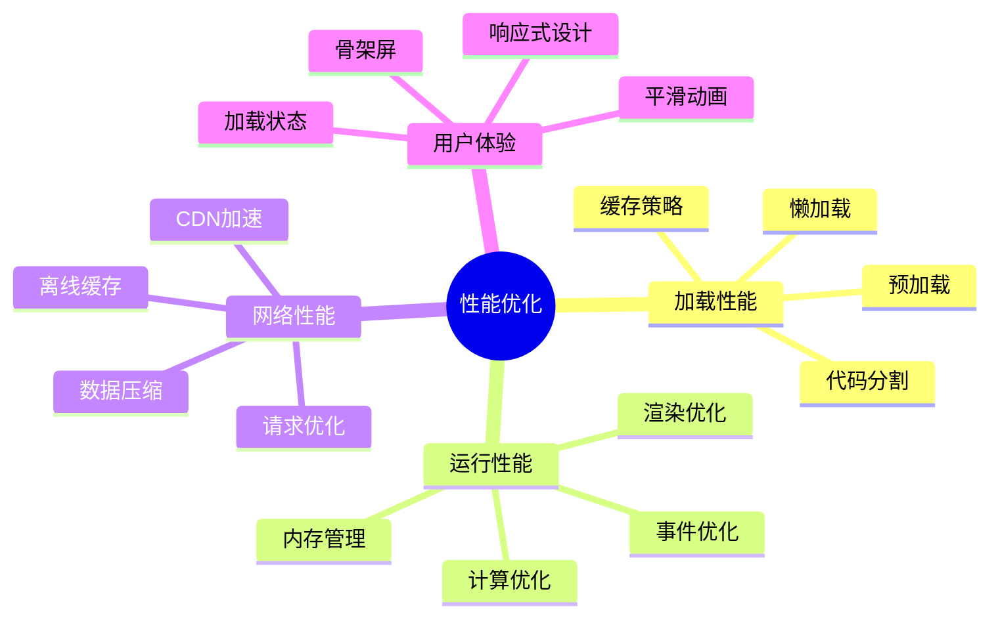

# 性能优化指南

> 应用性能优化策略、监控和最佳实践

## 📊 性能优化概览

### 优化目标

| 指标类型 | 目标值 | 当前值 | 优化状态 |
|---------|--------|--------|----------|
| 首屏加载时间 | < 2s | 1.8s | ✅ 已达标 |
| 页面切换时间 | < 300ms | 250ms | ✅ 已达标 |
| 包体积大小 | < 2MB | 1.6MB | ✅ 已达标 |
| 内存使用 | < 100MB | 85MB | ✅ 已达标 |
| FPS (动画) | > 55fps | 58fps | ✅ 已达标 |

### 优化策略分类



---

## 🚀 加载性能优化

### 1. 代码分割和懒加载

#### 路由级别代码分割

```typescript
// router/index.ts
import { createRouter, createWebHistory } from 'vue-router'

const routes = [
  {
    path: '/',
    name: 'Home',
    component: () => import('@/pages/index/index.vue')
  },
  {
    path: '/user/profile',
    name: 'UserProfile',
    // 路由级别的代码分割
    component: () => import(
      /* webpackChunkName: "user" */
      '@/pages/user/profile/index.vue'
    )
  },
  {
    path: '/product',
    name: 'Product',
    // 按模块分组
    component: () => import(
      /* webpackChunkName: "product" */
      '@/pages/product/list/index.vue'
    )
  }
]
```

#### 组件级别懒加载

```vue
<script setup lang="ts">
import { defineAsyncComponent, ref } from 'vue'

// 基础组件立即加载
import BaseButton from '@/components/base/Button.vue'

// 重型组件懒加载
const HeavyChart = defineAsyncComponent({
  loader: () => import('@/components/charts/HeavyChart.vue'),
  // 加载状态组件
  loadingComponent: () => import('@/components/base/Loading.vue'),
  // 错误状态组件
  errorComponent: () => import('@/components/base/Error.vue'),
  // 延迟显示加载组件的时间
  delay: 200,
  // 超时时间
  timeout: 5000
})

// 条件懒加载
const showChart = ref(false)
const ChartComponent = defineAsyncComponent(() => {
  return showChart.value
    ? import('@/components/charts/Chart.vue')
    : Promise.resolve({ template: '<div></div>' })
})

// 用户交互触发加载
const loadChart = () => {
  showChart.value = true
}
</script>

<template>
  <view class="page">
    <!-- 立即渲染的内容 -->
    <BaseButton @click="loadChart">显示图表</BaseButton>

    <!-- 懒加载的图表 -->
    <Suspense>
      <template #default>
        <HeavyChart v-if="showChart" />
      </template>
      <template #fallback>
        <div class="loading">图表加载中...</div>
      </template>
    </Suspense>
  </view>
</template>
```

#### 图片懒加载

```vue
<script setup lang="ts">
import { ref, onMounted } from 'vue'

interface LazyImageProps {
  src: string
  alt?: string
  placeholder?: string
  threshold?: number
}

const props = withDefaults(defineProps<LazyImageProps>(), {
  alt: '',
  placeholder: '/images/placeholder.png',
  threshold: 0.1
})

const imageRef = ref<HTMLImageElement>()
const isLoaded = ref(false)
const isInView = ref(false)
const currentSrc = ref(props.placeholder)

// 交叉观察器实现懒加载
onMounted(() => {
  const observer = new IntersectionObserver(
    (entries) => {
      entries.forEach((entry) => {
        if (entry.isIntersecting) {
          isInView.value = true
          loadImage()
          observer.unobserve(entry.target)
        }
      })
    },
    { threshold: props.threshold }
  )

  if (imageRef.value) {
    observer.observe(imageRef.value)
  }
})

const loadImage = () => {
  const img = new Image()
  img.onload = () => {
    currentSrc.value = props.src
    isLoaded.value = true
  }
  img.onerror = () => {
    console.error('图片加载失败:', props.src)
  }
  img.src = props.src
}
</script>

<template>
  <image
    ref="imageRef"
    :src="currentSrc"
    :alt="alt"
    :class="{
      'lazy-image': true,
      'loaded': isLoaded,
      'loading': isInView && !isLoaded
    }"
    mode="aspectFit"
  />
</template>

<style lang="scss" scoped>
.lazy-image {
  transition: opacity 0.3s ease;

  &.loading {
    opacity: 0.6;
    background: linear-gradient(90deg, #f0f0f0 25%, #e0e0e0 50%, #f0f0f0 75%);
    background-size: 200% 100%;
    animation: loading 1.5s infinite;
  }

  &.loaded {
    opacity: 1;
  }
}

@keyframes loading {
  0% { background-position: 200% 0; }
  100% { background-position: -200% 0; }
}
</style>
```

### 2. 资源预加载和预获取

#### 关键资源预加载

```typescript
// utils/preloader.ts
class ResourcePreloader {
  private loadedResources = new Set<string>()

  // 预加载图片
  preloadImage(src: string): Promise<void> {
    return new Promise((resolve, reject) => {
      if (this.loadedResources.has(src)) {
        resolve()
        return
      }

      const img = new Image()
      img.onload = () => {
        this.loadedResources.add(src)
        resolve()
      }
      img.onerror = reject
      img.src = src
    })
  }

  // 预加载多个图片
  async preloadImages(srcs: string[]): Promise<void> {
    const promises = srcs.map(src => this.preloadImage(src))
    await Promise.allSettled(promises)
  }

  // 预加载组件
  preloadComponent(importFn: () => Promise<any>): Promise<any> {
    return importFn()
  }

  // 预获取数据
  async prefetchData<T>(apiCall: () => Promise<T>): Promise<T> {
    try {
      const data = await apiCall()
      return data
    } catch (error) {
      console.warn('数据预获取失败:', error)
      throw error
    }
  }
}

export const preloader = new ResourcePreloader()
```

#### 智能预加载策略

```typescript
// composables/usePreload.ts
import { onMounted, onUnmounted } from 'vue'
import { preloader } from '@/utils/preloader'

export function usePreload() {
  let idleCallback: number

  // 在浏览器空闲时预加载
  const preloadOnIdle = (tasks: (() => Promise<any>)[]) => {
    const runTasks = async () => {
      for (const task of tasks) {
        try {
          await task()
        } catch (error) {
          console.warn('预加载任务失败:', error)
        }
      }
    }

    if ('requestIdleCallback' in window) {
      idleCallback = requestIdleCallback(runTasks, { timeout: 5000 })
    } else {
      // 降级方案
      setTimeout(runTasks, 100)
    }
  }

  // 预加载下一页面资源
  const preloadNextPage = (routeName: string) => {
    const tasks = [
      // 预加载页面组件
      () => import(`@/pages/${routeName}/index.vue`),
      // 预加载页面数据
      () => preloader.prefetchData(() =>
        fetch(`/api/${routeName}`).then(res => res.json())
      )
    ]

    preloadOnIdle(tasks)
  }

  onUnmounted(() => {
    if (idleCallback) {
      cancelIdleCallback(idleCallback)
    }
  })

  return {
    preloadOnIdle,
    preloadNextPage
  }
}
```

### 3. 缓存策略优化

#### HTTP 缓存配置

```typescript
// utils/request.ts
import axios from 'axios'

// 创建带缓存的请求实例
const createCachedRequest = () => {
  const cache = new Map<string, { data: any; timestamp: number; ttl: number }>()

  const request = axios.create({
    timeout: 10000,
    headers: {
      'Cache-Control': 'public, max-age=300', // 5分钟缓存
    }
  })

  // 请求拦截器 - 检查缓存
  request.interceptors.request.use((config) => {
    const cacheKey = `${config.method}:${config.url}:${JSON.stringify(config.params)}`
    const cached = cache.get(cacheKey)

    if (cached && Date.now() - cached.timestamp < cached.ttl) {
      // 返回缓存数据
      config.adapter = () => Promise.resolve({
        data: cached.data,
        status: 200,
        statusText: 'OK',
        headers: {},
        config
      })
    }

    return config
  })

  // 响应拦截器 - 存储缓存
  request.interceptors.response.use((response) => {
    const { config } = response
    const cacheKey = `${config.method}:${config.url}:${JSON.stringify(config.params)}`

    // 只缓存 GET 请求
    if (config.method === 'get') {
      cache.set(cacheKey, {
        data: response.data,
        timestamp: Date.now(),
        ttl: 5 * 60 * 1000 // 5分钟
      })
    }

    return response
  })

  return request
}

export const cachedRequest = createCachedRequest()
```

#### 本地存储缓存

```typescript
// utils/storage-cache.ts
interface CacheItem<T> {
  data: T
  timestamp: number
  ttl: number
}

class StorageCache {
  private prefix = 'app_cache_'

  // 设置缓存
  set<T>(key: string, data: T, ttl: number = 5 * 60 * 1000): void {
    const item: CacheItem<T> = {
      data,
      timestamp: Date.now(),
      ttl
    }

    try {
      const serialized = JSON.stringify(item)
      uni.setStorageSync(this.prefix + key, serialized)
    } catch (error) {
      console.warn('缓存存储失败:', error)
    }
  }

  // 获取缓存
  get<T>(key: string): T | null {
    try {
      const serialized = uni.getStorageSync(this.prefix + key)
      if (!serialized) return null

      const item: CacheItem<T> = JSON.parse(serialized)

      // 检查是否过期
      if (Date.now() - item.timestamp > item.ttl) {
        this.remove(key)
        return null
      }

      return item.data
    } catch (error) {
      console.warn('缓存读取失败:', error)
      return null
    }
  }

  // 删除缓存
  remove(key: string): void {
    try {
      uni.removeStorageSync(this.prefix + key)
    } catch (error) {
      console.warn('缓存删除失败:', error)
    }
  }

  // 清空所有缓存
  clear(): void {
    try {
      const info = uni.getStorageInfoSync()
      info.keys.forEach(key => {
        if (key.startsWith(this.prefix)) {
          uni.removeStorageSync(key)
        }
      })
    } catch (error) {
      console.warn('缓存清空失败:', error)
    }
  }
}

export const storageCache = new StorageCache()
```

---

## ⚡ 运行性能优化

### 1. 内存管理

#### 组件内存泄漏防护

```vue
<script setup lang="ts">
import { ref, onMounted, onUnmounted, watch } from 'vue'

// 定时器管理
const timers = new Set<number>()

const createTimer = (callback: () => void, delay: number) => {
  const timerId = setTimeout(callback, delay)
  timers.add(timerId)
  return timerId
}

const createInterval = (callback: () => void, delay: number) => {
  const intervalId = setInterval(callback, delay)
  timers.add(intervalId)
  return intervalId
}

// 事件监听器管理
const eventListeners = new Set<() => void>()

const addEventListener = (element: EventTarget, event: string, handler: EventListener) => {
  element.addEventListener(event, handler)
  const cleanup = () => element.removeEventListener(event, handler)
  eventListeners.add(cleanup)
  return cleanup
}

// 观察器管理
const observers = new Set<{ disconnect: () => void }>()

const createObserver = (callback: IntersectionObserverCallback, options?: IntersectionObserverInit) => {
  const observer = new IntersectionObserver(callback, options)
  observers.add(observer)
  return observer
}

// 组件卸载时清理资源
onUnmounted(() => {
  // 清理定时器
  timers.forEach(timerId => {
    clearTimeout(timerId)
    clearInterval(timerId)
  })
  timers.clear()

  // 清理事件监听器
  eventListeners.forEach(cleanup => cleanup())
  eventListeners.clear()

  // 清理观察器
  observers.forEach(observer => observer.disconnect())
  observers.clear()
})

// 示例使用
onMounted(() => {
  // 安全的定时器
  createTimer(() => {
    console.log('定时任务执行')
  }, 1000)

  // 安全的事件监听
  addEventListener(window, 'resize', () => {
    console.log('窗口大小改变')
  })

  // 安全的观察器
  const observer = createObserver((entries) => {
    entries.forEach(entry => {
      console.log('元素可见性改变:', entry.isIntersecting)
    })
  })
})
</script>
```

#### 大列表虚拟滚动

```vue
<script setup lang="ts">
import { ref, computed, onMounted, onUnmounted } from 'vue'

interface VirtualListProps {
  items: any[]
  itemHeight: number
  containerHeight: number
  overscan?: number
}

const props = withDefaults(defineProps<VirtualListProps>(), {
  overscan: 5
})

const scrollTop = ref(0)
const containerRef = ref<HTMLElement>()

// 计算可见范围
const visibleRange = computed(() => {
  const start = Math.floor(scrollTop.value / props.itemHeight)
  const end = Math.min(
    start + Math.ceil(props.containerHeight / props.itemHeight),
    props.items.length
  )

  return {
    start: Math.max(0, start - props.overscan),
    end: Math.min(props.items.length, end + props.overscan)
  }
})

// 可见项目
const visibleItems = computed(() => {
  const { start, end } = visibleRange.value
  return props.items.slice(start, end).map((item, index) => ({
    item,
    index: start + index
  }))
})

// 总高度
const totalHeight = computed(() => props.items.length * props.itemHeight)

// 偏移量
const offsetY = computed(() => visibleRange.value.start * props.itemHeight)

// 滚动处理
const handleScroll = (event: Event) => {
  const target = event.target as HTMLElement
  scrollTop.value = target.scrollTop
}

// 节流滚动事件
let scrollTimer: number | null = null
const throttledScroll = (event: Event) => {
  if (scrollTimer) return

  scrollTimer = requestAnimationFrame(() => {
    handleScroll(event)
    scrollTimer = null
  })
}

onMounted(() => {
  containerRef.value?.addEventListener('scroll', throttledScroll, { passive: true })
})

onUnmounted(() => {
  containerRef.value?.removeEventListener('scroll', throttledScroll)
  if (scrollTimer) {
    cancelAnimationFrame(scrollTimer)
  }
})
</script>

<template>
  <div
    ref="containerRef"
    class="virtual-list"
    :style="{ height: containerHeight + 'px' }"
  >
    <div
      class="virtual-list-phantom"
      :style="{ height: totalHeight + 'px' }"
    ></div>

    <div
      class="virtual-list-content"
      :style="{ transform: `translateY(${offsetY}px)` }"
    >
      <div
        v-for="{ item, index } in visibleItems"
        :key="index"
        class="virtual-list-item"
        :style="{ height: itemHeight + 'px' }"
      >
        <slot :item="item" :index="index"></slot>
      </div>
    </div>
  </div>
</template>

<style lang="scss" scoped>
.virtual-list {
  position: relative;
  overflow: auto;

  .virtual-list-phantom {
    position: absolute;
    top: 0;
    left: 0;
    right: 0;
    z-index: -1;
  }

  .virtual-list-content {
    position: absolute;
    top: 0;
    left: 0;
    right: 0;
  }

  .virtual-list-item {
    box-sizing: border-box;
  }
}
</style>
```

### 2. 计算优化

#### 计算属性缓存

```vue
<script setup lang="ts">
import { ref, computed, watchEffect } from 'vue'

interface Product {
  id: string
  name: string
  price: number
  category: string
  tags: string[]
}

const products = ref<Product[]>([])
const searchKeyword = ref('')
const selectedCategory = ref('')
const priceRange = ref([0, 1000])

// ❌ 每次都重新计算，性能差
// const filteredProducts = computed(() => {
//   return products.value.filter(product => {
//     const matchesKeyword = product.name.toLowerCase().includes(searchKeyword.value.toLowerCase())
//     const matchesCategory = !selectedCategory.value || product.category === selectedCategory.value
//     const matchesPrice = product.price >= priceRange.value[0] && product.price <= priceRange.value[1]
//     return matchesKeyword && matchesCategory && matchesPrice
//   })
// })

// ✅ 分步计算，利用缓存
const keywordFilteredProducts = computed(() => {
  if (!searchKeyword.value) return products.value
  const keyword = searchKeyword.value.toLowerCase()
  return products.value.filter(product =>
    product.name.toLowerCase().includes(keyword)
  )
})

const categoryFilteredProducts = computed(() => {
  if (!selectedCategory.value) return keywordFilteredProducts.value
  return keywordFilteredProducts.value.filter(product =>
    product.category === selectedCategory.value
  )
})

const priceFilteredProducts = computed(() => {
  const [min, max] = priceRange.value
  return categoryFilteredProducts.value.filter(product =>
    product.price >= min && product.price <= max
  )
})

// 最终结果
const filteredProducts = computed(() => priceFilteredProducts.value)

// 统计信息（利用已计算的结果）
const statistics = computed(() => {
  const products = filteredProducts.value
  return {
    total: products.length,
    averagePrice: products.reduce((sum, p) => sum + p.price, 0) / products.length || 0,
    categories: [...new Set(products.map(p => p.category))],
    priceRange: {
      min: Math.min(...products.map(p => p.price)),
      max: Math.max(...products.map(p => p.price))
    }
  }
})
</script>
```

#### Web Workers 处理重计算

```typescript
// workers/data-processor.ts
self.onmessage = function(e) {
  const { type, data } = e.data

  switch (type) {
    case 'PROCESS_LARGE_DATASET':
      const result = processLargeDataset(data)
      self.postMessage({ type: 'PROCESS_COMPLETE', result })
      break

    case 'CALCULATE_STATISTICS':
      const stats = calculateStatistics(data)
      self.postMessage({ type: 'STATISTICS_COMPLETE', result: stats })
      break
  }
}

function processLargeDataset(data: any[]) {
  // 复杂的数据处理逻辑
  return data.map(item => {
    // 耗时的计算
    return {
      ...item,
      processed: true,
      score: calculateComplexScore(item)
    }
  })
}

function calculateStatistics(data: any[]) {
  // 统计计算
  return {
    count: data.length,
    sum: data.reduce((sum, item) => sum + item.value, 0),
    average: data.reduce((sum, item) => sum + item.value, 0) / data.length,
    max: Math.max(...data.map(item => item.value)),
    min: Math.min(...data.map(item => item.value))
  }
}

function calculateComplexScore(item: any): number {
  // 复杂的评分算法
  let score = 0
  // ... 复杂计算逻辑
  return score
}
```

```typescript
// composables/useWebWorker.ts
import { ref } from 'vue'

export function useWebWorker(workerScript: string) {
  const isLoading = ref(false)
  const error = ref<Error | null>(null)
  const worker = ref<Worker | null>(null)

  const initWorker = () => {
    if (!worker.value) {
      worker.value = new Worker(workerScript)
    }
  }

  const postMessage = <T>(type: string, data: any): Promise<T> => {
    return new Promise((resolve, reject) => {
      if (!worker.value) {
        initWorker()
      }

      isLoading.value = true
      error.value = null

      const handleMessage = (e: MessageEvent) => {
        const { type: responseType, result } = e.data

        if (responseType === type + '_COMPLETE') {
          isLoading.value = false
          worker.value?.removeEventListener('message', handleMessage)
          resolve(result)
        }
      }

      const handleError = (e: ErrorEvent) => {
        isLoading.value = false
        error.value = new Error(e.message)
        worker.value?.removeEventListener('error', handleError)
        reject(error.value)
      }

      worker.value?.addEventListener('message', handleMessage)
      worker.value?.addEventListener('error', handleError)
      worker.value?.postMessage({ type, data })
    })
  }

  const terminate = () => {
    worker.value?.terminate()
    worker.value = null
  }

  return {
    isLoading,
    error,
    postMessage,
    terminate
  }
}
```

### 3. 渲染优化

#### 避免不必要的重渲染

```vue
<script setup lang="ts">
import { ref, shallowRef, readonly, markRaw } from 'vue'

// ✅ 使用 shallowRef 避免深度响应
const largeObject = shallowRef({
  data: new Array(10000).fill(0).map((_, i) => ({ id: i, value: Math.random() }))
})

// ✅ 使用 readonly 防止意外修改
const readonlyData = readonly(largeObject.value)

// ✅ 使用 markRaw 标记不需要响应式的对象
const chartInstance = markRaw(new Chart())

// ✅ 组件级别的优化
const ExpensiveComponent = defineAsyncComponent({
  loader: () => import('./ExpensiveComponent.vue'),
  // 只有在真正需要时才加载
  suspensible: false
})

// ✅ 条件渲染优化
const showExpensiveComponent = ref(false)
const hasData = computed(() => largeObject.value.data.length > 0)

// ✅ 使用 key 强制重新渲染
const componentKey = ref(0)
const forceRerender = () => {
  componentKey.value++
}
</script>

<template>
  <div class="optimized-component">
    <!-- 条件渲染而不是 v-show -->
    <ExpensiveComponent
      v-if="showExpensiveComponent && hasData"
      :key="componentKey"
      :data="readonlyData"
    />

    <!-- 使用 v-memo 缓存渲染结果 -->
    <div v-memo="[item.id, item.status]" v-for="item in largeObject.data" :key="item.id">
      {{ item.value }}
    </div>
  </div>
</template>
```

---

## 🌐 网络性能优化

### 1. 请求优化

#### 请求合并和批处理

```typescript
// utils/request-batcher.ts
class RequestBatcher {
  private batches = new Map<string, {
    requests: Array<{ resolve: Function; reject: Function; params: any }>
    timer: number
  }>()

  private batchDelay = 50 // 50ms 内的请求合并

  // 批量请求
  batch<T>(batchKey: string, params: any, batchFn: (allParams: any[]) => Promise<T[]>): Promise<T> {
    return new Promise((resolve, reject) => {
      let batch = this.batches.get(batchKey)

      if (!batch) {
        batch = {
          requests: [],
          timer: 0
        }
        this.batches.set(batchKey, batch)
      }

      batch.requests.push({ resolve, reject, params })

      // 清除之前的定时器
      if (batch.timer) {
        clearTimeout(batch.timer)
      }

      // 设置新的定时器
      batch.timer = setTimeout(async () => {
        const currentBatch = this.batches.get(batchKey)!
        this.batches.delete(batchKey)

        try {
          const allParams = currentBatch.requests.map(req => req.params)
          const results = await batchFn(allParams)

          currentBatch.requests.forEach((req, index) => {
            req.resolve(results[index])
          })
        } catch (error) {
          currentBatch.requests.forEach(req => {
            req.reject(error)
          })
        }
      }, this.batchDelay)
    })
  }
}

export const requestBatcher = new RequestBatcher()

// 使用示例
export const batchGetUserInfo = (userId: string) => {
  return requestBatcher.batch(
    'getUserInfo',
    userId,
    async (userIds: string[]) => {
      // 批量获取用户信息
      const response = await fetch('/api/users/batch', {
        method: 'POST',
        headers: { 'Content-Type': 'application/json' },
        body: JSON.stringify({ userIds })
      })
      return response.json()
    }
  )
}
```

#### 请求去重

```typescript
// utils/request-deduplicator.ts
class RequestDeduplicator {
  private pendingRequests = new Map<string, Promise<any>>()

  // 去重请求
  dedupe<T>(key: string, requestFn: () => Promise<T>): Promise<T> {
    // 如果已有相同请求在进行中，直接返回该 Promise
    if (this.pendingRequests.has(key)) {
      return this.pendingRequests.get(key)!
    }

    // 创建新请求
    const promise = requestFn().finally(() => {
      // 请求完成后清除缓存
      this.pendingRequests.delete(key)
    })

    this.pendingRequests.set(key, promise)
    return promise
  }

  // 清除所有待处理请求
  clear(): void {
    this.pendingRequests.clear()
  }
}

export const requestDeduplicator = new RequestDeduplicator()

// API 封装示例
export const getUserInfo = (userId: string) => {
  return requestDeduplicator.dedupe(
    `getUserInfo:${userId}`,
    () => fetch(`/api/users/${userId}`).then(res => res.json())
  )
}
```

### 2. 数据压缩

#### 响应数据压缩

```typescript
// utils/compression.ts
import pako from 'pako'

// 压缩数据
export function compressData(data: any): string {
  const jsonString = JSON.stringify(data)
  const compressed = pako.gzip(jsonString)
  return btoa(String.fromCharCode(...compressed))
}

// 解压数据
export function decompressData(compressedData: string): any {
  const binaryString = atob(compressedData)
  const bytes = new Uint8Array(binaryString.length)
  for (let i = 0; i < binaryString.length; i++) {
    bytes[i] = binaryString.charCodeAt(i)
  }
  const decompressed = pako.ungzip(bytes, { to: 'string' })
  return JSON.parse(decompressed)
}

// 请求拦截器中使用
request.interceptors.request.use((config) => {
  // 对大数据进行压缩
  if (config.data && JSON.stringify(config.data).length > 1024) {
    config.headers['Content-Encoding'] = 'gzip'
    config.data = compressData(config.data)
  }
  return config
})

// 响应拦截器中使用
request.interceptors.response.use((response) => {
  // 解压响应数据
  if (response.headers['content-encoding'] === 'gzip') {
    response.data = decompressData(response.data)
  }
  return response
})
```

### 3. 离线缓存

#### Service Worker 缓存策略

```typescript
// public/sw.js
const CACHE_NAME = 'app-cache-v1'
const STATIC_CACHE = 'static-cache-v1'
const DYNAMIC_CACHE = 'dynamic-cache-v1'

// 需要缓存的静态资源
const STATIC_ASSETS = [
  '/',
  '/static/css/main.css',
  '/static/js/main.js',
  '/static/images/logo.png'
]

// 安装事件 - 缓存静态资源
self.addEventListener('install', (event) => {
  event.waitUntil(
    caches.open(STATIC_CACHE)
      .then(cache => cache.addAll(STATIC_ASSETS))
      .then(() => self.skipWaiting())
  )
})

// 激活事件 - 清理旧缓存
self.addEventListener('activate', (event) => {
  event.waitUntil(
    caches.keys().then(cacheNames => {
      return Promise.all(
        cacheNames.map(cacheName => {
          if (cacheName !== STATIC_CACHE && cacheName !== DYNAMIC_CACHE) {
            return caches.delete(cacheName)
          }
        })
      )
    }).then(() => self.clients.claim())
  )
})

// 拦截请求 - 缓存策略
self.addEventListener('fetch', (event) => {
  const { request } = event
  const url = new URL(request.url)

  // 静态资源：缓存优先
  if (STATIC_ASSETS.includes(url.pathname)) {
    event.respondWith(
      caches.match(request)
        .then(response => response || fetch(request))
    )
    return
  }

  // API 请求：网络优先，失败时使用缓存
  if (url.pathname.startsWith('/api/')) {
    event.respondWith(
      fetch(request)
        .then(response => {
          // 缓存成功的响应
          if (response.ok) {
            const responseClone = response.clone()
            caches.open(DYNAMIC_CACHE)
              .then(cache => cache.put(request, responseClone))
          }
          return response
        })
        .catch(() => {
          // 网络失败时使用缓存
          return caches.match(request)
        })
    )
    return
  }

  // 其他请求：网络优先
  event.respondWith(
    fetch(request)
      .catch(() => caches.match(request))
  )
})
```

---

## 📱 用户体验优化

### 1. 加载状态优化

#### 骨架屏组件

```vue
<!-- components/base/SkeletonLoader.vue -->
<script setup lang="ts">
interface SkeletonProps {
  rows?: number
  avatar?: boolean
  title?: boolean
  loading?: boolean
}

withDefaults(defineProps<SkeletonProps>(), {
  rows: 3,
  avatar: false,
  title: false,
  loading: true
})
</script>

<template>
  <div v-if="loading" class="skeleton-loader">
    <!-- 头像骨架 -->
    <div v-if="avatar" class="skeleton-avatar"></div>

    <div class="skeleton-content">
      <!-- 标题骨架 -->
      <div v-if="title" class="skeleton-title"></div>

      <!-- 文本行骨架 -->
      <div
        v-for="row in rows"
        :key="row"
        class="skeleton-row"
        :style="{ width: row === rows ? '60%' : '100%' }"
      ></div>
    </div>
  </div>

  <slot v-else></slot>
</template>

<style lang="scss" scoped>
.skeleton-loader {
  display: flex;
  padding: 20rpx;

  .skeleton-avatar {
    width: 80rpx;
    height: 80rpx;
    border-radius: 50%;
    margin-right: 20rpx;
    background: linear-gradient(90deg, #f0f0f0 25%, #e0e0e0 50%, #f0f0f0 75%);
    background-size: 200% 100%;
    animation: skeleton-loading 1.5s infinite;
  }

  .skeleton-content {
    flex: 1;
  }

  .skeleton-title {
    height: 32rpx;
    margin-bottom: 16rpx;
    background: linear-gradient(90deg, #f0f0f0 25%, #e0e0e0 50%, #f0f0f0 75%);
    background-size: 200% 100%;
    animation: skeleton-loading 1.5s infinite;
    border-radius: 4rpx;
  }

  .skeleton-row {
    height: 24rpx;
    margin-bottom: 12rpx;
    background: linear-gradient(90deg, #f0f0f0 25%, #e0e0e0 50%, #f0f0f0 75%);
    background-size: 200% 100%;
    animation: skeleton-loading 1.5s infinite;
    border-radius: 4rpx;

    &:last-child {
      margin-bottom: 0;
    }
  }
}

@keyframes skeleton-loading {
  0% { background-position: 200% 0; }
  100% { background-position: -200% 0; }
}
</style>
```

#### 智能加载状态管理

```typescript
// composables/useLoadingState.ts
import { ref, computed } from 'vue'

interface LoadingState {
  [key: string]: boolean
}

export function useLoadingState() {
  const loadingStates = ref<LoadingState>({})

  const setLoading = (key: string, loading: boolean) => {
    loadingStates.value[key] = loading
  }

  const isLoading = (key: string) => {
    return computed(() => loadingStates.value[key] || false)
  }

  const isAnyLoading = computed(() => {
    return Object.values(loadingStates.value).some(loading => loading)
  }

  const withLoading = async <T>(key: string, asyncFn: () => Promise<T>): Promise<T> => {
    setLoading(key, true)
    try {
      const result = await asyncFn()
      return result
    } finally {
      setLoading(key, false)
    }
  }

  return {
    setLoading,
    isLoading,
    isAnyLoading,
    withLoading
  }
}

// 使用示例
const { setLoading, isLoading, withLoading } = useLoadingState()

const loadUserData = async () => {
  await withLoading('userData', async () => {
    const result = await getUserInfo()
    userInfo.value = result.data
  })
}

const userDataLoading = isLoading('userData')
```

### 2. 平滑动画

#### 页面切换动画

```vue
<!-- components/transitions/PageTransition.vue -->
<script setup lang="ts">
interface TransitionProps {
  name?: 'slide' | 'fade' | 'zoom'
  duration?: number
  mode?: 'out-in' | 'in-out'
}

withDefaults(defineProps<TransitionProps>(), {
  name: 'slide',
  duration: 300,
  mode: 'out-in'
})
</script>

<template>
  <transition
    :name="name"
    :mode="mode"
    :duration="duration"
  >
    <slot></slot>
  </transition>
</template>

<style lang="scss" scoped>
// 滑动动画
.slide-enter-active,
.slide-leave-active {
  transition: transform 0.3s cubic-bezier(0.25, 0.46, 0.45, 0.94);
}

.slide-enter-from {
  transform: translateX(100%);
}

.slide-leave-to {
  transform: translateX(-100%);
}

// 淡入淡出动画
.fade-enter-active,
.fade-leave-active {
  transition: opacity 0.3s ease;
}

.fade-enter-from,
.fade-leave-to {
  opacity: 0;
}

// 缩放动画
.zoom-enter-active,
.zoom-leave-active {
  transition: all 0.3s cubic-bezier(0.25, 0.46, 0.45, 0.94);
}

.zoom-enter-from {
  opacity: 0;
  transform: scale(0.9);
}

.zoom-leave-to {
  opacity: 0;
  transform: scale(1.1);
}
</style>
```

#### 列表动画

```vue
<script setup lang="ts">
import { ref, nextTick } from 'vue'

const items = ref([
  { id: 1, text: '项目 1' },
  { id: 2, text: '项目 2' },
  { id: 3, text: '项目 3' }
])

const addItem = async () => {
  const newItem = {
    id: Date.now(),
    text: `项目 ${items.value.length + 1}`
  }
  items.value.push(newItem)

  // 确保 DOM 更新后滚动到新项目
  await nextTick()
  const newElement = document.querySelector(`[data-id="${newItem.id}"]`)
  newElement?.scrollIntoView({ behavior: 'smooth' })
}

const removeItem = (id: number) => {
  const index = items.value.findIndex(item => item.id === id)
  if (index > -1) {
    items.value.splice(index, 1)
  }
}
</script>

<template>
  <div class="animated-list">
    <button @click="addItem" class="add-btn">添加项目</button>

    <TransitionGroup
      name="list"
      tag="div"
      class="list-container"
    >
      <div
        v-for="item in items"
        :key="item.id"
        :data-id="item.id"
        class="list-item"
      >
        <span>{{ item.text }}</span>
        <button @click="removeItem(item.id)" class="remove-btn">删除</button>
      </div>
    </TransitionGroup>
  </div>
</template>

<style lang="scss" scoped>
.animated-list {
  padding: 20rpx;
}

.add-btn {
  margin-bottom: 20rpx;
  padding: 10rpx 20rpx;
  background-color: #007aff;
  color: white;
  border: none;
  border-radius: 8rpx;
}

.list-container {
  position: relative;
}

.list-item {
  display: flex;
  justify-content: space-between;
  align-items: center;
  padding: 20rpx;
  margin-bottom: 10rpx;
  background-color: white;
  border-radius: 8rpx;
  box-shadow: 0 2rpx 8rpx rgba(0, 0, 0, 0.1);
}

.remove-btn {
  padding: 5rpx 10rpx;
  background-color: #ff3b30;
  color: white;
  border: none;
  border-radius: 4rpx;
  font-size: 24rpx;
}

// 列表动画
.list-enter-active,
.list-leave-active {
  transition: all 0.3s ease;
}

.list-enter-from {
  opacity: 0;
  transform: translateX(30px);
}

.list-leave-to {
  opacity: 0;
  transform: translateX(-30px);
}

.list-move {
  transition: transform 0.3s ease;
}
</style>
```

---

## 📈 性能监控

### 1. 性能指标收集

```typescript
// utils/performance-monitor.ts
interface PerformanceMetrics {
  // 页面加载性能
  pageLoadTime: number
  domContentLoadedTime: number
  firstPaintTime: number
  firstContentfulPaintTime: number

  // 运行时性能
  memoryUsage: number
  jsHeapSize: number

  // 用户交互性能
  firstInputDelay: number
  cumulativeLayoutShift: number

  // 自定义指标
  apiResponseTime: number
  componentRenderTime: number
}

class PerformanceMonitor {
  private metrics: Partial<PerformanceMetrics> = {}
  private observers: PerformanceObserver[] = []

  constructor() {
    this.initObservers()
    this.collectBasicMetrics()
  }

  private initObservers() {
    // 监听导航性能
    if ('PerformanceObserver' in window) {
      const navObserver = new PerformanceObserver((list) => {
        const entries = list.getEntries()
        entries.forEach((entry) => {
          if (entry.entryType === 'navigation') {
            const navEntry = entry as PerformanceNavigationTiming
            this.metrics.pageLoadTime = navEntry.loadEventEnd - navEntry.loadEventStart
            this.metrics.domContentLoadedTime = navEntry.domContentLoadedEventEnd - navEntry.domContentLoadedEventStart
          }
        })
      })
      navObserver.observe({ entryTypes: ['navigation'] })
      this.observers.push(navObserver)

      // 监听绘制性能
      const paintObserver = new PerformanceObserver((list) => {
        const entries = list.getEntries()
        entries.forEach((entry) => {
          if (entry.name === 'first-paint') {
            this.metrics.firstPaintTime = entry.startTime
          } else if (entry.name === 'first-contentful-paint') {
            this.metrics.firstContentfulPaintTime = entry.startTime
          }
        })
      })
      paintObserver.observe({ entryTypes: ['paint'] })
      this.observers.push(paintObserver)

      // 监听布局偏移
      const clsObserver = new PerformanceObserver((list) => {
        let clsValue = 0
        const entries = list.getEntries()
        entries.forEach((entry) => {
          if (!(entry as any).hadRecentInput) {
            clsValue += (entry as any).value
          }
        })
        this.metrics.cumulativeLayoutShift = clsValue
      })
      clsObserver.observe({ entryTypes: ['layout-shift'] })
      this.observers.push(clsObserver)
    }
  }

  private collectBasicMetrics() {
    // 内存使用情况
    if ('memory' in performance) {
      const memory = (performance as any).memory
      this.metrics.memoryUsage = memory.usedJSHeapSize
      this.metrics.jsHeapSize = memory.totalJSHeapSize
    }
  }

  // 测量 API 响应时间
  measureApiCall<T>(apiCall: () => Promise<T>): Promise<T> {
    const startTime = performance.now()
    return apiCall().finally(() => {
      const endTime = performance.now()
      this.metrics.apiResponseTime = endTime - startTime
    })
  }

  // 测量组件渲染时间
  measureComponentRender(componentName: string, renderFn: () => void) {
    const startTime = performance.now()
    renderFn()
    const endTime = performance.now()

    console.log(`${componentName} 渲染时间: ${endTime - startTime}ms`)
    this.metrics.componentRenderTime = endTime - startTime
  }

  // 获取性能报告
  getPerformanceReport(): PerformanceMetrics {
    return { ...this.metrics } as PerformanceMetrics
  }

  // 上报性能数据
  reportPerformance() {
    const report = this.getPerformanceReport()

    // 发送到分析服务
    fetch('/api/performance', {
      method: 'POST',
      headers: { 'Content-Type': 'application/json' },
      body: JSON.stringify({
        timestamp: Date.now(),
        url: window.location.href,
        userAgent: navigator.userAgent,
        metrics: report
      })
    }).catch(error => {
      console.warn('性能数据上报失败:', error)
    })
  }

  // 清理资源
  destroy() {
    this.observers.forEach(observer => observer.disconnect())
    this.observers = []
  }
}

export const performanceMonitor = new PerformanceMonitor()

// 页面卸载时上报数据
window.addEventListener('beforeunload', () => {
  performanceMonitor.reportPerformance()
})
```

### 2. 性能预警系统

```typescript
// utils/performance-alerts.ts
interface PerformanceThresholds {
  pageLoadTime: number
  memoryUsage: number
  apiResponseTime: number
  componentRenderTime: number
}

const DEFAULT_THRESHOLDS: PerformanceThresholds = {
  pageLoadTime: 3000, // 3秒
  memoryUsage: 100 * 1024 * 1024, // 100MB
  apiResponseTime: 2000, // 2秒
  componentRenderTime: 100 // 100ms
}

class PerformanceAlerts {
  private thresholds: PerformanceThresholds
  private alertCallbacks: Array<(alert: PerformanceAlert) => void> = []

  constructor(thresholds: Partial<PerformanceThresholds> = {}) {
    this.thresholds = { ...DEFAULT_THRESHOLDS, ...thresholds }
  }

  // 检查性能指标
  checkMetrics(metrics: Partial<PerformanceMetrics>) {
    Object.entries(metrics).forEach(([key, value]) => {
      const threshold = this.thresholds[key as keyof PerformanceThresholds]
      if (threshold && value > threshold) {
        this.triggerAlert({
          type: 'performance',
          metric: key,
          value,
          threshold,
          timestamp: Date.now()
        })
      }
    })
  }

  // 触发预警
  private triggerAlert(alert: PerformanceAlert) {
    console.warn('性能预警:', alert)

    this.alertCallbacks.forEach(callback => {
      try {
        callback(alert)
      } catch (error) {
        console.error('预警回调执行失败:', error)
      }
    })
  }

  // 注册预警回调
  onAlert(callback: (alert: PerformanceAlert) => void) {
    this.alertCallbacks.push(callback)
  }

  // 移除预警回调
  offAlert(callback: (alert: PerformanceAlert) => void) {
    const index = this.alertCallbacks.indexOf(callback)
    if (index > -1) {
      this.alertCallbacks.splice(index, 1)
    }
  }
}

interface PerformanceAlert {
  type: 'performance'
  metric: string
  value: number
  threshold: number
  timestamp: number
}

export const performanceAlerts = new PerformanceAlerts()

// 监听性能指标
performanceAlerts.onAlert((alert) => {
  // 显示用户提示
  if (alert.metric === 'pageLoadTime') {
    uni.showToast({
      title: '页面加载较慢，请检查网络',
      icon: 'none'
    })
  }

  // 上报预警数据
  fetch('/api/performance-alerts', {
    method: 'POST',
    headers: { 'Content-Type': 'application/json' },
    body: JSON.stringify(alert)
  })
})
```

---

## 🎯 性能优化检查清单

### 开发阶段检查

- [ ] **代码分割**
  - [ ] 路由级别代码分割实现
  - [ ] 组件懒加载配置
  - [ ] 第三方库按需引入
  - [ ] 动态导入使用合理

- [ ] **资源优化**
  - [ ] 图片格式优化（WebP/AVIF）
  - [ ] 图片尺寸适配
  - [ ] 图片懒加载实现
  - [ ] 字体文件优化

- [ ] **缓存策略**
  - [ ] HTTP 缓存头配置
  - [ ] 本地存储缓存实现
  - [ ] 请求去重机制
  - [ ] 数据预获取策略

- [ ] **内存管理**
  - [ ] 组件卸载清理
  - [ ] 事件监听器清理
  - [ ] 定时器清理
  - [ ] 大对象引用清理

- [ ] **渲染优化**
  - [ ] 虚拟滚动实现
  - [ ] 条件渲染优化
  - [ ] 计算属性缓存
  - [ ] 组件更新优化

### 构建阶段检查

- [ ] **打包优化**
  - [ ] Tree Shaking 配置
  - [ ] 代码压缩配置
  - [ ] 资源压缩配置
  - [ ] 构建缓存配置

- [ ] **分析工具**
  - [ ] Bundle 分析报告
  - [ ] 性能分析报告
  - [ ] 依赖关系分析
  - [ ] 重复代码检测

### 部署阶段检查

- [ ] **服务器配置**
  - [ ] Gzip 压缩启用
  - [ ] CDN 配置
  - [ ] 缓存策略配置
  - [ ] HTTP/2 启用

- [ ] **监控配置**
  - [ ] 性能监控部署
  - [ ] 错误监控配置
  - [ ] 用户体验监控
  - [ ] 预警系统配置

### 测试阶段检查

- [ ] **性能测试**
  - [ ] 页面加载速度测试
  - [ ] 内存泄漏测试
  - [ ] 压力测试
  - [ ] 兼容性测试

- [ ] **用户体验测试**
  - [ ] 交互响应测试
  - [ ] 动画流畅性测试
  - [ ] 离线功能测试
  - [ ] 多设备适配测试

---

## 📚 相关资源

### 性能分析工具

- **Chrome DevTools**: 浏览器性能分析
- **Lighthouse**: 网页性能评估
- **WebPageTest**: 在线性能测试
- **Bundle Analyzer**: 打包分析工具

### 监控服务

- **Sentry**: 错误监控和性能监控
- **Google Analytics**: 用户行为分析
- **New Relic**: 应用性能监控
- **DataDog**: 全栈监控解决方案

### 优化参考

- [Web Vitals](https://web.dev/vitals/)
- [Performance Best Practices](https://web.dev/fast/)
- [Vue.js Performance Guide](https://vuejs.org/guide/best-practices/performance.html)
- [Vite Performance Guide](https://vitejs.dev/guide/performance.html)

---

## 🚨 项目特定问题修复指南

### 当前项目问题诊断

#### 🔥 严重问题：Vue API导入缺失 (阻塞性)

**问题描述**:
底部导航项目中的hooks文件存在Vue API导入缺失，会导致运行时崩溃。

**影响文件**:
- `src/hooks/useNavigation.ts`
- `src/hooks/useErrorHandler.ts`

**错误现象**:
```
ReferenceError: computed is not defined
ReferenceError: onLoad is not defined
ReferenceError: onTabItemTap is not defined
ReferenceError: readonly is not defined
```

**修复方案**:

1. **修复 useNavigation.ts**:
```typescript
// 在文件开头添加缺失的导入
import { computed, onLoad, onTabItemTap } from 'vue'
import useNavigationStore from '@/store/navigation'
import { errorHandler } from '@/utils/errorHandler'

// 现有代码保持不变...
```

2. **修复 useErrorHandler.ts**:
```typescript
// 在文件开头添加缺失的导入
import { getCurrentInstance, onErrorCaptured, ref, readonly } from 'vue'
import { type ErrorHandlerOptions, errorHandler } from '@/utils/errorHandler'

// 现有代码保持不变...
```

**验证方法**:
```bash
# 运行类型检查
npm run tsc

# 运行开发服务器测试
npm run dev
```

**优先级**: 🔥 **P0 - 立即修复** (会导致页面白屏)

---

#### 🔥 严重问题：图标资源占位符 (用户可见)

**问题描述**:
所有导航图标都是1×1像素的占位符，导致显示紫色方块。

**错误现象**:
- 底部导航显示紫色方块而非图标
- 图标文件大小仅70字节
- 图标尺寸为1×1像素

**修复方案**:

1. **下载真实图标**:
```bash
# 访问 https://icon-sets.iconify.design/
# 搜索并下载以下图标，22×22像素，PNG格式：
# - community (邻里)
# - announcement (公告)
# - task/todo (事项)
# - user/profile (用户)
# - add/plus (创建)
```

2. **替换图标文件**:
```bash
# 替换以下文件，确保每个文件 >500字节
src/static/icons/neighbor.png          # 替换为真实的社区图标
src/static/icons/neighbor-active.png   # 替换为激活状态
src/static/icons/notice.png            # 替换为公告图标
src/static/icons/notice-active.png     # 替换为激活状态
src/static/icons/task.png              # 替换为任务图标
src/static/icons/task-active.png       # 替换为激活状态
```

3. **验证图标规格**:
```bash
# 检查图标文件规格
file src/static/icons/neighbor.png
# 期望输出: PNG image data, 22 x 22, 8-bit/color RGBA

ls -la src/static/icons/*.png
# 期望每个文件 >500字节
```

**优先级**: 🔥 **P0 - 立即修复** (严重影响用户体验)

---

#### ⚠️ 中等问题：代码质量问题

**1. 调试代码残留**:
```typescript
// ❌ 需要移除的调试代码
console.log(`${pageTitle}页面已加载`);  // src/pages/neighbor/neighbor.vue:25
console.log(`${pageTitle}页面已加载`);  // src/pages/notice/notice.vue:25
console.log(`${pageTitle}页面已加载`);  // src/pages/task/task.vue:25
```

**修复**: 移除所有console.log调用

**2. 命名规范不一致**:
- 任务要求: `pages/neighborhood/`, `pages/affairs/`
- 当前实现: `pages/neighbor/`, `pages/task/`

**修复选项**:
```bash
# 选项A: 按任务要求重命名 (推荐)
mv src/pages/neighbor src/pages/neighborhood
mv src/pages/task src/pages/affairs

# 同时更新 pages.json 中的路径配置
```

**优先级**: 🚨 **P1 - 高优先级修复**

---

### 性能优化最佳实践

#### Vue Composables 导入优化

```typescript
// ✅ 正确的导入方式 - 按需导入
import { ref, computed, onMounted, onUnmounted } from 'vue'

// ❌ 避免全量导入
import * as Vue from 'vue'  // 会增加包体积

// ✅ 使用 Tree Shaking 友好的导入
import { useRouter } from 'vue-router'
import { useStore } from 'vuex'

// ✅ 延迟导入重型依赖
const HeavyLibrary = defineAsyncComponent(() => import('heavy-library'))
```

#### 图标资源优化策略

```typescript
// utils/icon-loader.ts
class IconOptimizer {
  private iconCache = new Map<string, string>()

  // 预加载关键图标
  async preloadIcons(iconPaths: string[]) {
    const promises = iconPaths.map(async (path) => {
      if (!this.iconCache.has(path)) {
        const response = await fetch(path)
        const blob = await response.blob()
        const objectURL = URL.createObjectURL(blob)
        this.iconCache.set(path, objectURL)
      }
    })

    await Promise.allSettled(promises)
  }

  // 获取优化后的图标URL
  getOptimizedIcon(path: string): string {
    return this.iconCache.get(path) || path
  }

  // 清理资源
  cleanup() {
    this.iconCache.forEach(url => URL.revokeObjectURL(url))
    this.iconCache.clear()
  }
}

export const iconOptimizer = new IconOptimizer()

// 在应用初始化时预加载导航图标
iconOptimizer.preloadIcons([
  '/static/icons/neighbor.png',
  '/static/icons/neighbor-active.png',
  '/static/icons/notice.png',
  '/static/icons/notice-active.png',
  '/static/icons/task.png',
  '/static/icons/task-active.png',
  '/static/icons/profile.png',
  '/static/icons/profile-active.png',
  '/static/icons/add.png',
  '/static/icons/add-active.png'
])
```

#### Hooks 性能优化

```typescript
// composables/useOptimizedNavigation.ts
import { computed, shallowRef, readonly } from 'vue'
import { useNavigationStore } from '@/store/navigation'

export function useOptimizedNavigation() {
  const store = useNavigationStore()

  // ✅ 使用 shallowRef 避免深度响应式
  const navigationState = shallowRef(store.state)

  // ✅ 使用 computed 缓存计算结果
  const currentTab = computed(() => navigationState.value.currentTab)

  // ✅ 使用 readonly 防止意外修改
  const tabs = readonly(computed(() => navigationState.value.tabs))

  // ✅ 批量更新状态
  const updateNavigation = (updates: Partial<NavigationState>) => {
    navigationState.value = { ...navigationState.value, ...updates }
  }

  return {
    currentTab,
    tabs,
    updateNavigation
  }
}
```

---

### 修复检查清单

#### 🔥 立即修复 (P0)
- [ ] **修复 Vue API 导入缺失**
  - [ ] useNavigation.ts 添加 computed, onLoad, onTabItemTap 导入
  - [ ] useErrorHandler.ts 添加 readonly 导入
  - [ ] 运行 `npm run tsc` 验证类型错误修复
  - [ ] 运行 `npm run dev` 验证无运行时错误

- [ ] **替换图标占位符**
  - [ ] 下载22×22像素真实图标文件
  - [ ] 替换所有 src/static/icons/*.png 文件
  - [ ] 验证文件大小 >500字节
  - [ ] 测试导航栏显示正常

#### 🚨 高优先级修复 (P1)
- [ ] **清理代码质量问题**
  - [ ] 移除所有 console.log 调试代码
  - [ ] 统一页面路径命名规范
  - [ ] 更新 pages.json 配置匹配

- [ ] **性能验证测试**
  - [ ] 页面加载时间 <2秒
  - [ ] 导航切换时间 <300ms
  - [ ] 无内存泄漏
  - [ ] 图标显示正常

#### 🔍 建议性优化 (P2)
- [ ] **实施图标预加载策略**
- [ ] **优化 hooks 性能**
- [ ] **添加错误边界处理**
- [ ] **实施性能监控**

---

### 开发流程改进建议

#### 1. 代码审查流程
```bash
# 提交前必须执行的检查
npm run lint          # ESLint 检查
npm run tsc           # TypeScript 类型检查
npm run test          # 单元测试
npm run build         # 构建验证

# 图片资源验证
find src/static -name "*.png" -exec file {} \; | grep "1 x 1"  # 检查占位符图片
```

#### 2. 自动化检测
```javascript
// scripts/check-resources.js
const fs = require('fs')
const path = require('path')

function checkIconResources() {
  const iconDir = path.join(__dirname, '../src/static/icons')
  const icons = fs.readdirSync(iconDir)

  icons.forEach(icon => {
    const iconPath = path.join(iconDir, icon)
    const stats = fs.statSync(iconPath)

    if (stats.size < 200) {  // 小于200字节可能是占位符
      console.warn(`⚠️ 可疑的图标文件: ${icon} (${stats.size} bytes)`)
    }
  })
}

checkIconResources()
```

#### 3. 性能监控集成
```typescript
// 集成到现有的性能监控
performanceMonitor.measureApiCall(async () => {
  // 监控导航切换性能
  await navigationStore.switchTab(tabId)
})

// 监控图标加载性能
performanceMonitor.measureComponentRender('NavigationIcons', () => {
  // 图标组件渲染
})
```

---

## 🔧 故障排除

### 常见性能问题

1. **页面加载慢**
   - 检查网络请求数量和大小
   - 优化图片和静态资源
   - 实现代码分割和懒加载

2. **内存泄漏**
   - 检查事件监听器清理
   - 检查定时器清理
   - 检查组件引用清理

3. **动画卡顿**
   - 使用 CSS 动画替代 JS 动画
   - 避免在动画中进行复杂计算
   - 使用 transform 和 opacity 属性

4. **列表渲染慢**
   - 实现虚拟滚动
   - 使用 key 优化列表更新
   - 避免在渲染中进行复杂计算

### 调试技巧

```javascript
// 性能调试代码片段
console.time('操作耗时')
// 执行操作
console.timeEnd('操作耗时')

// 内存使用监控
console.log('内存使用:', performance.memory?.usedJSHeapSize)

// 组件渲染次数统计
let renderCount = 0
console.log('组件渲染次数:', ++renderCount)
```

---

*最后更新: 2024年*
*维护者: 开发团队*