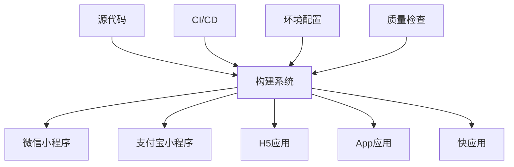

# 部署指南

> 全面的部署流程、环境配置和运维最佳实践

## 🎯 部署概览

### 支持的部署平台

| 平台 | 类型 | 特点 | 适用场景 |
|------|------|------|----------|
| **微信小程序** | 原生小程序 | 微信生态集成 | 微信用户群体 |
| **支付宝小程序** | 原生小程序 | 支付宝生态 | 支付场景应用 |
| **H5** | Web应用 | 跨平台兼容 | 浏览器访问 |
| **App** | 原生应用 | 性能优异 | 移动端体验 |
| **快应用** | 轻应用 | 快速启动 | 华为等厂商 |

### 部署架构图



---

## 🏗️ 构建配置

### 1. 环境变量配置

```bash
# .env.development (开发环境)
VITE_APP_TITLE=开发环境
VITE_API_BASE_URL=https://dev-api.example.com
VITE_APP_ENV=development
VITE_ENABLE_MOCK=true
VITE_ENABLE_VCONSOLE=true

# .env.staging (测试环境)
VITE_APP_TITLE=测试环境
VITE_API_BASE_URL=https://staging-api.example.com
VITE_APP_ENV=staging
VITE_ENABLE_MOCK=false
VITE_ENABLE_VCONSOLE=true

# .env.production (生产环境)
VITE_APP_TITLE=生产环境
VITE_API_BASE_URL=https://api.example.com
VITE_APP_ENV=production
VITE_ENABLE_MOCK=false
VITE_ENABLE_VCONSOLE=false
```

### 2. 构建脚本配置

```json
// package.json
{
  "scripts": {
    // 开发环境
    "dev:mp-weixin": "uni -p mp-weixin --mode development",
    "dev:mp-alipay": "uni -p mp-alipay --mode development",
    "dev:h5": "uni -p h5 --mode development",
    "dev:app": "uni -p app --mode development",

    // 构建命令
    "build:mp-weixin": "uni build -p mp-weixin --mode production",
    "build:mp-alipay": "uni build -p mp-alipay --mode production",
    "build:h5": "uni build -p h5 --mode production",
    "build:app": "uni build -p app --mode production",
    "build:quickapp": "uni build -p quickapp-webview --mode production",

    // 测试环境构建
    "build:staging:mp-weixin": "uni build -p mp-weixin --mode staging",
    "build:staging:h5": "uni build -p h5 --mode staging",

    // 全平台构建
    "build:all": "npm run build:mp-weixin && npm run build:mp-alipay && npm run build:h5 && npm run build:app",

    // 预览和分析
    "preview:h5": "vite preview",
    "analyze": "vite-bundle-analyzer dist"
  }
}
```

### 3. 平台特定配置

```typescript
// vite.config.ts
import { defineConfig } from 'vite'
import uni from '@dcloudio/vite-plugin-uni'
import { resolve } from 'path'

export default defineConfig(({ mode }) => {
  const isProduction = mode === 'production'

  return {
    plugins: [uni()],

    resolve: {
      alias: {
        '@': resolve(__dirname, 'src')
      }
    },

    build: {
      // 生产环境优化
      minify: isProduction ? 'terser' : false,
      sourcemap: !isProduction,

      // 分包配置
      rollupOptions: {
        output: {
          manualChunks: {
            vendor: ['vue', 'pinia'],
            utils: ['lodash-es', 'dayjs']
          }
        }
      },

      // 构建目标
      target: 'es2015',

      // 资源处理
      assetsDir: 'static',
      assetsInlineLimit: 4096
    },

    // 开发服务器配置
    server: {
      port: 3000,
      host: '0.0.0.0',
      proxy: {
        '/api': {
          target: 'https://dev-api.example.com',
          changeOrigin: true,
          rewrite: (path) => path.replace(/^\/api/, '')
        }
      }
    },

    // 环境变量
    define: {
      __APP_VERSION__: JSON.stringify(process.env.npm_package_version),
      __BUILD_TIME__: JSON.stringify(new Date().toISOString())
    }
  }
})
```

---

## 📱 微信小程序部署

### 1. 开发者工具配置

```json
// project.config.json
{
  "description": "项目配置文件",
  "packOptions": {
    "ignore": [
      {
        "type": "file",
        "value": ".eslintrc.js"
      },
      {
        "type": "folder",
        "value": "tests"
      }
    ]
  },
  "setting": {
    "urlCheck": false,
    "es6": true,
    "enhance": true,
    "postcss": true,
    "preloadBackgroundData": false,
    "minified": true,
    "newFeature": false,
    "coverView": true,
    "nodeModules": false,
    "autoAudits": false,
    "showShadowRootInWxmlPanel": true,
    "scopeDataCheck": false,
    "uglifyFileName": false,
    "checkInvalidKey": true,
    "checkSiteMap": true,
    "uploadWithSourceMap": true,
    "compileHotReLoad": false,
    "lazyloadPlaceholderEnable": false,
    "useMultiFrameRuntime": true,
    "useApiHook": true,
    "useApiHostProcess": true,
    "babelSetting": {
      "ignore": [],
      "disablePlugins": [],
      "outputPath": ""
    },
    "enableEngineNative": false,
    "useIsolateContext": true,
    "userConfirmedBundleSwitch": false,
    "packNpmManually": false,
    "packNpmRelationList": [],
    "minifyWXSS": true,
    "disableUseStrict": false,
    "minifyWXML": true,
    "showES6CompileOption": false,
    "useCompilerPlugins": false
  },
  "compileType": "miniprogram",
  "libVersion": "2.19.4",
  "appid": "your-app-id",
  "projectname": "uni-vue3-vite-ts-pinia",
  "debugOptions": {
    "hidedInDevtools": []
  },
  "scripts": {},
  "staticServerOptions": {
    "baseURL": "",
    "servePath": ""
  },
  "isGameTourist": false,
  "condition": {
    "search": {
      "list": []
    },
    "conversation": {
      "list": []
    },
    "game": {
      "list": []
    },
    "plugin": {
      "list": []
    },
    "gamePlugin": {
      "list": []
    },
    "miniprogram": {
      "list": []
    }
  }
}
```

### 2. 部署流程

```bash
#!/bin/bash
# scripts/deploy-weixin.sh

set -e

echo "🚀 开始微信小程序部署..."

# 1. 环境检查
if [ ! -f "project.config.json" ]; then
  echo "❌ 未找到 project.config.json 文件"
  exit 1
fi

# 2. 安装依赖
echo "📦 安装依赖..."
npm ci

# 3. 代码检查
echo "🔍 代码检查..."
npm run lint
npm run type-check

# 4. 运行测试
echo "🧪 运行测试..."
npm run test:run

# 5. 构建项目
echo "🏗️ 构建项目..."
npm run build:mp-weixin

# 6. 检查构建结果
if [ ! -d "dist/build/mp-weixin" ]; then
  echo "❌ 构建失败，未找到输出目录"
  exit 1
fi

# 7. 压缩代码（可选）
echo "📦 压缩代码..."
cd dist/build/mp-weixin
zip -r ../../../weixin-$(date +%Y%m%d-%H%M%S).zip .
cd ../../../

echo "✅ 微信小程序构建完成！"
echo "📁 构建目录: dist/build/mp-weixin"
echo "📋 请使用微信开发者工具打开构建目录进行预览和上传"
```

### 3. 自动化上传

```javascript
// scripts/upload-weixin.js
const ci = require('miniprogram-ci')
const path = require('path')
const fs = require('fs')

async function upload() {
  try {
    // 读取项目配置
    const projectConfig = JSON.parse(
      fs.readFileSync('project.config.json', 'utf8')
    )

    // 创建项目实例
    const project = new ci.Project({
      appid: projectConfig.appid,
      type: 'miniProgram',
      projectPath: path.resolve('dist/build/mp-weixin'),
      privateKeyPath: path.resolve('private.key'), // 私钥文件路径
      ignores: ['node_modules/**/*']
    })

    // 获取版本号
    const packageJson = JSON.parse(
      fs.readFileSync('package.json', 'utf8')
    )
    const version = packageJson.version

    // 上传代码
    console.log('🚀 开始上传微信小程序...')
    const uploadResult = await ci.upload({
      project,
      version,
      desc: `自动构建 ${new Date().toLocaleString()}`,
      setting: {
        es6: true,
        es7: true,
        minifyJS: true,
        minifyWXML: true,
        minifyWXSS: true,
        autoPrefixWXSS: true
      },
      onProgressUpdate: (progress) => {
        console.log(`上传进度: ${progress}%`)
      }
    })

    console.log('✅ 上传成功！', uploadResult)

  } catch (error) {
    console.error('❌ 上传失败:', error)
    process.exit(1)
  }
}

upload()
```

---

## 🌐 H5 部署

### 1. 静态资源部署

```bash
#!/bin/bash
# scripts/deploy-h5.sh

set -e

echo "🚀 开始 H5 部署..."

# 1. 构建项目
echo "🏗️ 构建 H5 项目..."
npm run build:h5

# 2. 检查构建结果
if [ ! -d "dist/build/h5" ]; then
  echo "❌ 构建失败"
  exit 1
fi

# 3. 部署到服务器
echo "📤 部署到服务器..."

# 方式1: 使用 rsync
rsync -avz --delete dist/build/h5/ user@server:/var/www/html/

# 方式2: 使用 scp
# scp -r dist/build/h5/* user@server:/var/www/html/

# 方式3: 使用 Docker
# docker build -t my-h5-app .
# docker push my-registry/my-h5-app:latest

echo "✅ H5 部署完成！"
```

### 2. Nginx 配置

```nginx
# nginx.conf
server {
    listen 80;
    server_name your-domain.com;

    # 重定向到 HTTPS
    return 301 https://$server_name$request_uri;
}

server {
    listen 443 ssl http2;
    server_name your-domain.com;

    # SSL 配置
    ssl_certificate /path/to/certificate.crt;
    ssl_certificate_key /path/to/private.key;
    ssl_protocols TLSv1.2 TLSv1.3;
    ssl_ciphers ECDHE-RSA-AES128-GCM-SHA256:ECDHE-RSA-AES256-GCM-SHA384;

    # 根目录
    root /var/www/html;
    index index.html;

    # Gzip 压缩
    gzip on;
    gzip_vary on;
    gzip_min_length 1024;
    gzip_types text/plain text/css text/xml text/javascript application/javascript application/xml+rss application/json;

    # 缓存配置
    location ~* \.(js|css|png|jpg|jpeg|gif|ico|svg|woff|woff2|ttf|eot)$ {
        expires 1y;
        add_header Cache-Control "public, immutable";
        add_header Vary Accept-Encoding;
    }

    # HTML 文件不缓存
    location ~* \.html$ {
        expires -1;
        add_header Cache-Control "no-cache, no-store, must-revalidate";
        add_header Pragma "no-cache";
    }

    # API 代理
    location /api/ {
        proxy_pass https://api.example.com/;
        proxy_set_header Host $host;
        proxy_set_header X-Real-IP $remote_addr;
        proxy_set_header X-Forwarded-For $proxy_add_x_forwarded_for;
        proxy_set_header X-Forwarded-Proto $scheme;
    }

    # SPA 路由支持
    location / {
        try_files $uri $uri/ /index.html;
    }

    # 安全头
    add_header X-Frame-Options "SAMEORIGIN" always;
    add_header X-Content-Type-Options "nosniff" always;
    add_header X-XSS-Protection "1; mode=block" always;
    add_header Referrer-Policy "strict-origin-when-cross-origin" always;
    add_header Content-Security-Policy "default-src 'self'; script-src 'self' 'unsafe-inline' 'unsafe-eval'; style-src 'self' 'unsafe-inline'; img-src 'self' data: https:; font-src 'self' data:; connect-src 'self' https:;" always;
}
```

### 3. Docker 部署

```dockerfile
# Dockerfile
# 构建阶段
FROM node:18-alpine as builder

WORKDIR /app

# 复制依赖文件
COPY package*.json ./
RUN npm ci --only=production

# 复制源代码
COPY . .

# 构建应用
RUN npm run build:h5

# 生产阶段
FROM nginx:alpine

# 复制构建结果
COPY --from=builder /app/dist/build/h5 /usr/share/nginx/html

# 复制 Nginx 配置
COPY nginx.conf /etc/nginx/conf.d/default.conf

# 暴露端口
EXPOSE 80

# 启动 Nginx
CMD ["nginx", "-g", "daemon off;"]
```

```yaml
# docker-compose.yml
version: '3.8'

services:
  web:
    build: .
    ports:
      - "80:80"
      - "443:443"
    volumes:
      - ./ssl:/etc/nginx/ssl:ro
    environment:
      - NODE_ENV=production
    restart: unless-stopped

  # 可选：添加反向代理
  nginx-proxy:
    image: nginx:alpine
    ports:
      - "80:80"
      - "443:443"
    volumes:
      - ./nginx-proxy.conf:/etc/nginx/nginx.conf:ro
      - ./ssl:/etc/nginx/ssl:ro
    depends_on:
      - web
    restart: unless-stopped
```

---

## 📱 App 部署

### 1. Android 打包

```bash
#!/bin/bash
# scripts/build-android.sh

set -e

echo "🤖 开始 Android 打包..."

# 1. 构建项目
echo "🏗️ 构建 App 项目..."
npm run build:app

# 2. 检查 Android 环境
if [ ! -d "$ANDROID_HOME" ]; then
  echo "❌ 未找到 Android SDK"
  exit 1
fi

# 3. 进入 Android 项目目录
cd platforms/android

# 4. 清理项目
echo "🧹 清理项目..."
./gradlew clean

# 5. 构建 APK
echo "📦 构建 APK..."
./gradlew assembleRelease

# 6. 检查构建结果
if [ -f "app/build/outputs/apk/release/app-release.apk" ]; then
  echo "✅ Android APK 构建成功！"
  echo "📁 APK 位置: platforms/android/app/build/outputs/apk/release/app-release.apk"
else
  echo "❌ APK 构建失败"
  exit 1
fi

# 7. 签名 APK（如果需要）
if [ -f "../../android-release-key.keystore" ]; then
  echo "✍️ 签名 APK..."
  jarsigner -verbose -sigalg SHA1withRSA -digestalg SHA1 \
    -keystore ../../android-release-key.keystore \
    app/build/outputs/apk/release/app-release.apk \
    alias_name

  # 对齐 APK
  zipalign -v 4 app/build/outputs/apk/release/app-release.apk \
    app/build/outputs/apk/release/app-release-aligned.apk
fi

echo "🎉 Android 打包完成！"
```

### 2. iOS 打包

```bash
#!/bin/bash
# scripts/build-ios.sh

set -e

echo "🍎 开始 iOS 打包..."

# 1. 检查 macOS 环境
if [ "$(uname)" != "Darwin" ]; then
  echo "❌ iOS 打包需要在 macOS 环境下进行"
  exit 1
fi

# 2. 检查 Xcode
if ! command -v xcodebuild &> /dev/null; then
  echo "❌ 未找到 Xcode"
  exit 1
fi

# 3. 构建项目
echo "🏗️ 构建 App 项目..."
npm run build:app

# 4. 进入 iOS 项目目录
cd platforms/ios

# 5. 安装 CocoaPods 依赖
echo "📦 安装 CocoaPods 依赖..."
pod install

# 6. 构建项目
echo "🔨 构建 iOS 项目..."
xcodebuild -workspace YourApp.xcworkspace \
  -scheme YourApp \
  -configuration Release \
  -destination generic/platform=iOS \
  -archivePath YourApp.xcarchive \
  archive

# 7. 导出 IPA
echo "📤 导出 IPA..."
xcodebuild -exportArchive \
  -archivePath YourApp.xcarchive \
  -exportPath ./build \
  -exportOptionsPlist ExportOptions.plist

echo "✅ iOS 打包完成！"
echo "📁 IPA 位置: platforms/ios/build/YourApp.ipa"
```

### 3. 应用商店发布

```javascript
// scripts/upload-app-store.js
const { execSync } = require('child_process')
const fs = require('fs')
const path = require('path')

// App Store Connect 配置
const config = {
  apiKeyId: process.env.APP_STORE_API_KEY_ID,
  apiKeyIssuer: process.env.APP_STORE_API_KEY_ISSUER,
  apiKeyPath: process.env.APP_STORE_API_KEY_PATH
}

async function uploadToAppStore() {
  try {
    console.log('🚀 开始上传到 App Store...')

    // 验证 IPA 文件
    const ipaPath = 'platforms/ios/build/YourApp.ipa'
    if (!fs.existsSync(ipaPath)) {
      throw new Error('未找到 IPA 文件')
    }

    // 使用 xcrun altool 上传
    const command = `xcrun altool --upload-app \
      --type ios \
      --file "${ipaPath}" \
      --apiKey "${config.apiKeyId}" \
      --apiIssuer "${config.apiKeyIssuer}"`

    console.log('📤 正在上传...')
    execSync(command, { stdio: 'inherit' })

    console.log('✅ 上传成功！')
    console.log('📋 请在 App Store Connect 中查看处理状态')

  } catch (error) {
    console.error('❌ 上传失败:', error.message)
    process.exit(1)
  }
}

uploadToAppStore()
```

---

## 🔄 CI/CD 流水线

### 1. GitHub Actions

```yaml
# .github/workflows/deploy.yml
name: 部署流水线

on:
  push:
    branches: [ main, develop ]
    tags: [ 'v*' ]
  pull_request:
    branches: [ main ]

env:
  NODE_VERSION: '18'
  PNPM_VERSION: '8'

jobs:
  # 代码质量检查
  quality:
    runs-on: ubuntu-latest
    steps:
      - uses: actions/checkout@v4

      - name: 设置 Node.js
        uses: actions/setup-node@v4
        with:
          node-version: ${{ env.NODE_VERSION }}
          cache: 'npm'

      - name: 安装依赖
        run: npm ci

      - name: 代码检查
        run: |
          npm run lint
          npm run type-check

      - name: 运行测试
        run: npm run test:coverage

      - name: 上传覆盖率报告
        uses: codecov/codecov-action@v3
        with:
          file: ./coverage/lcov.info

  # 构建各平台
  build:
    needs: quality
    runs-on: ubuntu-latest
    strategy:
      matrix:
        platform: [mp-weixin, mp-alipay, h5]

    steps:
      - uses: actions/checkout@v4

      - name: 设置 Node.js
        uses: actions/setup-node@v4
        with:
          node-version: ${{ env.NODE_VERSION }}
          cache: 'npm'

      - name: 安装依赖
        run: npm ci

      - name: 构建 ${{ matrix.platform }}
        run: npm run build:${{ matrix.platform }}

      - name: 上传构建产物
        uses: actions/upload-artifact@v4
        with:
          name: build-${{ matrix.platform }}
          path: dist/build/${{ matrix.platform }}
          retention-days: 7

  # 部署到测试环境
  deploy-staging:
    needs: build
    runs-on: ubuntu-latest
    if: github.ref == 'refs/heads/develop'
    environment: staging

    steps:
      - uses: actions/checkout@v4

      - name: 下载 H5 构建产物
        uses: actions/download-artifact@v4
        with:
          name: build-h5
          path: dist/build/h5

      - name: 部署到测试服务器
        uses: appleboy/ssh-action@v1.0.0
        with:
          host: ${{ secrets.STAGING_HOST }}
          username: ${{ secrets.STAGING_USER }}
          key: ${{ secrets.STAGING_SSH_KEY }}
          script: |
            cd /var/www/staging
            rm -rf *

      - name: 上传文件
        uses: appleboy/scp-action@v0.1.4
        with:
          host: ${{ secrets.STAGING_HOST }}
          username: ${{ secrets.STAGING_USER }}
          key: ${{ secrets.STAGING_SSH_KEY }}
          source: "dist/build/h5/*"
          target: "/var/www/staging"
          strip_components: 3

  # 部署到生产环境
  deploy-production:
    needs: build
    runs-on: ubuntu-latest
    if: startsWith(github.ref, 'refs/tags/v')
    environment: production

    steps:
      - uses: actions/checkout@v4

      - name: 下载构建产物
        uses: actions/download-artifact@v4
        with:
          pattern: build-*
          merge-multiple: true

      - name: 部署 H5 到生产环境
        uses: appleboy/scp-action@v0.1.4
        with:
          host: ${{ secrets.PROD_HOST }}
          username: ${{ secrets.PROD_USER }}
          key: ${{ secrets.PROD_SSH_KEY }}
          source: "build-h5/*"
          target: "/var/www/html"
          strip_components: 1

      - name: 重启服务
        uses: appleboy/ssh-action@v1.0.0
        with:
          host: ${{ secrets.PROD_HOST }}
          username: ${{ secrets.PROD_USER }}
          key: ${{ secrets.PROD_SSH_KEY }}
          script: |
            sudo systemctl reload nginx
            sudo systemctl status nginx

  # 发布通知
  notify:
    needs: [deploy-staging, deploy-production]
    runs-on: ubuntu-latest
    if: always()

    steps:
      - name: 发送通知
        uses: 8398a7/action-slack@v3
        with:
          status: ${{ job.status }}
          channel: '#deployments'
          webhook_url: ${{ secrets.SLACK_WEBHOOK }}
        env:
          SLACK_WEBHOOK_URL: ${{ secrets.SLACK_WEBHOOK }}
```

### 2. GitLab CI/CD

```yaml
# .gitlab-ci.yml
stages:
  - quality
  - build
  - deploy

variables:
  NODE_VERSION: "18"
  DOCKER_DRIVER: overlay2
  DOCKER_TLS_CERTDIR: "/certs"

# 缓存配置
cache:
  key: ${CI_COMMIT_REF_SLUG}
  paths:
    - node_modules/
    - .npm/

# 代码质量检查
quality:
  stage: quality
  image: node:${NODE_VERSION}-alpine
  before_script:
    - npm ci --cache .npm --prefer-offline
  script:
    - npm run lint
    - npm run type-check
    - npm run test:coverage
  coverage: '/Lines\s*:\s*(\d+\.?\d*)%/'
  artifacts:
    reports:
      coverage_report:
        coverage_format: cobertura
        path: coverage/cobertura-coverage.xml
    paths:
      - coverage/
    expire_in: 1 week

# 构建微信小程序
build:mp-weixin:
  stage: build
  image: node:${NODE_VERSION}-alpine
  before_script:
    - npm ci --cache .npm --prefer-offline
  script:
    - npm run build:mp-weixin
  artifacts:
    paths:
      - dist/build/mp-weixin/
    expire_in: 1 week
  only:
    - main
    - develop
    - tags

# 构建 H5
build:h5:
  stage: build
  image: node:${NODE_VERSION}-alpine
  before_script:
    - npm ci --cache .npm --prefer-offline
  script:
    - npm run build:h5
  artifacts:
    paths:
      - dist/build/h5/
    expire_in: 1 week
  only:
    - main
    - develop
    - tags

# 部署到测试环境
deploy:staging:
  stage: deploy
  image: alpine:latest
  before_script:
    - apk add --no-cache openssh-client rsync
    - eval $(ssh-agent -s)
    - echo "$STAGING_SSH_PRIVATE_KEY" | tr -d '\r' | ssh-add -
    - mkdir -p ~/.ssh
    - chmod 700 ~/.ssh
    - ssh-keyscan $STAGING_HOST >> ~/.ssh/known_hosts
    - chmod 644 ~/.ssh/known_hosts
  script:
    - rsync -avz --delete dist/build/h5/ $STAGING_USER@$STAGING_HOST:/var/www/staging/
  environment:
    name: staging
    url: https://staging.example.com
  dependencies:
    - build:h5
  only:
    - develop

# 部署到生产环境
deploy:production:
  stage: deploy
  image: alpine:latest
  before_script:
    - apk add --no-cache openssh-client rsync
    - eval $(ssh-agent -s)
    - echo "$PROD_SSH_PRIVATE_KEY" | tr -d '\r' | ssh-add -
    - mkdir -p ~/.ssh
    - chmod 700 ~/.ssh
    - ssh-keyscan $PROD_HOST >> ~/.ssh/known_hosts
    - chmod 644 ~/.ssh/known_hosts
  script:
    - rsync -avz --delete dist/build/h5/ $PROD_USER@$PROD_HOST:/var/www/html/
    - ssh $PROD_USER@$PROD_HOST "sudo systemctl reload nginx"
  environment:
    name: production
    url: https://example.com
  dependencies:
    - build:h5
  only:
    - tags
  when: manual
```

---

## 📊 监控和运维

### 1. 应用监控

```typescript
// src/utils/monitor.ts
interface ErrorInfo {
  message: string
  stack?: string
  url: string
  line?: number
  column?: number
  timestamp: number
  userAgent: string
  userId?: string
}

class Monitor {
  private apiUrl: string
  private appVersion: string

  constructor(apiUrl: string, appVersion: string) {
    this.apiUrl = apiUrl
    this.appVersion = appVersion
    this.init()
  }

  private init() {
    // 全局错误监听
    window.addEventListener('error', (event) => {
      this.reportError({
        message: event.message,
        stack: event.error?.stack,
        url: event.filename,
        line: event.lineno,
        column: event.colno,
        timestamp: Date.now(),
        userAgent: navigator.userAgent
      })
    })

    // Promise 错误监听
    window.addEventListener('unhandledrejection', (event) => {
      this.reportError({
        message: `Unhandled Promise Rejection: ${event.reason}`,
        stack: event.reason?.stack,
        url: window.location.href,
        timestamp: Date.now(),
        userAgent: navigator.userAgent
      })
    })

    // Vue 错误监听（如果使用 Vue）
    if (window.Vue) {
      window.Vue.config.errorHandler = (err, vm, info) => {
        this.reportError({
          message: `Vue Error: ${err.message}`,
          stack: err.stack,
          url: window.location.href,
          timestamp: Date.now(),
          userAgent: navigator.userAgent
        })
      }
    }
  }

  // 上报错误
  private async reportError(errorInfo: ErrorInfo) {
    try {
      await fetch(`${this.apiUrl}/errors`, {
        method: 'POST',
        headers: {
          'Content-Type': 'application/json'
        },
        body: JSON.stringify({
          ...errorInfo,
          appVersion: this.appVersion,
          platform: this.getPlatform()
        })
      })
    } catch (error) {
      console.error('Failed to report error:', error)
    }
  }

  // 性能监控
  public reportPerformance() {
    if ('performance' in window) {
      const navigation = performance.getEntriesByType('navigation')[0] as PerformanceNavigationTiming
      const paint = performance.getEntriesByType('paint')

      const performanceData = {
        // 页面加载时间
        loadTime: navigation.loadEventEnd - navigation.loadEventStart,
        // DNS 解析时间
        dnsTime: navigation.domainLookupEnd - navigation.domainLookupStart,
        // TCP 连接时间
        tcpTime: navigation.connectEnd - navigation.connectStart,
        // 首次绘制时间
        firstPaint: paint.find(p => p.name === 'first-paint')?.startTime || 0,
        // 首次内容绘制时间
        firstContentfulPaint: paint.find(p => p.name === 'first-contentful-paint')?.startTime || 0,
        // 页面 URL
        url: window.location.href,
        // 时间戳
        timestamp: Date.now(),
        // 应用版本
        appVersion: this.appVersion,
        // 平台信息
        platform: this.getPlatform()
      }

      this.reportData('/performance', performanceData)
    }
  }

  // 用户行为监控
  public reportUserAction(action: string, data?: any) {
    this.reportData('/user-actions', {
      action,
      data,
      url: window.location.href,
      timestamp: Date.now(),
      appVersion: this.appVersion,
      platform: this.getPlatform()
    })
  }

  private async reportData(endpoint: string, data: any) {
    try {
      await fetch(`${this.apiUrl}${endpoint}`, {
        method: 'POST',
        headers: {
          'Content-Type': 'application/json'
        },
        body: JSON.stringify(data)
      })
    } catch (error) {
      console.error('Failed to report data:', error)
    }
  }

  private getPlatform(): string {
    // #ifdef MP-WEIXIN
    return 'mp-weixin'
    // #endif

    // #ifdef MP-ALIPAY
    return 'mp-alipay'
    // #endif

    // #ifdef H5
    return 'h5'
    // #endif

    // #ifdef APP-PLUS
    return 'app'
    // #endif

    return 'unknown'
  }
}

// 初始化监控
export const monitor = new Monitor(
  import.meta.env.VITE_MONITOR_API_URL,
  import.meta.env.VITE_APP_VERSION
)
```

### 2. 日志收集

```typescript
// src/utils/logger.ts
enum LogLevel {
  DEBUG = 0,
  INFO = 1,
  WARN = 2,
  ERROR = 3
}

interface LogEntry {
  level: LogLevel
  message: string
  data?: any
  timestamp: number
  url: string
  userAgent: string
  userId?: string
}

class Logger {
  private logs: LogEntry[] = []
  private maxLogs = 100
  private apiUrl: string
  private currentLevel: LogLevel

  constructor(apiUrl: string, level: LogLevel = LogLevel.INFO) {
    this.apiUrl = apiUrl
    this.currentLevel = level

    // 定期上报日志
    setInterval(() => {
      this.flush()
    }, 30000) // 30秒上报一次

    // 页面卸载时上报
    window.addEventListener('beforeunload', () => {
      this.flush()
    })
  }

  private log(level: LogLevel, message: string, data?: any) {
    if (level < this.currentLevel) return

    const entry: LogEntry = {
      level,
      message,
      data,
      timestamp: Date.now(),
      url: window.location.href,
      userAgent: navigator.userAgent
    }

    this.logs.push(entry)

    // 控制日志数量
    if (this.logs.length > this.maxLogs) {
      this.logs.shift()
    }

    // 输出到控制台
    const consoleMethod = this.getConsoleMethod(level)
    consoleMethod(`[${new Date().toISOString()}] ${message}`, data)
  }

  public debug(message: string, data?: any) {
    this.log(LogLevel.DEBUG, message, data)
  }

  public info(message: string, data?: any) {
    this.log(LogLevel.INFO, message, data)
  }

  public warn(message: string, data?: any) {
    this.log(LogLevel.WARN, message, data)
  }

  public error(message: string, data?: any) {
    this.log(LogLevel.ERROR, message, data)
  }

  private getConsoleMethod(level: LogLevel) {
    switch (level) {
      case LogLevel.DEBUG:
        return console.debug
      case LogLevel.INFO:
        return console.info
      case LogLevel.WARN:
        return console.warn
      case LogLevel.ERROR:
        return console.error
      default:
        return console.log
    }
  }

  // 上报日志
  private async flush() {
    if (this.logs.length === 0) return

    const logsToSend = [...this.logs]
    this.logs = []

    try {
      await fetch(`${this.apiUrl}/logs`, {
        method: 'POST',
        headers: {
          'Content-Type': 'application/json'
        },
        body: JSON.stringify({
          logs: logsToSend,
          appVersion: import.meta.env.VITE_APP_VERSION,
          platform: this.getPlatform()
        })
      })
    } catch (error) {
      console.error('Failed to send logs:', error)
      // 发送失败时重新加入队列
      this.logs.unshift(...logsToSend)
    }
  }

  private getPlatform(): string {
    // 平台检测逻辑（同监控模块）
    return 'h5' // 简化示例
  }
}

// 导出日志实例
export const logger = new Logger(
  import.meta.env.VITE_LOG_API_URL,
  import.meta.env.PROD ? LogLevel.INFO : LogLevel.DEBUG
)
```

---

## 🔧 部署检查清单

### 构建前检查

- [ ] **代码质量**
  - [ ] ESLint 检查通过
  - [ ] TypeScript 类型检查通过
  - [ ] 单元测试通过
  - [ ] E2E 测试通过
  - [ ] 代码覆盖率达标

- [ ] **环境配置**
  - [ ] 环境变量配置正确
  - [ ] API 地址配置正确
  - [ ] 第三方服务配置正确
  - [ ] 证书和密钥配置正确

- [ ] **资源优化**
  - [ ] 图片资源优化
  - [ ] 代码分割配置
  - [ ] 缓存策略配置
  - [ ] CDN 配置

### 部署后检查

- [ ] **功能验证**
  - [ ] 核心功能正常
  - [ ] 页面路由正常
  - [ ] API 接口正常
  - [ ] 第三方集成正常

- [ ] **性能检查**
  - [ ] 页面加载速度
  - [ ] 资源加载正常
  - [ ] 内存使用正常
  - [ ] 网络请求正常

- [ ] **安全检查**
  - [ ] HTTPS 配置正确
  - [ ] 安全头配置
  - [ ] 敏感信息保护
  - [ ] 权限控制正常

- [ ] **监控配置**
  - [ ] 错误监控正常
  - [ ] 性能监控正常
  - [ ] 日志收集正常
  - [ ] 告警配置正常

---

## 📚 相关资源

### 官方文档

- [uni-app 发布指南](https://uniapp.dcloud.net.cn/tutorial/build/)
- [微信小程序发布流程](https://developers.weixin.qq.com/miniprogram/dev/framework/quickstart/release.html)
- [支付宝小程序发布流程](https://opendocs.alipay.com/mini/introduce/release)

### 工具推荐

- **CI/CD**: GitHub Actions, GitLab CI, Jenkins
- **容器化**: Docker, Kubernetes
- **监控**: Sentry, LogRocket, Datadog
- **CDN**: 阿里云 CDN, 腾讯云 CDN, Cloudflare

### 最佳实践

- [前端部署最佳实践](https://web.dev/deployment/)
- [移动应用发布指南](https://developer.android.com/studio/publish)
- [小程序性能优化](https://developers.weixin.qq.com/miniprogram/dev/framework/performance/)

---

*最后更新: 2024年*
*维护者: 开发团队*