# 财务透明功能 - 架构图

> 使用 Mermaid 图表展示系统架构，可在 GitHub/GitLab 中直接预览

---

## 系统架构全景图

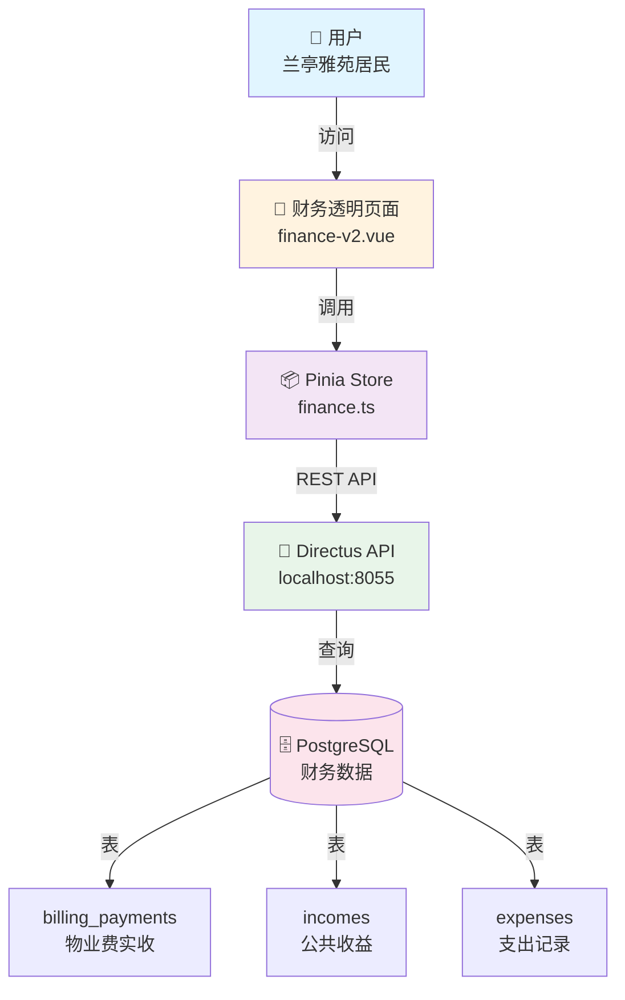

---

## 数据流向图

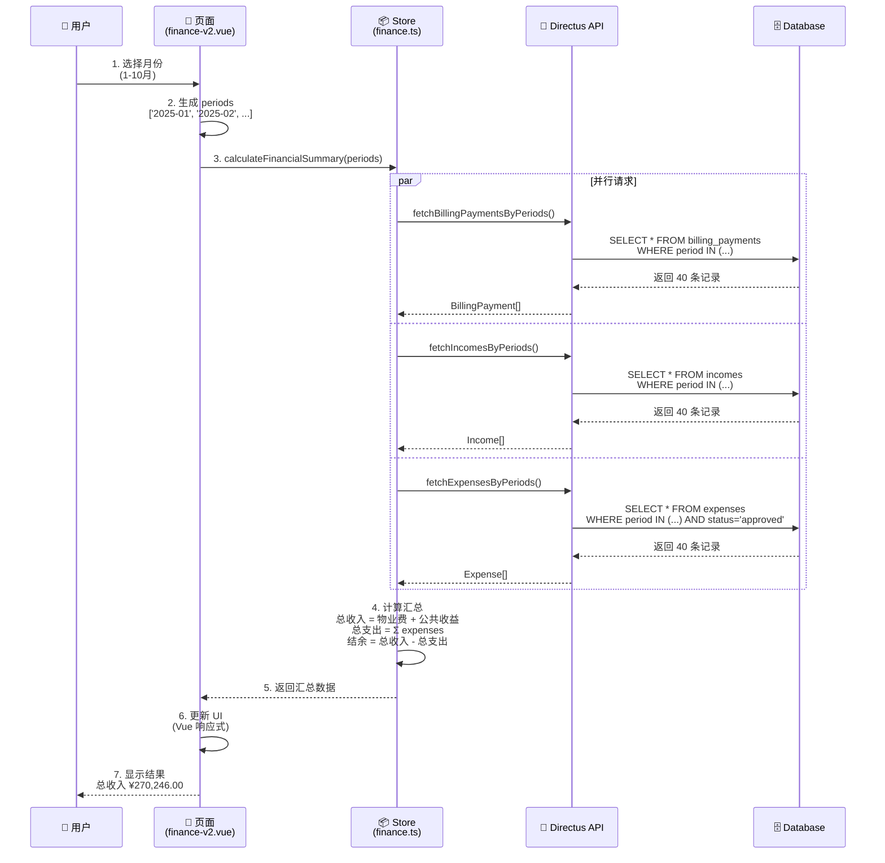

---

## 数据库 ER 图

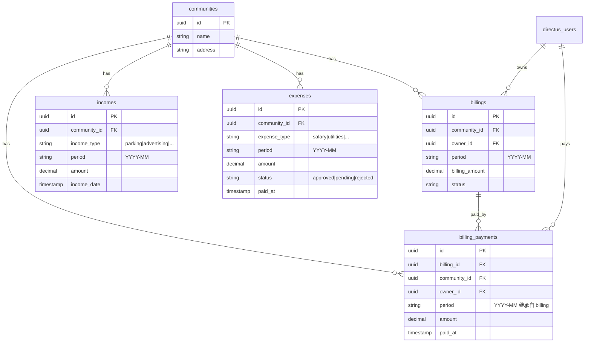

---

## Store 方法调用关系图

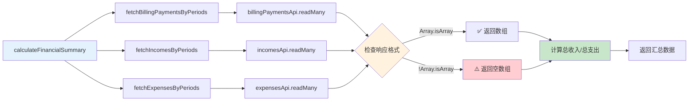

---

## 页面组件结构图

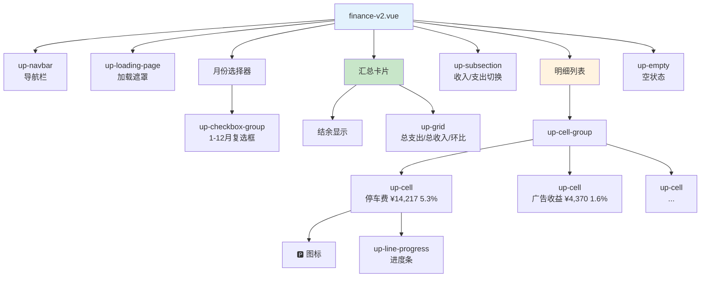

---

## 权限控制流程图

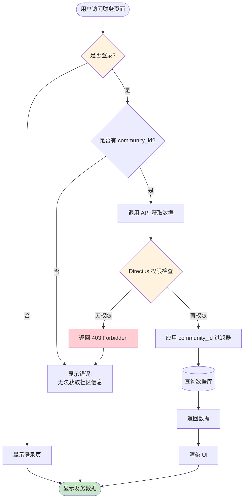

---

## 数据聚合逻辑图

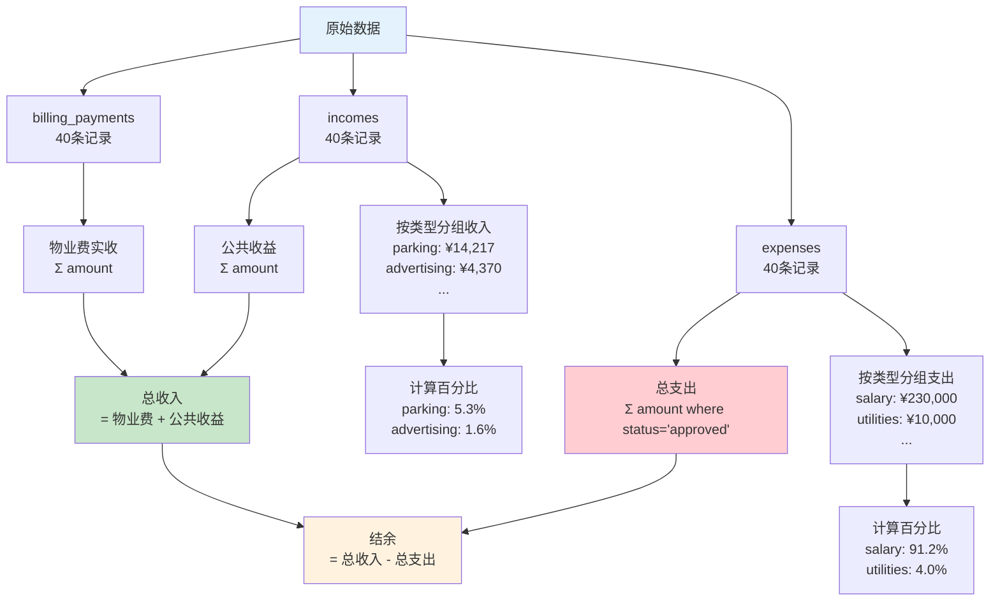

---

## 测试数据生成流程图

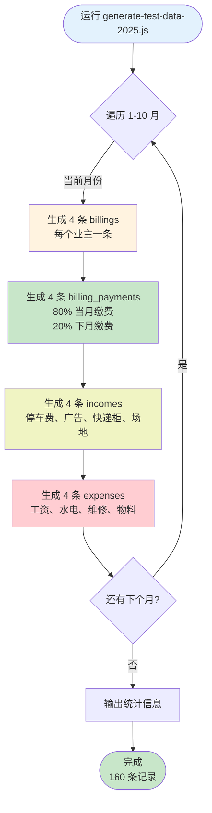

---

## 常见问题排查流程图

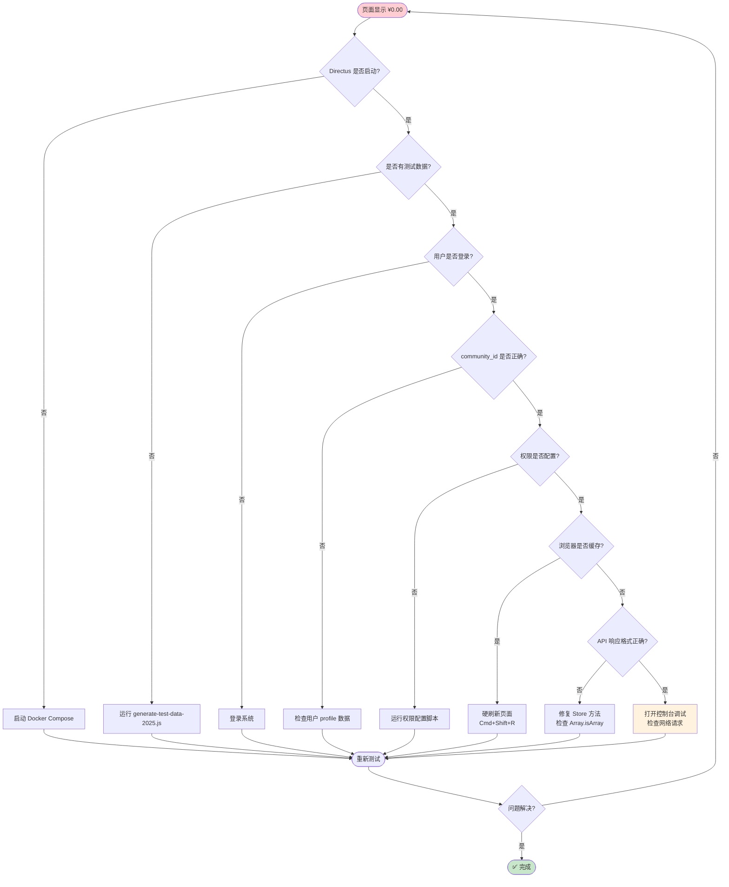

---

## 部署架构图

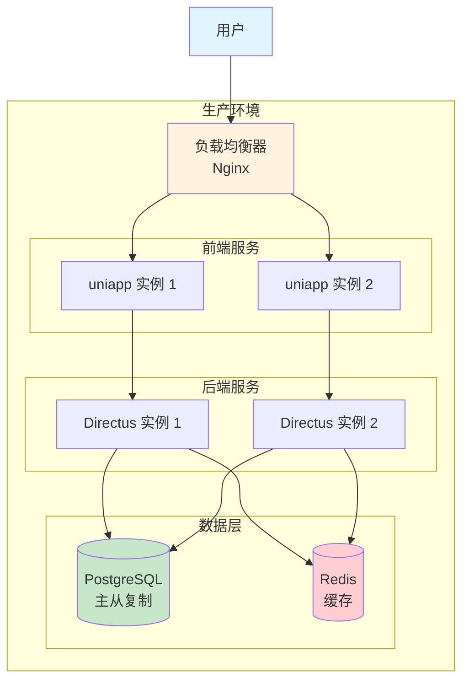

---

## 技术栈依赖图

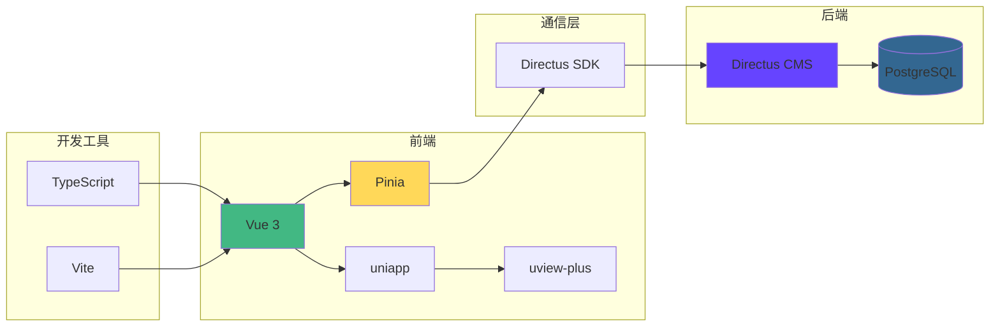

---

## 使用说明

这些图表使用 [Mermaid](https://mermaid.js.org/) 语法编写，可以在以下环境中直接渲染：

- ✅ GitHub / GitLab（原生支持）
- ✅ VS Code（安装 Mermaid 插件）
- ✅ Notion / Obsidian（安装插件）
- ✅ 在线编辑器：https://mermaid.live/

---

## 相关文档

- [完整开发文档](./finance-transparency-v2.md)
- [快速上手指南](./FINANCE_QUICKSTART.md)
- [测试数据说明](../tasks/billing/test-data-summary.md)
