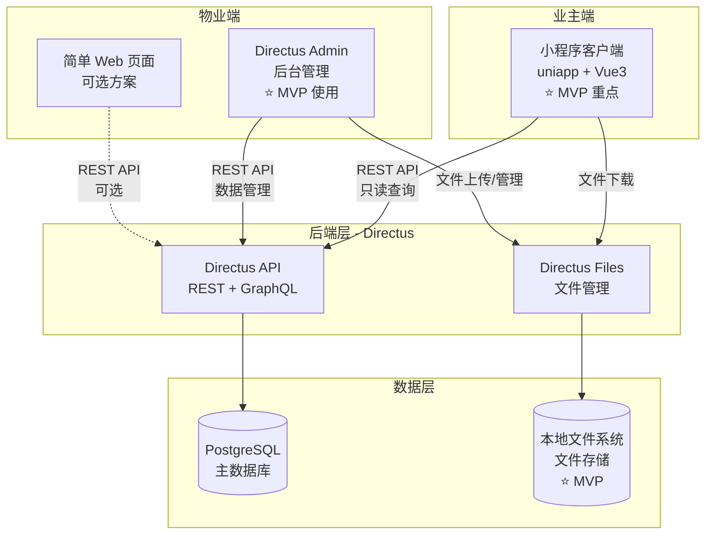
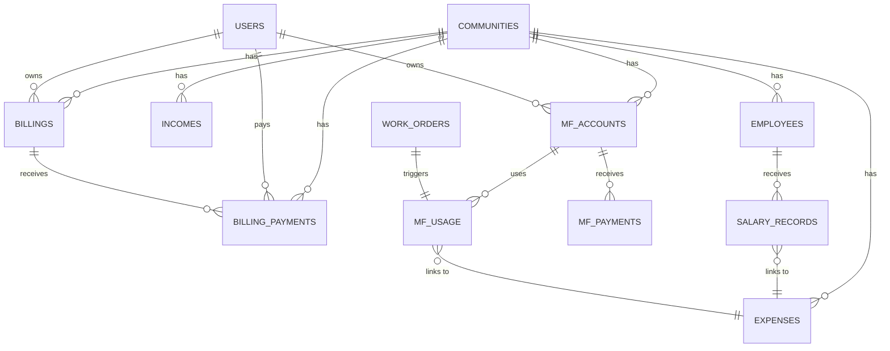
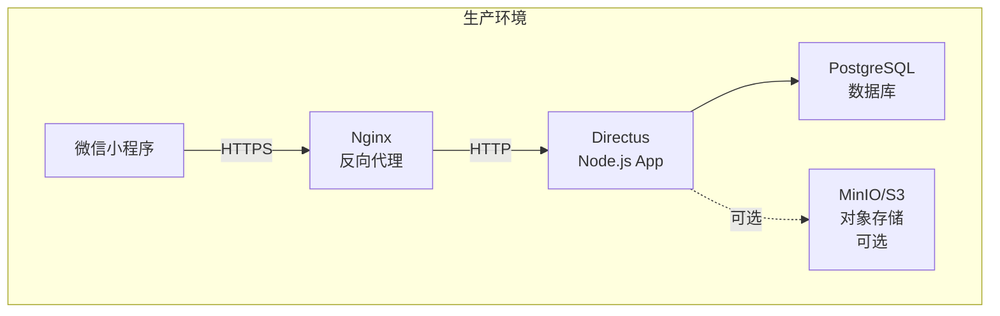

# 设计文档（Design Document）
## 社区财务透明化系统

---

## 📋 文档信息

| 项目 | 内容 |
|------|------|
| **文档版本** | v2.4 |
| **创建日期** | 2025-10-13 |
| **最后更新** | 2025-10-13 |
| **技术负责人** | 待定 |
| **架构师** | 待定 |
| **文档状态** | 待审批 |

**重要说明（v2.4 更新）**：
- MVP 阶段只开发**业主端小程序**（5个页面）
- **业主端仅提供查看功能，不包含在线支付**（在线支付为 v2.0+ 功能）
- 物业管理员功能通过 **Directus 后台**或简单网页实现（不在小程序中开发）
- 维修基金功能标记为 **v2.5+**（MVP 不包含）
- 业委会功能标记为 **v2.8+**（MVP 不包含）
- **文件存储**：MVP 阶段使用**本地文件系统**，生产环境可选配置 MinIO/S3 等对象存储

---

## 目录

1. [系统架构设计](#1-系统架构设计)
2. [数据库设计](#2-数据库设计)
3. [前端架构设计](#3-前端架构设计)
4. [API 设计](#4-api-设计)
5. [权限设计](#5-权限设计)
6. [UI/UX 设计](#6-uiux-设计)
7. [性能优化](#7-性能优化)
8. [安全设计](#8-安全设计)
9. [错误处理](#9-错误处理)
10. [部署架构](#10-部署架构)

---

## 1. 系统架构设计

### 1.1 整体架构

**MVP 阶段系统架构**：



**架构说明**：
- **业主端（小程序）**：业主通过微信小程序查看财务信息、账单、缴费记录、公共收入明细等（MVP 开发重点）
- **物业端（后台系统）**：
  - **方案 1（推荐）**：直接使用 Directus Admin Panel 进行数据录入和管理
  - **方案 2（可选）**：开发简单的 HTML/JavaScript 网页供物业人员使用
- **业委会端**：v2.0+ 功能，MVP 不涉及

### 1.2 技术栈

#### 前端技术栈
| 技术 | 版本 | 用途 |
|------|------|------|
| **uniapp** | 最新 | 跨平台框架 |
| **Vue 3** | 3.3+ | 前端框架（Composition API） |
| **TypeScript** | 5.0+ | 类型安全 |
| **Pinia** | 2.1+ | 状态管理 |
| **uview-plus** | 3.2+ | UI 组件库 |
| **Vite** | 4.0+ | 构建工具 |
| **Directus SDK** | 17.0+ | API 客户端 |
| **dayjs** | 最新 | 日期处理 |

#### 后端技术栈
| 技术 | 版本 | 用途 |
|------|------|------|
| **Directus** | 10.x | Headless CMS / API 服务器 / 文件管理 |
| **PostgreSQL** | 14+ | 关系型数据库 |
| **本地文件系统** | - | 文件存储（⭐ MVP 阶段） |

> **注**：生产环境可根据需要配置 MinIO/S3/Azure Blob 等对象存储作为 Directus Files 的存储驱动，以支持大规模文件管理和 CDN 加速。MVP 阶段使用本地文件系统即可。

### 1.3 核心设计原则

#### 应收与实收分离（简化设计v2.5）
**设计目标**：
- 物业费按月收取，业主一次可缴纳多个月（整数倍）
- 遵循FIFO原则：必须从最早未缴月份开始缴费
- 避免使用触发器/Hooks，逻辑在应用层实现
- 通过paid_periods字段支持价格变动追溯

**解决方案**：
```
billings (应收账单)          billing_payments (实收记录)
┌─────────────────┐          ┌──────────────────────┐
│ id              │          │ owner_id             │
│ period          │          │ amount               │
│ amount          │          │ paid_periods         │ ← JSON数组
│ is_paid         │ ← 布尔   │ paid_at              │
│ paid_at         │          │ proof_files          │ ← Directus文件UUID数组
└─────────────────┘          └──────────────────────┘
```

**优势**：
- ✅ 简化设计：billings表只用is_paid布尔字段
- ✅ FIFO原则：从最早月份开始缴费
- ✅ 一次缴费多个月：paid_periods = ["2025-01","2025-02","2025-03"]
- ✅ 价格变动可追溯：通过paid_periods知道每笔缴费对应哪几个月
- ✅ 无需触发器：业务逻辑在前端/后端代码中实现

#### 收入与支出分类管理
```
收入侧（4张表）                支出侧（4张表）
┌────────────────┐            ┌────────────────┐
│ billings       │            │ expenses       │
│ 物业费账单      │            │ 通用支出记录    │
└────────────────┘            └────────────────┘
┌────────────────┐            ┌────────────────┐
│ billing_payments│            │ employees      │
│ 缴费记录        │            │ 员工档案        │
└────────────────┘            └────────────────┘
┌────────────────┐            ┌────────────────┐
│ incomes        │            │ salary_records │
│ 公共收益        │            │ 工资发放记录    │
└────────────────┘            └────────────────┘
┌────────────────┐            ┌────────────────┐
│ mf_accounts    │            │ mf_usage       │
│ 维修基金账户    │            │ 维修基金使用    │
└────────────────┘            └────────────────┘
```

#### 凭证管理
所有收入和支出都支持上传凭证：
```typescript
// 凭证字段统一设计（JSON数组）
proof_files: ["file_id_1", "file_id_2", ...]

// 业务场景示例
billing_payments.proof_files  // 缴费凭证（转账截图、收据）
incomes.proof_files          // 收入凭证（合同、收款单）
expenses.proof_files         // 支出凭证（发票、合同、转账记录）
salary_records.proof_files   // 工资凭证（工资表、转账记录）
mf_usage.proof_files        // 维修基金凭证（申请单、合同、发票）
```

---

## 2. 数据库设计

### 2.1 ER 图



### 2.2 数据表详细设计

#### 2.2.1 收入管理表

##### billings（物业费账单 - 应收）

| 字段名 | 类型 | 约束 | 说明 |
|--------|------|------|------|
| id | uuid | PK | 主键 |
| community_id | uuid | NOT NULL, FK | 所属小区 |
| building_id | uuid | FK | 所属楼栋 |
| owner_id | uuid | NOT NULL, FK | 业主ID |
| period | varchar(7) | NOT NULL | 账期（YYYY-MM） |
| amount | decimal(10,2) | NOT NULL | 应缴金额 |
| area | decimal(10,2) | - | 计费面积（m²） |
| unit_price | decimal(10,2) | - | 单价（元/m²） |
| is_paid | boolean | NOT NULL, DEFAULT false | 是否已缴费 |
| paid_at | timestamp | - | 缴费时间 |
| due_date | timestamp | - | 到期日期 |
| late_fee | decimal(10,2) | DEFAULT 0 | 滞纳金 |
| notes | text | - | 备注 |
| date_created | timestamp | DEFAULT now() | 创建时间 |
| date_deleted | timestamp | - | 软删除时间 |

**设计说明**：
- ✅ 简化设计：移除`paid_amount`和`status`，改用`is_paid`布尔字段
- ✅ `is_paid = true`时，`paid_at`记录缴费时间
- ✅ 一个billing记录对应一个账期（月份）
- ✅ 逻辑在应用层实现，不依赖数据库触发器

**索引设计**：
```sql
-- 小区+账期查询（物业查看某月所有账单）
CREATE INDEX idx_billings_community_period
ON billings(community_id, period, is_paid, date_created, id);

-- 业主查询自己的账单
CREATE INDEX idx_billings_owner_period
ON billings(owner_id, period, date_created, id);

-- 未缴费账单查询（用于FIFO）
CREATE INDEX idx_billings_owner_unpaid
ON billings(owner_id, is_paid, period) WHERE is_paid = false;
```

##### billing_payments（缴费记录 - 实收）

| 字段名 | 类型 | 约束 | 说明 |
|--------|------|------|------|
| id | uuid | PK | 主键 |
| owner_id | uuid | NOT NULL, FK | 业主ID |
| amount | decimal(10,2) | NOT NULL | 实收金额 |
| paid_at | timestamp | NOT NULL | 缴费时间 |
| paid_periods | json | NOT NULL | 缴费账期数组（JSON） |
| payment_method | payment_method | NOT NULL | 支付方式 |
| payer_name | varchar(100) | - | 缴费人姓名（代缴） |
| payer_phone | varchar(20) | - | 缴费人电话 |
| transaction_no | varchar(100) | - | 交易流水号 |
| proof_files | json | - | 凭证文件UUID数组（Directus Files） |
| notes | text | - | 备注 |
| date_created | timestamp | DEFAULT now() | 创建时间 |
| date_deleted | timestamp | - | 软删除时间 |

**设计说明**：
- ✅ 移除`billing_id`外键，通过`paid_periods`间接关联
- ✅ `paid_periods`示例：`["2025-01","2025-02","2025-03","2025-04"]`
- ✅ 支持一次缴费多个月，符合FIFO原则
- ✅ `proof_files`存储Directus文件UUID数组：`["file-uuid-1","file-uuid-2"]`

**业务规则（FIFO原则）**：
1. 查询业主未缴费的账单（`is_paid = false`），按`period`升序排序
2. 取前N个月的账单（用户选择缴纳几个月）
3. 批量更新这N个billing记录：`is_paid = true`, `paid_at = now()`
4. 创建一条payment记录，`paid_periods`记录这N个月的period
5. 物业费价格变动时，可通过`paid_periods`追溯每笔缴费对应的月份

##### incomes（公共收益）

| 字段名 | 类型 | 约束 | 说明 |
|--------|------|------|------|
| id | uuid | PK | 主键 |
| community_id | uuid | NOT NULL, FK | 所属小区 |
| income_type | income_type | NOT NULL | 收入类型 |
| title | varchar(255) | NOT NULL | 收入标题 |
| description | text | - | 详细说明 |
| amount | decimal(10,2) | NOT NULL | 收入金额 |
| income_date | timestamp | NOT NULL | 收入日期 |
| period | varchar(7) | - | 所属账期（用于月度汇总） |
| payment_method | payment_method | NOT NULL | 收款方式 |
| transaction_no | varchar(100) | - | 交易流水号 |
| related_info | json | - | 关联信息（灵活扩展） |
| proof_files | json | - | 凭证文件 |
| notes | text | - | 备注 |

**income_type 枚举**：
```typescript
enum income_type {
  advertising = "广告收益",     // 小区广告位出租
  parking = "停车收益",         // 停车位租赁
  venue_rental = "场地租赁",    // 会议室、活动室租赁
  vending = "自动售货机",       // 自动售货机分成
  express_locker = "快递柜",    // 快递柜分成
  recycling = "废品回收",       // 废品回收分成
  other = "其他"
}
```

**related_info 示例**：
```json
// 广告收益
{
  "advertiser": "XX广告公司",
  "location": "东门广告牌",
  "contract_no": "AD202401",
  "contract_start": "2024-01-01",
  "contract_end": "2024-12-31"
}

// 停车收益
{
  "space_no": "A-101",
  "renter": "李四",
  "rental_type": "monthly",  // monthly/yearly
  "phone": "13812345678"
}

// 场地租赁
{
  "venue": "会议室A",
  "renter": "XX公司",
  "purpose": "年会活动",
  "date": "2024-01-15",
  "hours": 4
}
```

##### maintenance_fund_accounts（维修基金账户）

| 字段名 | 类型 | 约束 | 说明 |
|--------|------|------|------|
| id | uuid | PK | 主键 |
| community_id | uuid | NOT NULL, FK | 所属小区 |
| building_id | uuid | NOT NULL, FK | 所属楼栋 |
| owner_id | uuid | NOT NULL, FK | 业主ID |
| house_area | decimal(10,2) | - | 房屋面积（m²） |
| unit_number | varchar(50) | - | 房号（如：1-101） |
| total_paid | decimal(10,2) | NOT NULL, DEFAULT 0 | 累计缴纳 |
| total_used | decimal(10,2) | NOT NULL, DEFAULT 0 | 累计使用 |
| balance | decimal(10,2) | NOT NULL, DEFAULT 0 | 当前余额 |
| last_payment_date | timestamp | - | 最后缴纳日期 |

**业务规则**：
- `balance = total_paid - total_used`
- 每户一个账户（community_id + owner_id 唯一）

##### maintenance_fund_payments（维修基金缴纳记录）

| 字段名 | 类型 | 约束 | 说明 |
|--------|------|------|------|
| id | uuid | PK | 主键 |
| account_id | uuid | NOT NULL, FK | 关联账户 |
| community_id | uuid | NOT NULL, FK | 所属小区 |
| owner_id | uuid | NOT NULL, FK | 业主ID |
| payment_type | mf_payment_type | NOT NULL | 缴纳类型 |
| amount | decimal(10,2) | NOT NULL | 缴纳金额 |
| paid_at | timestamp | NOT NULL | 缴纳时间 |
| payment_method | payment_method | NOT NULL | 支付方式 |
| house_area | decimal(10,2) | - | 房屋面积（计算依据） |
| unit_price | decimal(10,2) | - | 单价（元/m²） |
| proof_files | json | - | 凭证文件 |
| notes | text | - | 备注 |

**mf_payment_type 枚举**：
```typescript
enum mf_payment_type {
  initial = "首次缴纳",         // 购房时首次缴纳
  replenishment = "续筹",       // 余额不足时续筹
  supplement = "补缴"           // 历史欠缴补缴
}
```

#### 2.2.2 支出管理表

##### expenses（支出记录）

| 字段名 | 类型 | 约束 | 说明 |
|--------|------|------|------|
| id | uuid | PK | 主键 |
| community_id | uuid | NOT NULL, FK | 所属小区 |
| expense_type | expense_type | NOT NULL | 支出类型 |
| title | varchar(255) | NOT NULL | 支出标题 |
| description | text | - | 详细说明 |
| amount | decimal(10,2) | NOT NULL | 支出金额 |
| paid_at | timestamp | NOT NULL | 支付时间 |
| period | varchar(7) | - | 所属账期（月度汇总） |
| payment_method | payment_method | NOT NULL | 支付方式 |
| category | varchar(50) | - | 细分类（可选） |
| related_info | json | - | 关联信息 |
| status | expense_status | NOT NULL, DEFAULT approved | 审核状态 |
| approved_by | uuid | FK | 审批人 |
| approved_at | timestamp | - | 审批时间 |
| proof_files | json | - | 凭证文件 |
| notes | text | - | 备注 |
| created_by | uuid | NOT NULL, FK | 创建人 |

**expense_type 枚举**：
```typescript
enum expense_type {
  salary = "员工工资",           // 关联 salary_records
  maintenance = "设施维护",       // 电梯、消防、安防等
  utilities = "公共能耗",         // 水电气
  materials = "耗材采购",         // 清洁用品、工具等
  activity = "社区活动",          // 节日活动、业主活动
  committee_fund = "业委会经费",  // 业委会日常开支
  maintenance_fund = "维修基金使用", // 关联 mf_usage
  other = "其他"
}
```

**related_info 示例**：
```json
// 工资支出
{
  "salary_record_ids": ["uuid1", "uuid2"],
  "period": "2024-01",
  "employee_count": 12
}

// 维修基金使用
{
  "mf_usage_id": "uuid",
  "project_name": "电梯更换",
  "work_order_id": "uuid"
}

// 维护支出
{
  "contractor": "XX维保公司",
  "contract_no": "MNT202401",
  "service_type": "电梯维保"
}
```

##### employees（员工档案）

| 字段名 | 类型 | 约束 | 说明 |
|--------|------|------|------|
| id | uuid | PK | 主键 |
| community_id | uuid | NOT NULL, FK | 所属小区 |
| name | varchar(100) | NOT NULL | 姓名 |
| phone | varchar(20) | - | 联系电话 |
| id_card_last4 | varchar(4) | - | 身份证后4位（隐私保护） |
| position_type | position_type | NOT NULL | 岗位类型 |
| position_title | varchar(100) | - | 岗位名称（如：保安队长） |
| employment_status | employment_status | NOT NULL, DEFAULT active | 在职状态 |
| hire_date | date | NOT NULL | 入职日期 |
| resignation_date | date | - | 离职日期 |
| base_salary | decimal(10,2) | - | 基本工资 |
| notes | text | - | 备注 |

**position_type 枚举**：
```typescript
enum position_type {
  security = "保安",
  cleaning = "保洁",
  management = "管理人员",
  electrician = "电工",
  plumber = "管道工",
  gardener = "绿化工",
  temp_worker = "临时工",
  other = "其他"
}
```

**employment_status 枚举**：
```typescript
enum employment_status {
  active = "在职",
  resigned = "离职",
  on_leave = "休假",
  suspended = "停职"
}
```

##### salary_records（工资发放记录）

| 字段名 | 类型 | 约束 | 说明 |
|--------|------|------|------|
| id | uuid | PK | 主键 |
| employee_id | uuid | NOT NULL, FK | 员工ID |
| community_id | uuid | NOT NULL, FK | 所属小区 |
| period | varchar(7) | NOT NULL | 工资月份（YYYY-MM） |
| base_salary | decimal(10,2) | NOT NULL | 基本工资 |
| bonus | decimal(10,2) | DEFAULT 0 | 奖金/绩效 |
| subsidy | decimal(10,2) | DEFAULT 0 | 补贴 |
| deduction | decimal(10,2) | DEFAULT 0 | 扣款 |
| social_security | decimal(10,2) | DEFAULT 0 | 社保（个人部分） |
| housing_fund | decimal(10,2) | DEFAULT 0 | 公积金（个人部分） |
| actual_amount | decimal(10,2) | NOT NULL | 实发金额 |
| payment_date | timestamp | NOT NULL | 发放日期 |
| payment_method | payment_method | NOT NULL | 发放方式 |
| expense_id | uuid | FK | 关联支出记录 |
| proof_files | json | - | 凭证文件 |
| notes | text | - | 备注 |

**业务规则**：
- `actual_amount = base_salary + bonus + subsidy - deduction - social_security - housing_fund`
- 同一员工同一账期只能有一条工资记录（unique index）
- 录入工资后自动创建对应的 `expenses` 记录（expense_type = salary）

##### maintenance_fund_usage（维修基金使用记录）

| 字段名 | 类型 | 约束 | 说明 |
|--------|------|------|------|
| id | uuid | PK | 主键 |
| work_order_id | uuid | NOT NULL, FK, UNIQUE | 关联工单 |
| community_id | uuid | NOT NULL, FK | 所属小区 |
| project_name | varchar(255) | NOT NULL | 项目名称 |
| project_type | mf_usage_type | NOT NULL | 项目类型 |
| description | text | NOT NULL | 详细说明 |
| contractor | varchar(255) | - | 施工单位 |
| contract_no | varchar(100) | - | 合同编号 |
| estimated_amount | decimal(10,2) | - | 预算金额 |
| actual_amount | decimal(10,2) | - | 实际使用金额 |
| approval_status | mf_approval_status | NOT NULL, DEFAULT pending | 审批状态 |
| approved_by | uuid | FK | 审批人（业委会） |
| approved_at | timestamp | - | 审批时间 |
| rejection_reason | text | - | 拒绝原因 |
| usage_date | timestamp | - | 实际使用日期 |
| expense_id | uuid | FK | 关联支出记录 |
| proof_files | json | - | 凭证文件 |
| notes | text | - | 备注 |

**mf_usage_type 枚举**：
```typescript
enum mf_usage_type {
  elevator = "电梯更换/维修",
  exterior_wall = "外墙维修",
  roof = "屋顶防水",
  pipeline = "管道更换",
  fire_system = "消防系统",
  security_system = "安防系统",
  road = "道路维修",
  other = "其他"
}
```

**mf_approval_status 枚举**：
```typescript
enum mf_approval_status {
  pending = "待审批",
  approved = "已批准",
  rejected = "已拒绝",
  completed = "已完成"
}
```

**业务流程**：
1. 物业创建维修基金申请工单（work_orders 表）
2. 自动创建 maintenance_fund_usage 记录（status = pending）
3. 业委会审批（更新 approval_status、approved_by、approved_at）
4. 审批通过后，物业录入实际使用金额
5. 自动创建 expenses 记录（expense_type = maintenance_fund）
6. 自动扣减相关业主的维修基金余额

### 2.3 数据完整性约束

#### ~~触发器（Trigger）需求~~ 【v2.5已废弃】

> **重要更新（v2.5）**：为了简化设计并提高跨环境可移植性，我们决定**不使用数据库触发器和Directus Flows/Hooks**。所有业务逻辑在应用层实现。

##### ~~1. 自动更新账单状态~~ 【已废弃】
```sql
-- ❌ v2.5已废弃：不再使用触发器自动更新 billings.paid_amount 和 status
-- ❌ 新设计中 billing_payments 没有 billing_id 外键
-- ❌ 新设计中 billings 只有 is_paid 布尔字段，没有 paid_amount 和 status
```

**新设计（v2.5）- 应用层实现**：
```typescript
// FIFO缴费流程（应用层代码）
async function createPayment(ownerId: string, monthCount: number) {
  // 1. 获取未缴费账单（FIFO顺序）
  const unpaidBillings = await billingsApi.readMany({
    filter: { owner_id: { _eq: ownerId }, is_paid: { _eq: false } },
    sort: ['period'],
    limit: monthCount
  });

  // 2. 批量更新billing为已缴费
  await Promise.all(
    unpaidBillings.map(b =>
      billingsApi.updateOne(b.id, { is_paid: true, paid_at: new Date() })
    )
  );

  // 3. 创建payment记录
  await billingPaymentsApi.createOne({
    owner_id: ownerId,
    amount: unpaidBillings.reduce((sum, b) => sum + b.amount, 0),
    paid_periods: unpaidBillings.map(b => b.period),
    paid_at: new Date()
  });
}
```

##### 2. 自动更新维修基金账户余额
```sql
-- 当 mf_payments 或 mf_usage 变化时，自动更新账户余额
CREATE OR REPLACE FUNCTION update_mf_account_balance()
RETURNS TRIGGER AS $$
DECLARE
  account_uuid uuid;
BEGIN
  -- 获取 account_id（根据触发表不同）
  IF TG_TABLE_NAME = 'maintenance_fund_payments' THEN
    account_uuid := NEW.account_id;
  ELSIF TG_TABLE_NAME = 'maintenance_fund_usage' THEN
    account_uuid := (
      SELECT account_id
      FROM maintenance_fund_accounts
      WHERE owner_id = (
        SELECT owner_id FROM work_orders WHERE id = NEW.work_order_id
      )
    );
  END IF;

  -- 更新账户余额
  UPDATE maintenance_fund_accounts
  SET
    total_paid = (
      SELECT COALESCE(SUM(amount), 0)
      FROM maintenance_fund_payments
      WHERE account_id = account_uuid
      AND date_deleted IS NULL
    ),
    total_used = (
      SELECT COALESCE(SUM(actual_amount), 0)
      FROM maintenance_fund_usage
      WHERE approval_status = 'completed'
      AND ...  -- 关联到该账户
    ),
    balance = total_paid - total_used
  WHERE id = account_uuid;

  RETURN NEW;
END;
$$ LANGUAGE plpgsql;
```

##### 3. 工资录入自动创建支出记录
```sql
-- 当 salary_records 插入时，自动创建对应的 expenses 记录
CREATE OR REPLACE FUNCTION create_salary_expense()
RETURNS TRIGGER AS $$
DECLARE
  expense_uuid uuid;
BEGIN
  -- 创建支出记录
  INSERT INTO expenses (
    id,
    community_id,
    expense_type,
    title,
    amount,
    paid_at,
    period,
    payment_method,
    related_info,
    status,
    created_by
  ) VALUES (
    gen_random_uuid(),
    NEW.community_id,
    'salary',
    '员工工资 - ' || NEW.period,
    NEW.actual_amount,
    NEW.payment_date,
    NEW.period,
    NEW.payment_method,
    jsonb_build_object(
      'salary_record_id', NEW.id,
      'employee_id', NEW.employee_id
    ),
    'approved',
    NEW.user_created
  ) RETURNING id INTO expense_uuid;

  -- 更新 salary_records 的 expense_id
  UPDATE salary_records
  SET expense_id = expense_uuid
  WHERE id = NEW.id;

  RETURN NEW;
END;
$$ LANGUAGE plpgsql;
```

---

## 3. 前端架构设计

### 3.1 目录结构

**MVP 阶段小程序目录结构**：

```
src/
├── pages/
│   ├── finance/                    # 财务模块页面（业主端）
│   │   ├── index.vue              # ✅ MVP - 财务概览（业主）
│   │   ├── my-billings.vue        # ✅ MVP - 我的账单（业主）
│   │   ├── billing-detail.vue     # ✅ MVP - 账单详情（业主）
│   │   ├── monthly-accounts.vue   # ✅ MVP - 月度账目（业主）
│   │   ├── income-detail.vue      # ✅ MVP - 公共收入明细（业主）
│   │   │
│   │   ├── maintenance-fund.vue   # 🔮 v2.0+ - 维修基金（业主）
│   │   │
│   │   ├── pm/                    # ❌ MVP 不开发（使用 Directus 后台）
│   │   │   # 以下功能通过 Directus Admin Panel 实现：
│   │   │   # - 缴费录入（billing_payments collection）
│   │   │   # - 账单管理（billings collection）
│   │   │   # - 收入录入（incomes collection）
│   │   │   # - 支出录入（expenses collection）
│   │   │   # - 员工管理（employees collection）
│   │   │   # - 工资录入（salary_records collection）
│   │   │
│   │   └── committee/             # 🔮 v2.0+ - 业委会页面（不在 MVP）
│   │
├── store/
│   ├── finance.ts                 # 财务 Store（核心）
│   ├── user.ts                    # 用户 Store（已有）
│   └── workOrders.ts              # 工单 Store（已有）
│
├── components/
│   └── finance/                   # 财务组件
│       ├── FinanceCard.vue        # 财务卡片
│       ├── ProofViewer.vue        # 凭证查看器
│       ├── FileUploader.vue       # 文件上传器
│       ├── BillingSummary.vue     # 账单汇总
│       └── ExpenseChart.vue       # 支出图表
│
├── utils/
│   ├── directus.ts                # Directus API 封装
│   ├── fileUtils.ts               # 文件工具（已有）
│   └── finance-labels.ts          # 财务字段标签映射
│
└── @types/
    └── directus-schema.ts         # Directus 类型定义
```

### 3.2 Store 设计（Pinia）

#### State 结构
```typescript
interface FinanceState {
  // 数据数组（9个）
  billings: Billing[];
  billingPayments: BillingPayment[];
  incomes: Income[];
  expenses: Expense[];
  employees: Employee[];
  salaryRecords: SalaryRecord[];
  mfAccounts: MaintenanceFundAccount[];
  mfPayments: MaintenanceFundPayment[];
  mfUsage: MaintenanceFundUsage[];

  // 分页状态（每个列表独立分页）
  billingsPage: number;
  billingsHasMore: boolean;
  // ... 其他列表的分页状态

  // 通用状态
  loading: boolean;
  error: string | null;
  initialized: boolean;
}
```

#### Getters 设计
```typescript
// 收入相关
totalIncome: computed(() => totalPropertyFeeIncome + totalPublicIncome)
totalPropertyFeeIncome: computed(() => sum of paid billings)
totalPublicIncome: computed(() => sum of incomes)
incomesByType: computed(() => group incomes by income_type)

// 支出相关
totalExpense: computed(() => sum of approved expenses)
expensesByType: computed(() => group expenses by expense_type)
salaryExpense: computed(() => sum of salary type expenses)
employeesByPosition: computed(() => group employees by position_type)

// 收支平衡
balance: computed(() => totalIncome - totalExpense)

// 我的数据（业主视角）
myBillings: computed(() => filter by current user)
myUnpaidAmount: computed(() => sum of unpaid billings)
myMFAccount: computed(() => find by current user)
myMFBalance: computed(() => myMFAccount.balance)

// 社区数据（物业/业委会视角）
communityMFBalance: computed(() => sum of all MF accounts)
overdueCount: computed(() => count overdue billings)
```

#### Actions 设计
```typescript
// 查询 Actions
fetchMyBillings(refresh?: boolean): Promise<Billing[]>
fetchMyBillingPayments(billingId: string): Promise<BillingPayment[]>
fetchCommunityIncomes(refresh?: boolean): Promise<Income[]>
fetchCommunityExpenses(refresh?: boolean): Promise<Expense[]>
fetchEmployees(refresh?: boolean): Promise<Employee[]>
fetchSalaryRecords(period: string): Promise<SalaryRecord[]>
fetchMyMFAccount(): Promise<MaintenanceFundAccount>
fetchCommunityMFUsage(refresh?: boolean): Promise<MaintenanceFundUsage[]>

// 创建 Actions（物业管理员）
createBilling(data: Partial<Billing>): Promise<Billing>
createBillingPayment(data: Partial<BillingPayment>): Promise<BillingPayment>
createIncome(data: Partial<Income>): Promise<Income>
createExpense(data: Partial<Expense>): Promise<Expense>
createEmployee(data: Partial<Employee>): Promise<Employee>
createSalaryRecord(data: Partial<SalaryRecord>): Promise<SalaryRecord>

// 更新 Actions
updateEmployee(id: string, data: Partial<Employee>): Promise<Employee>
approveMFUsage(id: string, decision: 'approved' | 'rejected', reason?: string): Promise<MaintenanceFundUsage>

// 批量操作
batchCreateBillings(period: string, unitPrice: number): Promise<Billing[]>
batchCreateSalaryRecords(data: Partial<SalaryRecord>[]): Promise<SalaryRecord[]>

// 工具 Actions
reset(): void  // 清空数据（用户登出时）
```

### 3.3 路由设计

**MVP 阶段路由配置（仅业主端）**：

```typescript
// src/pages.json
{
  "pages": [
    // ... 现有页面

    // ✅ MVP - 业主端页面（共5个）
    {
      "path": "pages/finance/index",
      "style": {
        "navigationBarTitleText": "财务透明",
        "navigationBarBackgroundColor": "#ffffff"
      }
    },
    {
      "path": "pages/finance/my-billings",
      "style": { "navigationBarTitleText": "我的账单" }
    },
    {
      "path": "pages/finance/billing-detail",
      "style": { "navigationBarTitleText": "账单详情" }
    },
    {
      "path": "pages/finance/monthly-accounts",
      "style": { "navigationBarTitleText": "月度账目" }
    },
    {
      "path": "pages/finance/income-detail",
      "style": { "navigationBarTitleText": "公共收入明细" }
    }

    // 🔮 v2.0+ - 维修基金页面
    // {
    //   "path": "pages/finance/maintenance-fund",
    //   "style": { "navigationBarTitleText": "维修基金" }
    // }

    // ❌ MVP 不开发 - 物业管理员页面（使用 Directus 后台替代）
    // 物业人员通过以下方式管理数据：
    // 1. Directus Admin Panel (http://localhost:8055/admin)
    // 2. 或开发简单的 Web 管理页面（可选）

    // 🔮 v2.0+ - 业委会页面
    // {
    //   "path": "pages/finance/committee/mf-approval",
    //   "style": { "navigationBarTitleText": "维修基金审批" }
    // }
  ]
}
```

**Directus Collections 映射（物业端管理）**：

| 功能 | Directus Collection | 操作方式 |
|------|-------------------|---------|
| 账单管理 | `billings` | Directus Admin Panel |
| 缴费录入 | `billing_payments` | Directus Admin Panel |
| 收入录入 | `incomes` | Directus Admin Panel |
| 支出录入 | `expenses` | Directus Admin Panel |
| 员工管理 | `employees` | Directus Admin Panel |
| 工资录入 | `salary_records` | Directus Admin Panel |

### 3.4 组件设计

#### FinanceCard（财务卡片）
```vue
<template>
  <view class="finance-card">
    <view class="card-header">
      <up-icon :name="icon" :color="iconColor" size="20" />
      <text class="card-title">{{ title }}</text>
    </view>
    <view class="card-body">
      <text class="card-amount">¥{{ formattedAmount }}</text>
      <text v-if="subtitle" class="card-subtitle">{{ subtitle }}</text>
    </view>
  </view>
</template>

<script setup lang="ts">
interface Props {
  title: string;
  amount: number;
  subtitle?: string;
  icon?: string;
  iconColor?: string;
  variant?: 'income' | 'expense' | 'balance';
}
</script>
```

#### ProofViewer（凭证查看器）
```vue
<template>
  <view class="proof-viewer">
    <view v-if="images.length" class="proof-images">
      <view
        v-for="(img, idx) in images"
        :key="idx"
        class="proof-image"
        @click="previewImage(idx)"
      >
        <up-image :src="img" mode="aspectFill" />
      </view>
    </view>
    <view v-if="files.length" class="proof-files">
      <view
        v-for="(file, idx) in files"
        :key="idx"
        class="proof-file"
        @click="downloadFile(file)"
      >
        <up-icon name="file-text" />
        <text>{{ file.name }}</text>
      </view>
    </view>
  </view>
</template>
```

#### FileUploader（文件上传器）
```vue
<template>
  <view class="file-uploader">
    <view class="upload-list">
      <view
        v-for="(file, idx) in fileList"
        :key="idx"
        class="upload-item"
      >
        <image v-if="isImage(file)" :src="file.url" mode="aspectFill" />
        <view v-else class="file-icon">
          <up-icon name="file" size="40" />
        </view>
        <view class="delete-btn" @click="removeFile(idx)">
          <up-icon name="close-circle-fill" />
        </view>
      </view>
      <view v-if="fileList.length < maxCount" class="upload-btn" @click="chooseFile">
        <up-icon name="plus" size="40" />
        <text>上传凭证</text>
      </view>
    </view>
  </view>
</template>

<script setup lang="ts">
interface Props {
  modelValue: string[];  // 文件ID数组
  maxCount?: number;     // 最大文件数
  accept?: 'image' | 'all';  // 接受的文件类型
}
</script>
```

---

## 4. API 设计

### 4.1 Directus SDK 封装

```typescript
// src/utils/directus.ts

import { createDirectus, rest, authentication } from '@directus/sdk';
import type { Schema } from '@/@types/directus-schema';
import env from '@/config/env';

// 创建 Directus 客户端
export const directusClient = createDirectus<Schema>(env.directusUrl)
  .with(authentication('json'))
  .with(rest());

// 通用集合 API 工厂
function createCollectionApi<T extends keyof Schema>(collection: T) {
  return {
    // 查询多条
    readMany: async (query?: Query<Schema, Schema[T]>) => {
      return await directusClient.request(
        readItems(collection, query as any)
      );
    },

    // 查询单条
    readOne: async (id: string, query?: Query<Schema, Schema[T]>) => {
      return await directusClient.request(
        readItem(collection, id, query as any)
      );
    },

    // 创建
    createOne: async (data: Partial<Schema[T]>) => {
      return await directusClient.request(
        createItem(collection, data as any)
      );
    },

    // 批量创建
    createMany: async (data: Partial<Schema[T]>[]) => {
      return await directusClient.request(
        createItems(collection, data as any)
      );
    },

    // 更新
    updateOne: async (id: string, data: Partial<Schema[T]>) => {
      return await directusClient.request(
        updateItem(collection, id, data as any)
      );
    },

    // 删除（软删除）
    deleteOne: async (id: string) => {
      return await directusClient.request(
        updateItem(collection, id, {
          date_deleted: new Date().toISOString()
        } as any)
      );
    },

    // 聚合查询
    aggregate: async (query: AggregateQuery) => {
      return await directusClient.request(
        aggregate(collection, query as any)
      );
    }
  };
}

// 导出各表 API
export const billingsApi = createCollectionApi('billings');
export const billingPaymentsApi = createCollectionApi('billing_payments');
export const incomesApi = createCollectionApi('incomes');
export const expensesApi = createCollectionApi('expenses');
export const employeesApi = createCollectionApi('employees');
export const salaryRecordsApi = createCollectionApi('salary_records');
export const maintenanceFundAccountsApi = createCollectionApi('maintenance_fund_accounts');
export const maintenanceFundPaymentsApi = createCollectionApi('maintenance_fund_payments');
export const maintenanceFundUsageApi = createCollectionApi('maintenance_fund_usage');
```

### 4.2 字段配置（Fields）

```typescript
// src/store/finance.ts

// billings 字段配置
const BILLING_FIELDS = [
  'id',
  'community_id.id',
  'community_id.name',
  'building_id.id',
  'building_id.name',
  'owner_id.id',
  'owner_id.first_name',
  'owner_id.last_name',
  'period',
  'billing_amount',
  'area',
  'unit_price',
  'status',
  'paid_amount',
  'due_date',
  'late_fee',
  'notes',
  'date_created'
] as const;

// billing_payments 字段配置
const BILLING_PAYMENT_FIELDS = [
  'id',
  'billing_id',
  'amount',
  'paid_at',
  'payment_method',
  'payer_name',
  'payer_phone',
  'transaction_no',
  'proof_files',
  'notes',
  'date_created'
] as const;

// incomes 字段配置
const INCOME_FIELDS = [
  'id',
  'community_id.id',
  'community_id.name',
  'income_type',
  'title',
  'description',
  'amount',
  'income_date',
  'period',
  'payment_method',
  'transaction_no',
  'related_info',
  'proof_files',
  'notes',
  'date_created'
] as const;

// expenses 字段配置
const EXPENSE_FIELDS = [
  'id',
  'community_id.id',
  'community_id.name',
  'expense_type',
  'title',
  'description',
  'amount',
  'paid_at',
  'period',
  'payment_method',
  'category',
  'related_info',
  'status',
  'approved_by.id',
  'approved_by.first_name',
  'approved_by.last_name',
  'approved_at',
  'proof_files',
  'notes',
  'created_by.id',
  'created_by.first_name',
  'created_by.last_name',
  'date_created'
] as const;

// employees 字段配置（业主端 - 脱敏）
const EMPLOYEE_FIELDS_RESIDENT = [
  'id',
  'position_type',
  'position_title',
  'employment_status',
  'hire_date'
] as const;

// employees 字段配置（物业/业委会 - 完整）
const EMPLOYEE_FIELDS_FULL = [
  ...EMPLOYEE_FIELDS_RESIDENT,
  'name',
  'phone',
  'id_card_last4',
  'resignation_date',
  'base_salary',
  'notes'
] as const;

// ... 其他字段配置
```

### 4.3 查询示例

#### 查询我的账单（业主）
```typescript
const fetchMyBillings = async (refresh = false) => {
  const userId = userStore.profile?.id;
  if (!userId) throw new Error('用户未登录');

  const query: BillingQuery = {
    limit: 20,
    page: state.value.billingsPage,
    fields: BILLING_FIELDS,
    sort: ['-period', '-date_created'],
    filter: {
      owner_id: { _eq: userId },
      date_deleted: { _null: true }
    }
  };

  const items = await billingsApi.readMany(query);

  if (refresh) {
    state.value.billings = items;
  } else {
    state.value.billings = [...state.value.billings, ...items];
  }

  state.value.billingsPage += 1;
  state.value.billingsHasMore = items.length >= 20;

  return items;
};
```

#### 查询某月所有账单（物业）
```typescript
const fetchCommunityBillings = async (period: string) => {
  const communityId = userStore.community?.id;
  if (!communityId) throw new Error('小区信息缺失');

  const query: BillingQuery = {
    fields: BILLING_FIELDS,
    sort: ['building_id', 'owner_id'],
    filter: {
      community_id: { _eq: communityId },
      period: { _eq: period },
      date_deleted: { _null: true }
    }
  };

  return await billingsApi.readMany(query);
};
```

#### 查询逾期账单（物业）
```typescript
const fetchOverdueBillings = async () => {
  const communityId = userStore.community?.id;
  if (!communityId) throw new Error('小区信息缺失');

  const query: BillingQuery = {
    fields: BILLING_FIELDS,
    sort: ['due_date'],  // 逾期最久的在前
    filter: {
      community_id: { _eq: communityId },
      status: { _eq: 'overdue' },
      date_deleted: { _null: true }
    }
  };

  return await billingsApi.readMany(query);
};
```

#### 聚合查询 - 月度收支汇总
```typescript
const fetchMonthlySummary = async (period: string) => {
  const communityId = userStore.community?.id;

  // 查询收入
  const incomeQuery = {
    aggregate: {
      sum: ['amount']
    },
    query: {
      filter: {
        community_id: { _eq: communityId },
        period: { _eq: period }
      }
    }
  };

  const totalIncome = await billingsApi.aggregate(incomeQuery);

  // 查询支出
  const expenseQuery = {
    aggregate: {
      sum: ['amount']
    },
    query: {
      filter: {
        community_id: { _eq: communityId },
        period: { _eq: period },
        status: { _eq: 'approved' }
      }
    }
  };

  const totalExpense = await expensesApi.aggregate(expenseQuery);

  return {
    period,
    totalIncome: totalIncome[0].sum.amount,
    totalExpense: totalExpense[0].sum.amount,
    balance: totalIncome[0].sum.amount - totalExpense[0].sum.amount
  };
};
```

---

## 5. 权限设计

### 5.1 角色定义

| 角色 | Directus Role | 说明 |
|------|--------------|------|
| 业主 | `resident` | 普通业主，查看自己的数据 |
| 物业管理员 | `property_manager` | 物业工作人员，全权限 |
| 业委会成员 | `committee_member` | 业委会成员，查看+审批 |

### 5.2 权限矩阵

#### billings（物业费账单）

| 角色 | 查询 | 创建 | 更新 | 删除 | 字段限制 | 行级过滤 |
|------|------|------|------|------|----------|---------|
| resident | ✅ | ❌ | ❌ | ❌ | 全部可见 | `owner_id = $CURRENT_USER` |
| property_manager | ✅ | ✅ | ✅ | ✅ | 全部可见 | `community_id = $CURRENT_USER.community_id` |
| committee_member | ✅ | ❌ | ❌ | ❌ | 全部可见 | `community_id = $CURRENT_USER.community_id` |

**行级过滤规则**（resident）：
```json
{
  "_and": [
    {
      "owner_id": {
        "_eq": "$CURRENT_USER"
      }
    },
    {
      "date_deleted": {
        "_null": true
      }
    }
  ]
}
```

#### billing_payments（缴费记录）

| 角色 | 查询 | 创建 | 更新 | 删除 |
|------|------|------|------|------|
| resident | ✅ | ❌ | ❌ | ❌ |
| property_manager | ✅ | ✅ | ✅ | ✅ |
| committee_member | ✅ | ❌ | ❌ | ❌ |

**行级过滤规则**（resident）：
```json
{
  "_and": [
    {
      "owner_id": {
        "_eq": "$CURRENT_USER"
      }
    },
    {
      "date_deleted": {
        "_null": true
      }
    }
  ]
}
```

#### incomes（公共收益）

| 角色 | 查询 | 创建 | 更新 | 删除 | 行级过滤 |
|------|------|------|------|------|---------|
| resident | ✅ | ❌ | ❌ | ❌ | `community_id = $CURRENT_USER.community_id` |
| property_manager | ✅ | ✅ | ✅ | ✅ | `community_id = $CURRENT_USER.community_id` |
| committee_member | ✅ | ❌ | ❌ | ❌ | `community_id = $CURRENT_USER.community_id` |

#### expenses（支出记录）

| 角色 | 查询 | 创建 | 更新 | 删除 | 字段限制 |
|------|------|------|------|------|----------|
| resident | ✅ | ❌ | ❌ | ❌ | 工资支出脱敏（只看岗位分布） |
| property_manager | ✅ | ✅ | ✅ | ✅ | 全部可见 |
| committee_member | ✅ | ❌ | ❌ | ❌ | 全部可见 |

**行级过滤规则**（resident）：
```json
{
  "_and": [
    {
      "community_id": {
        "_eq": "$CURRENT_USER.community_id"
      }
    },
    {
      "status": {
        "_eq": "approved"
      }
    },
    {
      "date_deleted": {
        "_null": true
      }
    }
  ]
}
```

**字段级权限**（resident）：
- 工资支出（expense_type = salary）时：
  - ✅ 可见字段：`expense_type`, `amount`, `paid_at`, `period`, `category`（岗位类型）
  - ❌ 不可见字段：`related_info`（包含员工ID）、`proof_files`

#### employees（员工档案）

| 角色 | 查询 | 创建 | 更新 | 删除 | 字段限制 |
|------|------|------|------|------|----------|
| resident | ✅ | ❌ | ❌ | ❌ | **脱敏显示** |
| property_manager | ✅ | ✅ | ✅ | ✅ | 全部可见 |
| committee_member | ✅ | ❌ | ❌ | ❌ | 全部可见 |

**字段级权限**（resident）：
```json
{
  "fields": [
    "position_type",      // 岗位类型（保安/保洁/...）
    "position_title",     // 岗位名称
    "employment_status",  // 在职状态
    "hire_date"           // 入职日期
  ]
}
```
❌ 不可见字段：`name`, `phone`, `id_card_last4`, `base_salary`

#### salary_records（工资记录）

| 角色 | 查询 | 创建 | 更新 | 删除 |
|------|------|------|------|------|
| resident | ❌ | ❌ | ❌ | ❌ |
| property_manager | ✅ | ✅ | ✅ | ✅ |
| committee_member | ✅ | ❌ | ❌ | ❌ |

#### maintenance_fund_accounts（维修基金账户）

| 角色 | 查询 | 创建 | 更新 | 删除 | 行级过滤 |
|------|------|------|------|------|---------|
| resident | ✅ | ❌ | ❌ | ❌ | `owner_id = $CURRENT_USER` |
| property_manager | ✅ | ✅ | ✅ | ❌ | `community_id = $CURRENT_USER.community_id` |
| committee_member | ✅ | ❌ | ❌ | ❌ | `community_id = $CURRENT_USER.community_id` |

#### maintenance_fund_usage（维修基金使用）

| 角色 | 查询 | 创建 | 更新 | 删除 | 更新字段限制 |
|------|------|------|------|------|--------------|
| resident | ✅ | ❌ | ❌ | ❌ | - |
| property_manager | ✅ | ✅ | ✅ | ❌ | 不可更新：`approval_status`, `approved_by`, `approved_at` |
| committee_member | ✅ | ❌ | ✅ | ❌ | **只可更新审批字段** |

**字段级权限**（committee_member 可更新的字段）：
```json
{
  "fields": [
    "approval_status",      // 审批状态
    "approved_by",          // 审批人
    "approved_at",          // 审批时间
    "rejection_reason"      // 拒绝原因
  ]
}
```

### 5.3 权限配置脚本

#### Directus Permissions 配置
```typescript
// scripts/configure-finance-permissions.ts

import { directus } from './directus-client';

// 业主权限配置
const residentPermissions = [
  // billings - 只读自己的
  {
    role: 'resident',
    collection: 'billings',
    action: 'read',
    fields: ['*'],
    permissions: {
      _and: [
        { owner_id: { _eq: '$CURRENT_USER' } },
        { date_deleted: { _null: true } }
      ]
    }
  },

  // billing_payments - 只读自己的
  {
    role: 'resident',
    collection: 'billing_payments',
    action: 'read',
    fields: ['*'],
    permissions: {
      _and: [
        { owner_id: { _eq: '$CURRENT_USER' } },
        { date_deleted: { _null: true } }
      ]
    }
  },

  // incomes - 只读本小区的
  {
    role: 'resident',
    collection: 'incomes',
    action: 'read',
    fields: ['*'],
    permissions: {
      _and: [
        { community_id: { _eq: '$CURRENT_USER.community_id' } },
        { date_deleted: { _null: true } }
      ]
    }
  },

  // expenses - 只读本小区已审核的（工资脱敏）
  {
    role: 'resident',
    collection: 'expenses',
    action: 'read',
    fields: [
      'id', 'expense_type', 'title', 'amount', 'paid_at',
      'period', 'payment_method', 'category', 'status', 'notes'
    ],  // 不包含 related_info 和 proof_files
    permissions: {
      _and: [
        { community_id: { _eq: '$CURRENT_USER.community_id' } },
        { status: { _eq: 'approved' } },
        { date_deleted: { _null: true } }
      ]
    }
  },

  // employees - 只读岗位信息（脱敏）
  {
    role: 'resident',
    collection: 'employees',
    action: 'read',
    fields: ['id', 'position_type', 'position_title', 'employment_status', 'hire_date'],
    permissions: {
      _and: [
        { community_id: { _eq: '$CURRENT_USER.community_id' } },
        { date_deleted: { _null: true } }
      ]
    }
  },

  // salary_records - 不可访问
  {
    role: 'resident',
    collection: 'salary_records',
    action: 'read',
    permissions: { _none: {} }
  },

  // maintenance_fund_accounts - 只读自己的
  {
    role: 'resident',
    collection: 'maintenance_fund_accounts',
    action: 'read',
    fields: ['*'],
    permissions: {
      owner_id: { _eq: '$CURRENT_USER' }
    }
  },

  // maintenance_fund_payments - 只读自己的
  {
    role: 'resident',
    collection: 'maintenance_fund_payments',
    action: 'read',
    fields: ['*'],
    permissions: {
      owner_id: { _eq: '$CURRENT_USER' }
    }
  },

  // maintenance_fund_usage - 只读本小区的
  {
    role: 'resident',
    collection: 'maintenance_fund_usage',
    action: 'read',
    fields: ['*'],
    permissions: {
      community_id: { _eq: '$CURRENT_USER.community_id' }
    }
  }
];

// 物业管理员权限配置
const propertyManagerPermissions = [
  // 所有表全权限（限定本小区）
  ...['billings', 'billing_payments', 'incomes', 'expenses',
      'employees', 'salary_records', 'maintenance_fund_accounts',
      'maintenance_fund_payments', 'maintenance_fund_usage'].map(collection => ({
    role: 'property_manager',
    collection,
    action: 'create',
    fields: ['*']
  })),

  ...['billings', 'billing_payments', 'incomes', 'expenses',
      'employees', 'salary_records', 'maintenance_fund_accounts',
      'maintenance_fund_payments', 'maintenance_fund_usage'].map(collection => ({
    role: 'property_manager',
    collection,
    action: 'read',
    fields: ['*'],
    permissions: {
      community_id: { _eq: '$CURRENT_USER.community_id' }
    }
  })),

  // 更新权限（maintenance_fund_usage 不可更新审批字段）
  {
    role: 'property_manager',
    collection: 'maintenance_fund_usage',
    action: 'update',
    fields: [
      'project_name', 'project_type', 'description', 'contractor',
      'contract_no', 'estimated_amount', 'actual_amount', 'usage_date',
      'expense_id', 'proof_files', 'notes'
    ],  // 不包含审批字段
    permissions: {
      community_id: { _eq: '$CURRENT_USER.community_id' }
    }
  }
];

// 业委会权限配置
const committeeMemberPermissions = [
  // 所有表只读权限（限定本小区）
  ...['billings', 'billing_payments', 'incomes', 'expenses',
      'employees', 'salary_records', 'maintenance_fund_accounts',
      'maintenance_fund_payments', 'maintenance_fund_usage'].map(collection => ({
    role: 'committee_member',
    collection,
    action: 'read',
    fields: ['*'],
    permissions: {
      community_id: { _eq: '$CURRENT_USER.community_id' }
    }
  })),

  // maintenance_fund_usage - 更新审批字段
  {
    role: 'committee_member',
    collection: 'maintenance_fund_usage',
    action: 'update',
    fields: ['approval_status', 'approved_by', 'approved_at', 'rejection_reason'],
    permissions: {
      _and: [
        { community_id: { _eq: '$CURRENT_USER.community_id' } },
        { approval_status: { _eq: 'pending' } }  // 只能审批待审批的
      ]
    }
  }
];

// 批量创建权限
async function setupPermissions() {
  const allPermissions = [
    ...residentPermissions,
    ...propertyManagerPermissions,
    ...committeeMemberPermissions
  ];

  for (const perm of allPermissions) {
    try {
      await directus.request(createItem('directus_permissions', perm));
      console.log(`✅ Created permission: ${perm.role} - ${perm.collection} - ${perm.action}`);
    } catch (error) {
      console.error(`❌ Failed to create permission: ${perm.role} - ${perm.collection} - ${perm.action}`, error);
    }
  }
}

setupPermissions();
```

---

## 6. UI/UX 设计

### 6.1 色彩规范

| 用途 | 颜色值 | 说明 |
|------|--------|------|
| **收入色** | `#52C41A` | 绿色，用于收入金额、收入图标 |
| **支出色** | `#FF4D4F` | 红色，用于支出金额、支出图标 |
| **结余色（正）** | `#1AA86C` | 深绿色，结余为正数 |
| **结余色（负）** | `#FF4D4F` | 红色，结余为负数 |
| **未缴费** | `#FAAD14` | 橙色/黄色，用于未缴费账单 |
| **已缴费** | `#52C41A` | 绿色，用于已缴费账单 |
| **逾期** | `#FF4D4F` | 红色，用于逾期账单 |
| **主背景** | `#F4F5F7` | 页面背景色 |
| **卡片背景** | `#FFFFFF` | 卡片背景色 |
| **主文本** | `#333333` | 深灰色，主要文本 |
| **次文本** | `#999999` | 浅灰色，次要文本 |

### 6.2 字体规范

| 用途 | 字号 | 字重 |
|------|------|------|
| 页面标题 | 32rpx | 600（Semi Bold） |
| 卡片标题 | 30rpx | 600 |
| 正文大 | 28rpx | 400（Regular） |
| 正文 | 26rpx | 400 |
| 辅助文本 | 24rpx | 400 |
| 金额数字 | 36-48rpx | 600 |

### 6.3 间距规范

| 用途 | 尺寸 |
|------|------|
| 页面左右边距 | 32rpx |
| 卡片外边距（上下） | 24rpx |
| 卡片内边距 | 32rpx |
| 组件间距 | 24rpx |
| 小间距 | 16rpx |

### 6.4 图标规范

使用 `uview-plus` 内置图标：
- 收入：`arrow-up-circle`
- 支出：`arrow-down-circle`
- 已缴费：`checkmark-circle-fill`
- 未缴费：`clock`
- 逾期：`warning-fill`
- 附件：`paperclip`
- 日历：`calendar`
- 地图：`map`
- 用户：`account`

### 6.5 页面布局示例

> **注**：以下布局仅展示 MVP 阶段的业主端小程序页面。物业管理员页面通过 Directus 后台实现，无需小程序 UI 设计。

#### ✅ MVP - 财务概览页（业主）
```
┌─────────────────────────────────────┐
│      导航栏：财务透明                │
├─────────────────────────────────────┤
│                                     │
│  ┌───────────────────────────────┐ │
│  │  🟢 本月收入    ¥125,600.00   │ │
│  │  🔴 本月支出    ¥ 83,420.50   │ │
│  │  💰 本月结余    ¥ 42,179.50   │ │
│  └───────────────────────────────┘ │
│                                     │
│  ┌───────────────────────────────┐ │
│  │  💳 我的账单                   │ │
│  │  未缴：¥800.00  已缴：¥2,400  │ │
│  │  [查看详情 >]                 │ │
│  └───────────────────────────────┘ │
│                                     │
│  ┌───────────────────────────────┐ │
│  │  🏗️ 维修基金                   │ │
│  │  余额：¥5,200.00              │ │
│  │  [查看详情 >]                 │ │
│  └───────────────────────────────┘ │
│                                     │
│  📊 收支趋势（近6个月）            │
│  ┌───────────────────────────────┐ │
│  │  [折线图]                      │ │
│  └───────────────────────────────┘ │
│                                     │
│  快速入口：                        │
│  [月度账目] [公共收入] [支出明细] │
│                                     │
└─────────────────────────────────────┘
```

#### ✅ MVP - 我的账单页（业主）
```
┌─────────────────────────────────────┐
│      导航栏：我的账单                │
├─────────────────────────────────────┤
│  汇总：未缴 ¥800  已缴 ¥2,400      │
│  筛选：[全部] [未缴] [已缴] [逾期] │
├─────────────────────────────────────┤
│  ┌───────────────────────────────┐ │
│  │  2024年10月            [已缴] │ │
│  │  应缴：¥800.00  已缴：¥800.00 │ │
│  │  缴费日期：2024-10-05         │ │
│  │  [查看详情 >]                 │ │
│  └───────────────────────────────┘ │
│                                     │
│  ┌───────────────────────────────┐ │
│  │  2024年09月            [已缴] │ │
│  │  应缴：¥800.00  已缴：¥800.00 │ │
│  │  缴费日期：2024-09-03         │ │
│  │  [查看详情 >]                 │ │
│  └───────────────────────────────┘ │
│                                     │
│  ┌───────────────────────────────┐ │
│  │  2024年08月           [未缴]  │ │
│  │  应缴：¥800.00  已缴：¥0.00   │ │
│  │  到期：2024-08-10（已逾期）   │ │
│  │  滞纳金：¥10.00               │ │
│  │  [立即缴费]                   │ │
│  └───────────────────────────────┘ │
│                                     │
│  [加载更多...]                     │
│                                     │
└─────────────────────────────────────┘
```

#### ❌ MVP 不开发 - 缴费录入（物业端 - Directus 后台）

**实现方式**：通过 Directus Admin Panel 的 `billing_payments` collection 进行数据录入

**字段配置**：
- `billing_id`（关联字段）：选择对应账单
- `amount`（数字）：缴费金额
- `paid_at`（日期时间）：缴费时间
- `payment_method`（下拉选择）：微信/支付宝/银行转账/现金
- `payer_name`（文本）：缴费人姓名
- `payer_phone`（文本）：缴费人电话
- `transaction_no`（文本）：交易流水号
- `proof_files`（文件上传）：凭证文件
- `notes`（文本）：备注

**操作流程**：
1. 登录 Directus Admin Panel
2. 进入 `billing_payments` collection
3. 点击"Create New Item"
4. 填写表单字段
5. 上传凭证文件
6. 保存（自动触发账单状态更新）

> **注**：v1.5+ 版本可选开发专门的物业管理 Web 界面以优化操作体验

### 6.6 交互规范

#### 加载状态
- 首次加载：显示骨架屏（Skeleton）
- 下拉刷新：使用 uview-plus 的 `u-loading-page` 组件
- 上拉加载更多：底部显示"加载中..."或"没有更多了"

#### 错误提示
- 表单校验错误：字段下方红色文字提示
- 网络错误：Toast 提示"网络错误，请稍后重试"
- 权限错误：Toast 提示"无权访问"，并返回上一页

#### 成功反馈
- 数据提交成功：Toast 提示"操作成功"
- 关键操作（如缴费录入）：显示 Modal 确认提示

#### 图片预览
- 点击凭证图片：使用 `uni.previewImage` 全屏预览
- 支持左右滑动查看多张图片

---

## 7. 性能优化

### 7.1 分页策略

- **默认分页大小**：20 条/页
- **预加载**：滚动到距离底部 100px 时自动加载下一页
- **防抖**：分页加载增加 300ms 防抖，避免重复请求

### 7.2 缓存策略

#### Store 级别缓存
```typescript
// 数据缓存时间：5分钟
const CACHE_DURATION = 5 * 60 * 1000;

// 添加时间戳
interface CachedData<T> {
  data: T[];
  timestamp: number;
}

// 检查缓存是否有效
const isCacheValid = (timestamp: number) => {
  return Date.now() - timestamp < CACHE_DURATION;
};

// 在 fetch 时检查缓存
const fetchMyBillings = async (refresh = false) => {
  if (!refresh && state.value.billingsCacheTimestamp) {
    if (isCacheValid(state.value.billingsCacheTimestamp)) {
      console.log('使用缓存数据');
      return state.value.billings;
    }
  }

  // 否则重新请求
  const items = await billingsApi.readMany(query);
  state.value.billings = items;
  state.value.billingsCacheTimestamp = Date.now();
  return items;
};
```

#### 图片缓存
- 使用 uniapp 的图片缓存机制
- 缩略图优先：列表中使用缩略图（`thumbnail` API）
- 原图懒加载：详情页再加载原图

### 7.3 索引优化

确保数据库索引覆盖常用查询：
```sql
-- 业主查询自己的账单（高频）
CREATE INDEX idx_billings_owner_period
ON billings(owner_id, period DESC, date_created DESC, id);

-- 物业查询某月所有账单
CREATE INDEX idx_billings_community_period
ON billings(community_id, period, status, date_created DESC, id);

-- 逾期账单查询
CREATE INDEX idx_billings_status_due
ON billings(status, due_date);

-- 维修基金查询
CREATE INDEX idx_mf_accounts_community_owner
ON maintenance_fund_accounts(community_id, owner_id) UNIQUE;
```

### 7.4 虚拟列表

对于长列表（如员工管理、工资记录），使用虚拟滚动：
```vue
<template>
  <u-list>
    <u-list-item
      v-for="item in visibleItems"
      :key="item.id"
    >
      <!-- 列表项内容 -->
    </u-list-item>
  </u-list>
</template>

<script setup lang="ts">
// 只渲染可见区域的 ±10 条数据
const visibleItems = computed(() => {
  const start = Math.max(0, scrollIndex.value - 10);
  const end = Math.min(allItems.value.length, scrollIndex.value + 30);
  return allItems.value.slice(start, end);
});
</script>
```

---

## 8. 安全设计

### 8.1 数据安全

#### 敏感信息脱敏
```typescript
// 身份证号脱敏（只保留后4位）
const maskIDCard = (idCard: string) => {
  if (!idCard || idCard.length < 4) return '****';
  return '****' + idCard.slice(-4);
};

// 手机号脱敏
const maskPhone = (phone: string) => {
  if (!phone || phone.length < 11) return phone;
  return phone.slice(0, 3) + '****' + phone.slice(-4);
};

// 工资脱敏（业主端只显示岗位和人数）
const maskSalary = (salaries: SalaryRecord[]) => {
  return salaries.reduce((acc, salary) => {
    const position = salary.employee.position_type;
    if (!acc[position]) {
      acc[position] = { count: 0, totalAmount: 0 };
    }
    acc[position].count += 1;
    acc[position].totalAmount += salary.actual_amount;
    return acc;
  }, {} as Record<string, { count: number; totalAmount: number }>);
};
```

#### SQL 注入防护
- 使用 Directus SDK 的参数化查询（自动防护）
- 不直接拼接 SQL 字符串

#### XSS 防护
- Vue 3 自动转义 HTML
- 用户输入内容使用 `v-text` 而非 `v-html`

### 8.2 权限校验

#### 前端权限校验
```typescript
// 检查用户角色
const hasRole = (role: 'resident' | 'property_manager' | 'committee_member') => {
  const userRole = userStore.profile?.role;
  return userRole === role;
};

// 路由守卫
const canAccessPage = (pagePath: string) => {
  const rolePages = {
    resident: ['/pages/finance/index', '/pages/finance/my-billings', ...],
    property_manager: [..., '/pages/finance/pm/billing-payment-entry', ...],
    committee_member: [..., '/pages/finance/committee/mf-approval']
  };

  const userRole = userStore.profile?.role;
  return rolePages[userRole]?.includes(pagePath) ?? false;
};

// 使用示例
onLoad(() => {
  if (!canAccessPage(getCurrentPages().at(-1)?.route)) {
    uni.showToast({ title: '无权访问', icon: 'none' });
    uni.navigateBack();
  }
});
```

#### 后端权限校验
- 依赖 Directus 的 RBAC 系统
- 所有 API 请求自动校验权限
- 行级过滤（Row-Level Security）自动生效

### 8.3 文件安全

#### 上传限制
```typescript
const uploadFile = async (file: File) => {
  // 1. 文件类型校验
  const allowedTypes = ['image/jpeg', 'image/png', 'image/jpg', 'application/pdf'];
  if (!allowedTypes.includes(file.type)) {
    throw new Error('不支持的文件类型');
  }

  // 2. 文件大小限制（10MB）
  if (file.size > 10 * 1024 * 1024) {
    throw new Error('文件大小不能超过10MB');
  }

  // 3. 上传到 Directus
  const formData = new FormData();
  formData.append('file', file);

  const response = await directusClient.request(uploadFiles(formData));
  return response.id;
};
```

#### 访问控制
- 凭证文件只能由有权限的用户访问
- Directus 文件 URL 需要带 token 鉴权：
  ```typescript
  const getFileUrl = (fileId: string) => {
    const token = userStore.accessToken;
    return `${env.directusUrl}/assets/${fileId}?access_token=${token}`;
  };
  ```

---

## 9. 错误处理

### 9.1 错误类型

```typescript
// 自定义错误类型
class APIError extends Error {
  constructor(
    public code: string,
    public message: string,
    public details?: any
  ) {
    super(message);
  }
}

// 错误代码
enum ErrorCode {
  NETWORK_ERROR = 'NETWORK_ERROR',         // 网络错误
  AUTH_ERROR = 'AUTH_ERROR',               // 认证错误
  PERMISSION_ERROR = 'PERMISSION_ERROR',   // 权限错误
  VALIDATION_ERROR = 'VALIDATION_ERROR',   // 数据校验错误
  BUSINESS_ERROR = 'BUSINESS_ERROR',       // 业务逻辑错误
  UNKNOWN_ERROR = 'UNKNOWN_ERROR'          // 未知错误
}
```

### 9.2 错误处理流程

```typescript
// 统一错误处理器
const handleError = (error: any): APIError => {
  // 1. Directus SDK 错误
  if (error.errors) {
    const firstError = error.errors[0];

    // 认证错误
    if (firstError.extensions?.code === 'INVALID_CREDENTIALS') {
      return new APIError(
        ErrorCode.AUTH_ERROR,
        '登录已过期，请重新登录'
      );
    }

    // 权限错误
    if (firstError.extensions?.code === 'FORBIDDEN') {
      return new APIError(
        ErrorCode.PERMISSION_ERROR,
        '无权访问'
      );
    }

    // 数据校验错误
    if (firstError.extensions?.code === 'RECORD_NOT_UNIQUE') {
      return new APIError(
        ErrorCode.VALIDATION_ERROR,
        '数据已存在'
      );
    }

    return new APIError(
      ErrorCode.BUSINESS_ERROR,
      firstError.message
    );
  }

  // 2. 网络错误
  if (error.message === 'Network request failed') {
    return new APIError(
      ErrorCode.NETWORK_ERROR,
      '网络连接失败，请检查网络'
    );
  }

  // 3. 其他错误
  return new APIError(
    ErrorCode.UNKNOWN_ERROR,
    error.message || '未知错误'
  );
};

// 在 Store Actions 中使用
const fetchMyBillings = async (refresh = false) => {
  try {
    const items = await billingsApi.readMany(query);
    return items;
  } catch (error) {
    const apiError = handleError(error);

    // 认证错误：自动跳转登录
    if (apiError.code === ErrorCode.AUTH_ERROR) {
      await userStore.logout();
      uni.reLaunch({ url: '/pages/login/index' });
      return;
    }

    // 其他错误：Toast 提示
    uni.showToast({
      title: apiError.message,
      icon: 'none',
      duration: 2000
    });

    // 抛出错误供组件处理
    throw apiError;
  }
};
```

### 9.3 业务逻辑错误

```typescript
// 缴费金额校验
const validatePaymentAmount = (billing: Billing, amount: number): void => {
  if (amount <= 0) {
    throw new APIError(
      ErrorCode.VALIDATION_ERROR,
      '缴费金额必须大于0'
    );
  }

  const unpaidAmount = billing.billing_amount - billing.paid_amount;
  if (amount > unpaidAmount) {
    throw new APIError(
      ErrorCode.VALIDATION_ERROR,
      `缴费金额不能超过欠款金额 ¥${unpaidAmount.toFixed(2)}`
    );
  }
};

// 工资计算校验
const validateSalaryAmount = (salary: Partial<SalaryRecord>): void => {
  const calculated =
    salary.base_salary! +
    (salary.bonus || 0) +
    (salary.subsidy || 0) -
    (salary.deduction || 0) -
    (salary.social_security || 0) -
    (salary.housing_fund || 0);

  if (Math.abs(calculated - salary.actual_amount!) > 0.01) {
    throw new APIError(
      ErrorCode.VALIDATION_ERROR,
      `实发金额计算错误，应为 ¥${calculated.toFixed(2)}`
    );
  }
};

// 维修基金审批校验
const validateMFApproval = (mfUsage: MaintenanceFundUsage): void => {
  if (mfUsage.approval_status !== 'pending') {
    throw new APIError(
      ErrorCode.BUSINESS_ERROR,
      '该申请已审批，无法重复审批'
    );
  }

  const userRole = userStore.profile?.role;
  if (userRole !== 'committee_member') {
    throw new APIError(
      ErrorCode.PERMISSION_ERROR,
      '只有业委会成员可以审批维修基金'
    );
  }
};
```

---

## 10. 部署架构

### 10.1 部署拓扑

**生产环境部署架构**（供参考）：



> **注**：
> - **MVP 阶段**：Directus Files 使用**本地文件系统**存储，无需配置 MinIO/S3
> - **生产环境**（可选）：当文件量增大或需要 CDN 加速时，可配置 MinIO/S3/Azure Blob 等对象存储作为 Directus 的存储驱动
> - 切换存储驱动只需修改 Directus 环境变量配置，无需修改应用代码

### 10.2 环境配置

#### 开发环境
```typescript
// src/config/env.development.ts
export default {
  directusUrl: 'http://localhost:8055',
  directusToken: 'development_token',
  environment: 'development'
};
```

#### 生产环境
```typescript
// src/config/env.production.ts
export default {
  directusUrl: 'https://api.yourdomain.com',
  directusToken: '',  // 使用用户登录token
  environment: 'production'
};
```

### 10.3 CI/CD 流程

```yaml
# .github/workflows/deploy.yml
name: Deploy to Production

on:
  push:
    branches: [ main ]

jobs:
  build-and-deploy:
    runs-on: ubuntu-latest

    steps:
      - uses: actions/checkout@v2

      - name: Setup Node.js
        uses: actions/setup-node@v2
        with:
          node-version: '18'

      - name: Install dependencies
        run: npm ci

      - name: Lint
        run: npm run lint

      - name: Type check
        run: npm run type-check

      - name: Build for production
        run: npm run build:mp-weixin
        env:
          NODE_ENV: production

      - name: Upload to WeChat
        run: npx miniprogram-ci upload
        env:
          APPID: ${{ secrets.WECHAT_APPID }}
          PRIVATE_KEY: ${{ secrets.WECHAT_PRIVATE_KEY }}
```

---

## 11. 附录

### 11.1 数据库迁移脚本

见 `scripts/create-finance-tables-v2.sh`

### 11.2 权限配置脚本

见 `scripts/configure-finance-permissions-v2.sh`

### 11.3 测试数据生成

见 `scripts/generate-finance-data.js`

---

**文档状态**：🚧 待审批

**版本历史**：

| 版本 | 日期 | 修改人 | 修改内容 |
|------|------|--------|----------|
| v1.0 | 2025-01-XX | 初稿 | 初始版本 |
| v2.0 | 2025-10-13 | Claude | 完善设计文档，增加详细实现方案 |
| v2.2 | 2025-10-13 | Claude | **架构调整**：物业端功能使用 Directus 后台，MVP 只开发业主端小程序；维修基金和业委会功能标记为 v2.0+ |
| v2.3 | 2025-10-13 | Claude | **业主缴费调整**：明确 MVP 不包含在线支付功能，仅展示账单和缴费记录；在线支付推迟到 v2.0 版本 |
| v2.4 | 2025-10-13 | Claude | **存储架构澄清**：明确 MVP 阶段使用本地文件系统存储，MinIO/S3 仅为生产环境可选方案；更正架构图和技术栈表 |

**审批流程**：

| 角色 | 姓名 | 审批意见 | 日期 |
|------|------|----------|------|
| 技术负责人 | 待定 | 待审批 | - |
| 架构师 | 待定 | 待审批 | - |
| 产品负责人 | 待定 | 待审批 | - |

**下一步行动**：完成审批后，进入开发实施阶段（MVP 重点：5个业主端小程序页面 + Directus 后台配置）。
